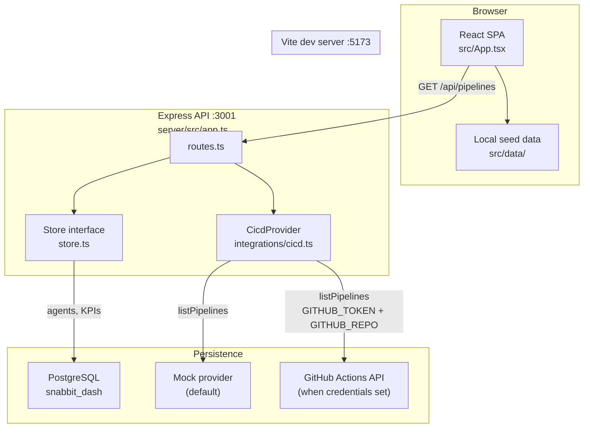
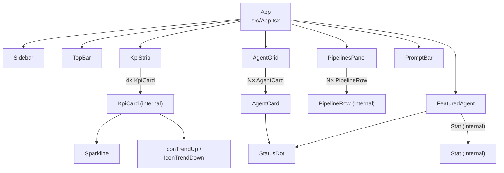
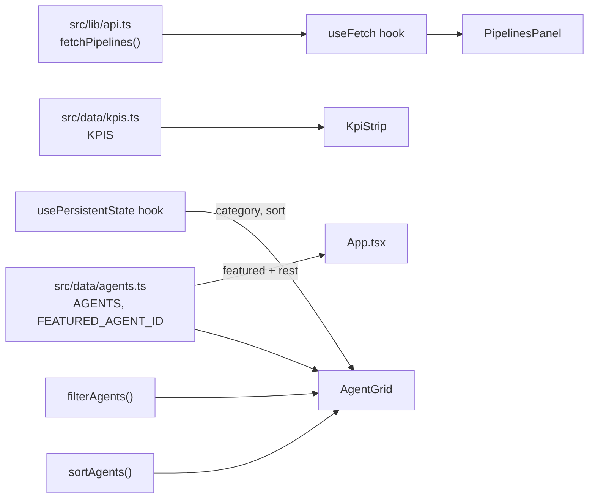
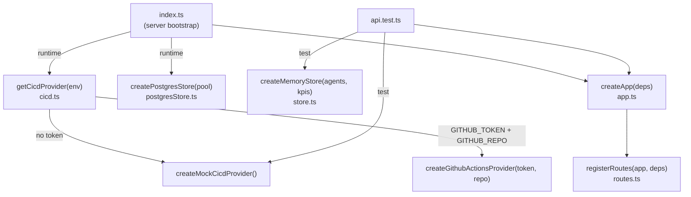
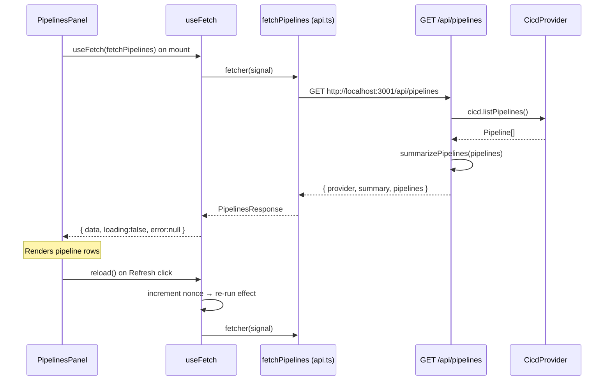
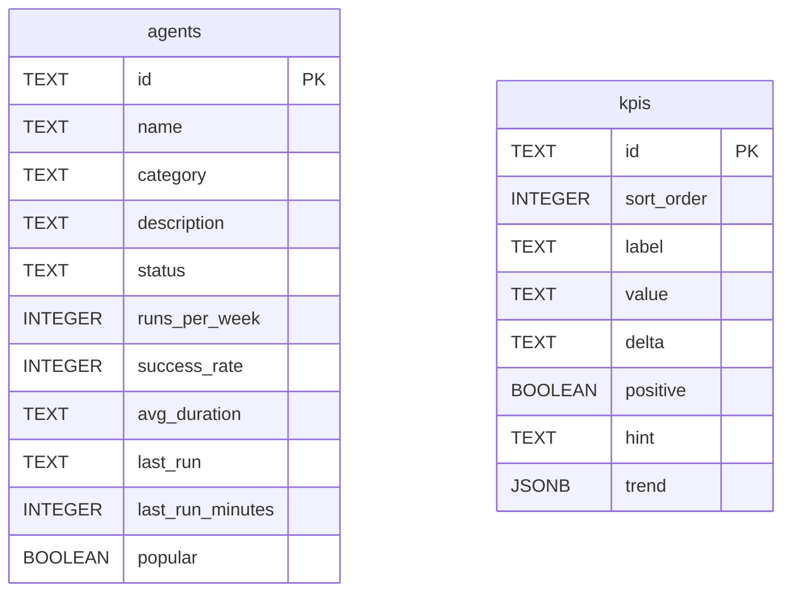
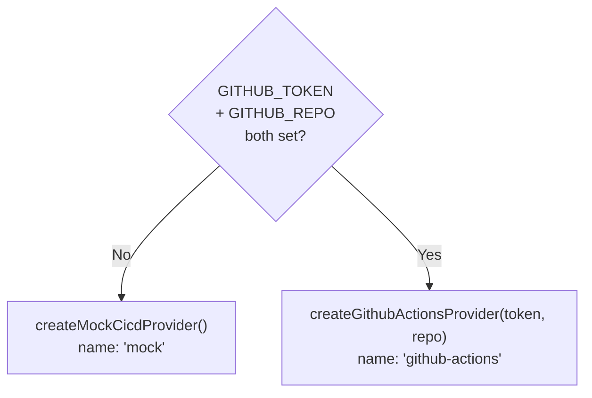

The Snabbit Agent Console is split into a React frontend (Vite SPA) and an
Express backend API, connected over a small REST surface, with a pluggable
CI/CD integration layer. Both packages live in one repository but build, test,
and run independently.

## Product design

The Snabbit 2.0 product design from Figma. The Agent Console dashboard comprises:
a collapsible left sidebar (workspace switcher, navigation items, recent sessions,
user footer); a top bar with a global ⌘K search palette and an environment
switcher; a four-tile KPI strip showing agent runs, PRs reviewed, mean time to
merge, and suite pass rate; a featured-agent hero card with a gradient accent
wash and a "Run agent" call to action; a live CI/CD pipeline table with status
indicators, branch chips, and duration; a scrollable agent grid with category
tabs, a sort select, and free-text filtering; and a multi-line prompt bar pinned
at the bottom with a model picker and Enter-to-send keyboard shortcut.

## System overview

The frontend is a fully self-contained SPA. Of its four dashboard panels, only
the **CI/CD pipelines panel** makes a live network call to the backend. The KPI
strip, featured agent, and agent grid all render from static seed data bundled
into the client at build time.

## Frontend

A Vite 8 + React 19 + TypeScript 6 + Tailwind CSS v4 SPA at the repository root.

### Component tree

### Data flow (frontend)

## Backend

An Express 5 + TypeScript API run with `tsx`, located in `server/`.

### Dependency-injection architecture

`createApp({ store, cicd })` in `server/src/app.ts` accepts its dependencies by
injection. The running server passes a Postgres store and the configured CI/CD
provider; tests pass an in-memory store and the mock provider. This means
`npm test` needs no database and no network.

### Request flow: pipelines panel

The only live end-to-end path in the app today:

If the backend is unreachable the fetch rejects, `useFetch` sets `error`, and
the panel shows "Could not reach the API…" while the rest of the dashboard
(running from local data) is unaffected.

## Database schema

`agents` and `kpis` are independent tables with no foreign-key relationship.
`kpis.trend` stores a JSON array of numbers (JSONB). `kpis.sort_order` preserves
display order; it is not part of the `Kpi` domain type.

## CI/CD provider selection

## The data boundary

The frontend (`src/data/`) and backend (`server/src/domain.ts`,
`server/src/seed.ts`) maintain structurally identical `Agent` and `Kpi` types
by hand — there is no shared package. The seed data is also duplicated in both
locations.

In Postgres the columns are `snake_case`; `postgresStore.ts` maps rows back to
the camelCase domain types. The KPI `trend` array is stored as JSONB.

## CORS and ports

The API enables CORS for all origins so the Vite dev server (port 5173) can
call it (port 3001). Both ports are configurable: the API port via `PORT`, the
frontend's API base URL via `VITE_API_URL`.
