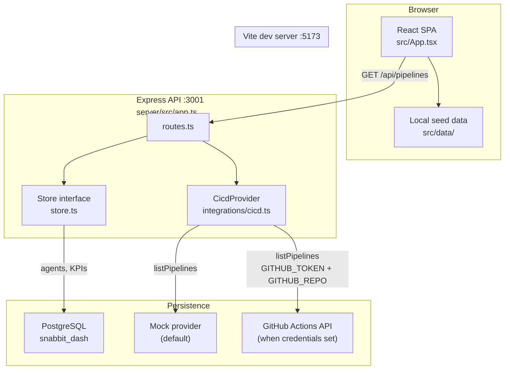
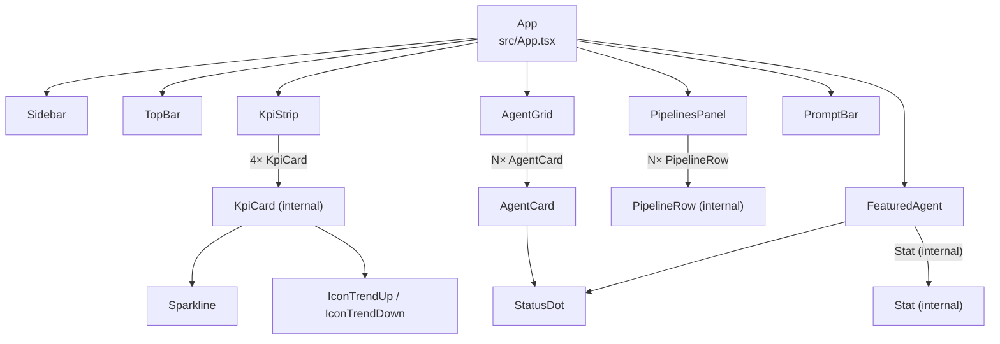
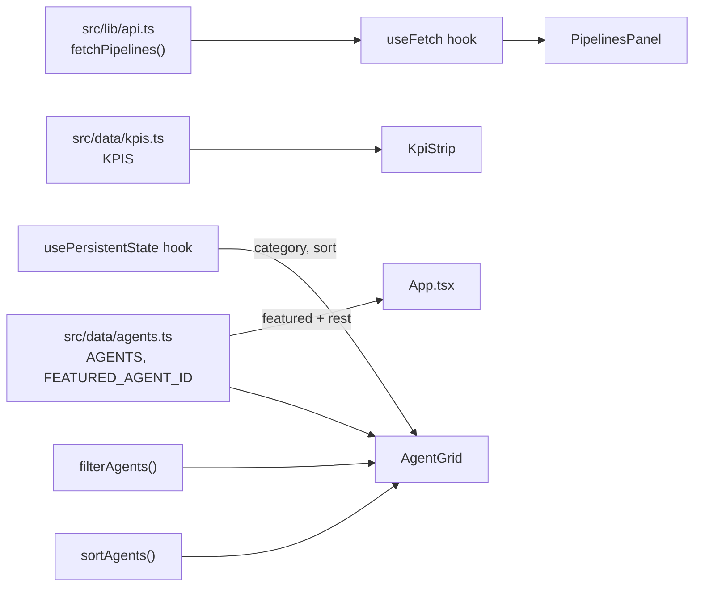
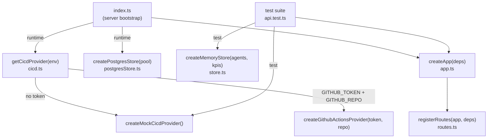
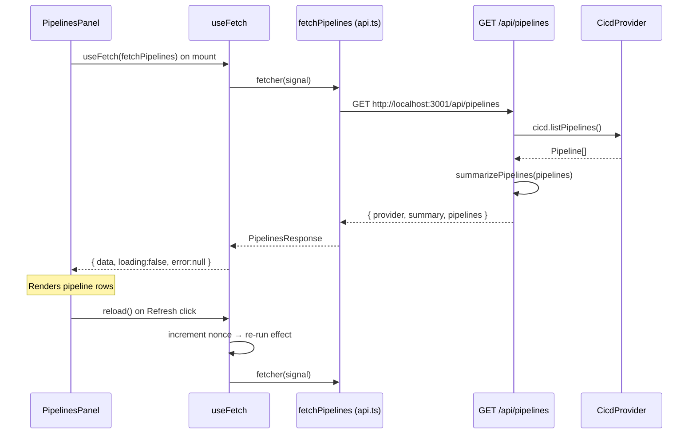
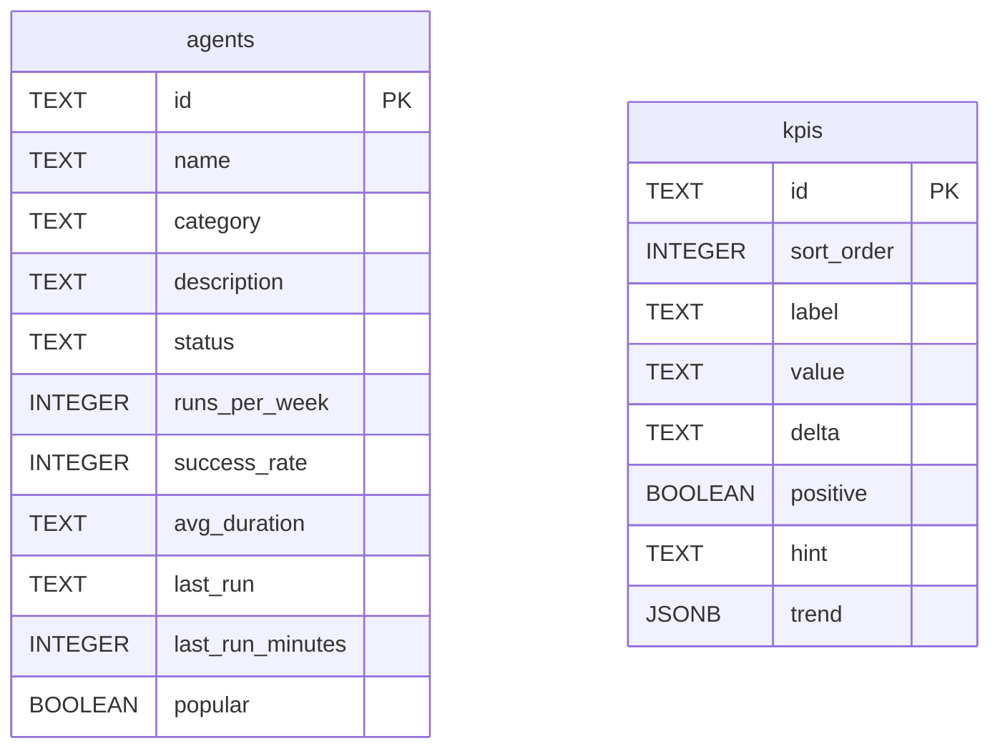
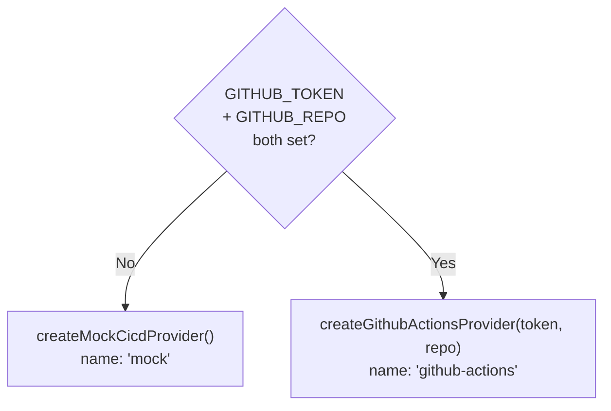

The console is split into a React frontend and an Express backend, connected
over a REST API, with a pluggable CI/CD integration. Both packages live in one
repository but build, test and run independently.

## System overview

The frontend is a fully self-contained SPA. Of its four dashboard panels, only
the **CI/CD pipelines panel** makes a network call to the backend. The KPI
strip, featured agent, and agent grid all render from static seed data bundled
into the client at build time.

## Frontend

A Vite + React 19 + TypeScript + Tailwind CSS v4 SPA at the repository root.

### Component tree

### Data flow (frontend)

## Backend

An Express 5 + TypeScript API run with `tsx`, in `server/`.

### Dependency-injection architecture

The critical architectural decision: `createApp({ store, cicd })` accepts its
dependencies by injection (`server/src/app.ts`). The running server passes a
Postgres store and the configured CI/CD provider; tests pass an in-memory store
and the mock provider. This means `npm test` needs no database, no network.

### Request flow: pipelines panel

The only live end-to-end path in the app today:

If the backend is unreachable the fetch rejects, `useFetch` sets `error`, and
the panel shows "Could not reach the API…" while the rest of the dashboard
(running from local data) is unaffected.

## Database schema

`agents` and `kpis` are independent tables with no foreign-key relationship.
The `kpis.trend` column stores a JSON array of numbers (`JSONB`). The extra
`sort_order` column on `kpis` preserves display order; it is not present on the
`Kpi` domain type.

## CI/CD provider selection

## The data boundary

The frontend (`src/data/`) and backend (`server/src/domain.ts`, `server/src/seed.ts`)
maintain structurally identical `Agent` and `Kpi` types by hand — there is no
shared package. The seed data is also duplicated.

In Postgres the columns are `snake_case`; `postgresStore.ts` maps rows back to
the camelCase domain types. The KPI `trend` array is stored as JSONB.

## CORS and ports

The API enables CORS for all origins so the Vite dev server (port 5173) can
call it (port 3001). Both ports are configurable: the API port via `PORT`, the
frontend's API base via `VITE_API_URL`.
