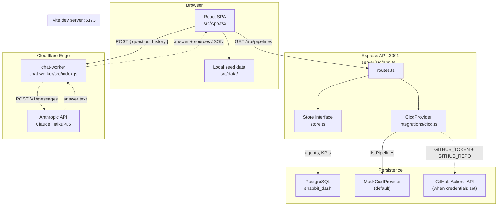
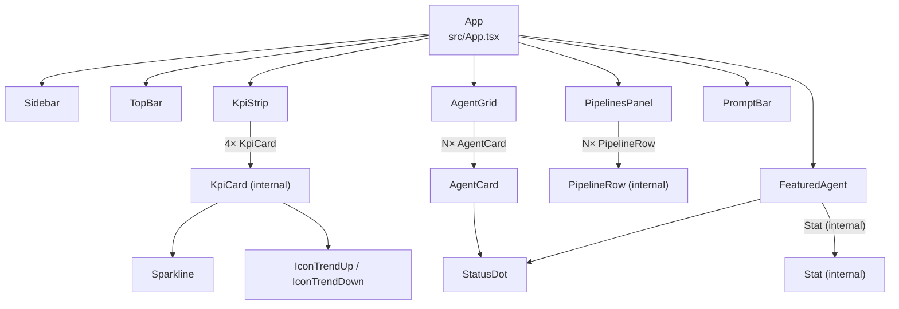
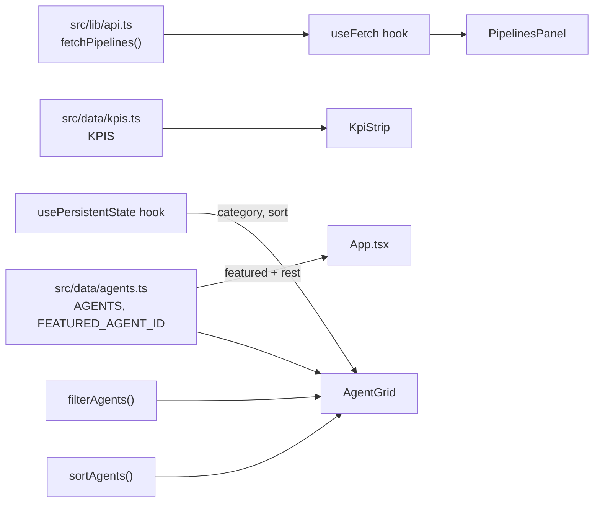
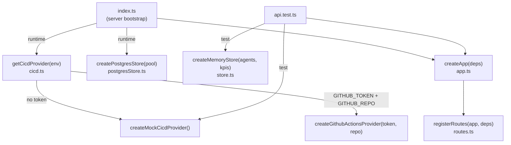
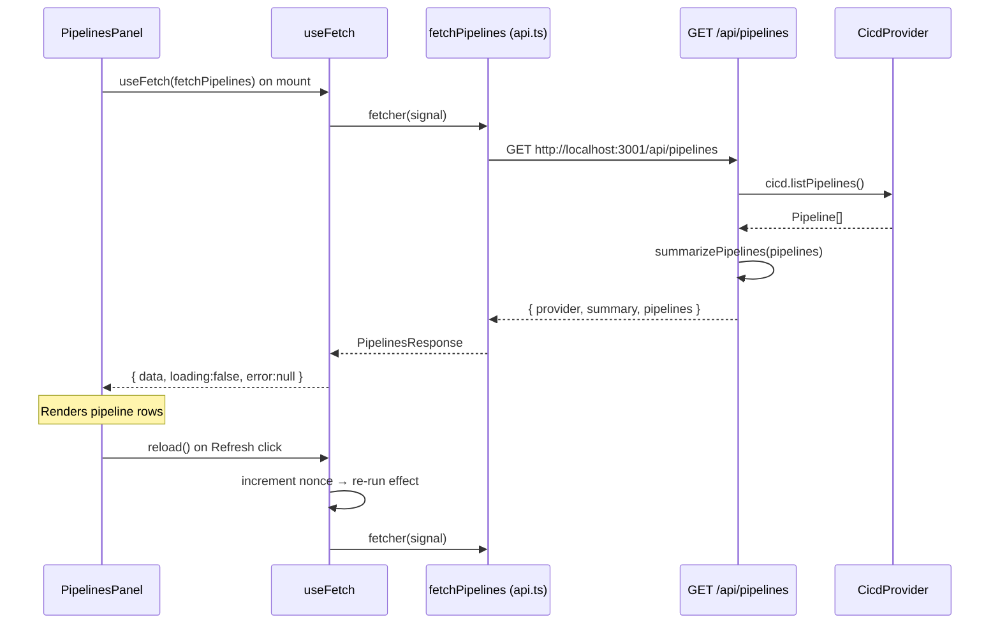
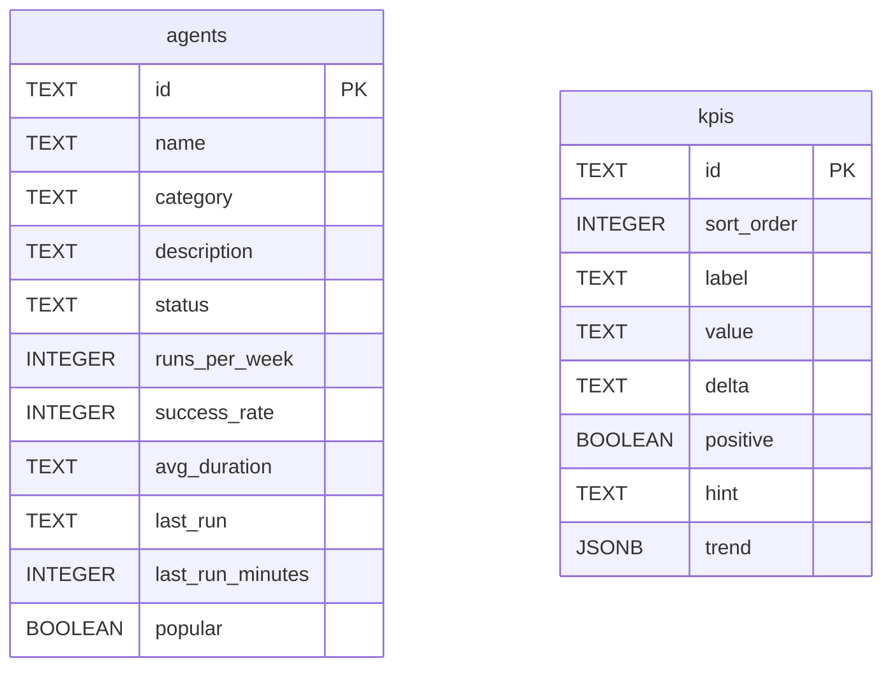
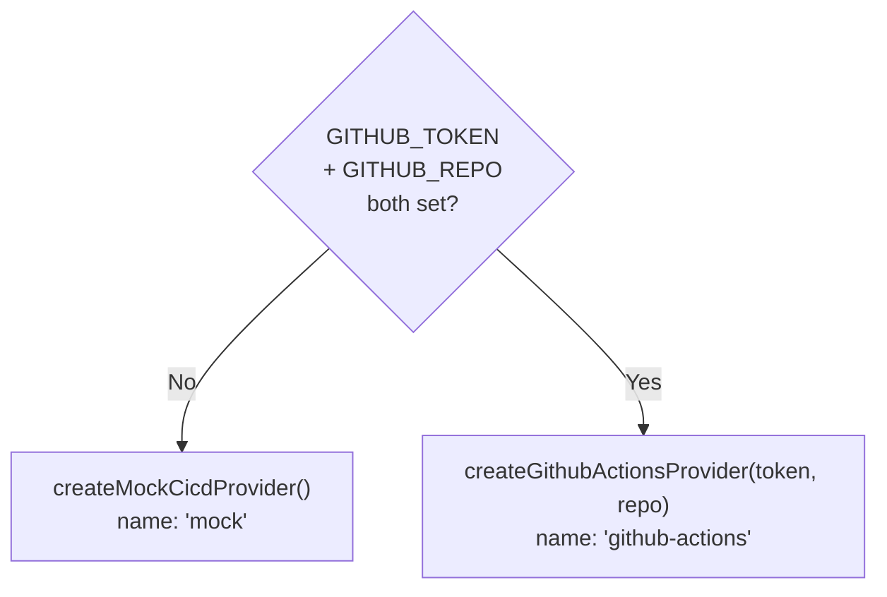
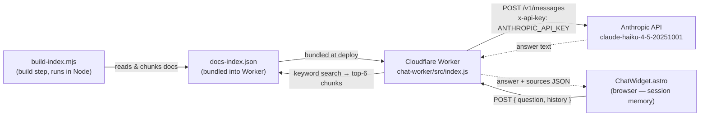

The Snabbit Agent Console is split into a React frontend (Vite SPA), an Express backend API, and a Cloudflare Worker chatbot. The frontend and backend are connected over a small REST surface; the chat worker is a completely independent edge function. All three packages live in one repository but build, test, and run independently.

## Product design


*Snabbit 2.0 product design from Figma.* The Agent Console dashboard comprises: a collapsible left sidebar (workspace switcher, navigation items, recent sessions, user footer); a top bar with a global ⌘K search palette and an environment switcher; a four-tile KPI strip showing agent runs, PRs reviewed, mean time to merge, and suite pass rate; a featured-agent hero card with a gradient accent wash and a "Run agent" call to action; a live CI/CD pipeline table with status indicators, branch chips, and duration; a scrollable agent grid with category tabs, a sort select, and free-text filtering; and a multi-line prompt bar pinned at the bottom with a model picker and Enter-to-send keyboard shortcut.

:::caution
Figma designs from PRs #1–#4 (all of which modified `src/App.tsx`) could not be exported — the Figma API token has expired. Embed the exported screens manually here after refreshing the token with a current Figma personal access token.
:::

## System overview



The frontend is a fully self-contained SPA. Of its four dashboard panels, only the **CI/CD pipelines panel** makes a live network call to the backend. The KPI strip, featured agent, and agent grid all render from static seed data bundled into the client at build time. The chat worker operates on a completely separate path — it is never proxied through the Express API.

## Frontend

A Vite 8 + React 19 + TypeScript 6 + Tailwind CSS v4 SPA at the repository root.

### Component tree



### Data flow (frontend)



`usePersistentState` wraps `localStorage`, so the selected category tab and sort order survive page reloads. `filterAgents` and `sortAgents` are pure functions applied client-side with no backend involvement.

## Backend

An Express 5 + TypeScript API run with `tsx`, located in `server/`.

### Dependency-injection architecture

`createApp({ store, cicd })` in `server/src/app.ts` accepts its dependencies by injection. The running server passes a Postgres store and the configured CI/CD provider; tests pass an in-memory store and the mock provider. This design means `npm test` needs no database and no network.



### Request flow: pipelines panel

The only live end-to-end network path in the app today:



If the backend is unreachable, the fetch rejects, `useFetch` sets `error`, and the panel shows "Could not reach the API…" while the rest of the dashboard (running from local seed data) is unaffected.

## Database schema



`agents` and `kpis` are independent tables with no foreign-key relationship. `kpis.trend` stores a JSON array of numbers as JSONB. `kpis.sort_order` preserves display order; it is not part of the `Kpi` domain type exposed by the API.

The frontend (`src/data/`) and backend (`server/src/domain.ts`, `server/src/seed.ts`) maintain structurally identical `Agent` and `Kpi` types by hand — there is no shared package. The seed data is duplicated in both locations. In Postgres the columns are `snake_case`; `postgresStore.ts` maps rows back to the camelCase domain types.

## CI/CD provider selection



By default the adapter returns deterministic mock data — no credentials needed. Set both `GITHUB_TOKEN` (repo + actions:read scope) and `GITHUB_REPO` (`owner/repo`) before starting the server to pull live GitHub Actions runs. The `provider` field in `GET /api/pipelines` responses reports which backend is active (`'mock'` or `'github-actions'`).

## The data boundary

The frontend and backend maintain parallel type definitions and seed data. There is no shared TypeScript package. When making structural changes to `Agent` or `Kpi`, update both locations:

| Location | File | Purpose |
|----------|------|---------|
| Frontend | `src/data/agents.ts` | TypeScript types + seed array |
| Frontend | `src/data/kpis.ts` | TypeScript types + seed array |
| Backend | `server/src/domain.ts` | TypeScript types |
| Backend | `server/src/seed.ts` | Seed data for DB setup |
| Backend | `server/src/db/schema.ts` | SQL DDL |

## CORS and ports

The API enables CORS for all origins so the Vite dev server (port 5173) can reach it (port 3001). Both ports are configurable: the API port via the `PORT` environment variable, the frontend's API base URL via `VITE_API_URL` (defaults to `http://localhost:3001`).

## The "Ask the docs" chat worker

A separate Cloudflare Worker (`chat-worker/`) provides the AI chatbot embedded on every page of this documentation site. It calls the **Anthropic API** directly — it does **not** use Cloudflare Workers AI or any Llama model.

### Key facts

| Property | Value |
|----------|-------|
| Runtime | Cloudflare Worker (ES module) |
| AI model | `claude-haiku-4-5-20251001` |
| AI endpoint | `https://api.anthropic.com/v1/messages` |
| API key | `ANTHROPIC_API_KEY` Wrangler secret |
| Stateless? | Yes — conversation history kept in browser |
| Index source | `docs-index.json` bundled into the Worker |
| Search method | Keyword scoring (tf-style term frequency over title + heading + text) |
| Context chunks | Top 6 matching chunks injected into the Anthropic system prompt |
| Max response tokens | 600 |

### Architecture flowchart



### How the search works

`build-index.mjs` walks every Markdown file under `docs-site/src/content/docs/`, splits each page at `##` headings into chunks of up to 1 500 characters each, and records `{ title, heading, url, text }` for each chunk. The resulting `docs-index.json` is committed to `chat-worker/` and bundled with the Worker at deploy time (imported via `import INDEX from '../docs-index.json'`).

At request time the Worker tokenises the user's question (lowercase alphanumeric tokens, stop-words removed), scores every chunk by raw term-frequency with a 4× weight on title/heading matches, and selects the top 6 chunks. Those chunks are injected verbatim into the Anthropic system prompt as grounding context. The model is instructed to answer using only the provided excerpts.

### Stateless conversation

The Worker does not store any state. The `ChatWidget.astro` component keeps a session-scoped message array in JavaScript memory and sends the last 6 turns as `payload.history` with every request. The Worker trims history to those 6 turns, filters to valid `user`/`assistant` roles, and prepends them to the Anthropic `messages` array before the current question.

### Security

The `ANTHROPIC_API_KEY` is stored exclusively as a Wrangler secret on the Worker — it is set once with `npx wrangler secret put ANTHROPIC_API_KEY` and is never present in source code, `wrangler.toml`, or the browser. The Worker adds `Access-Control-Allow-Origin: *` CORS headers so any origin (including the docs site) can POST to it.

### Rebuilding the index

Run these commands whenever the documentation content changes:

```bash
cd chat-worker
npm run index   # node build-index.mjs → writes docs-index.json
npm run deploy  # wrangler deploy → bundles and pushes to Cloudflare
```

See [Chat worker overview](/sdlc-sample-worflow/chat-worker/) and [build-index.mjs](/sdlc-sample-worflow/chat-worker/build-index/) for full details.
