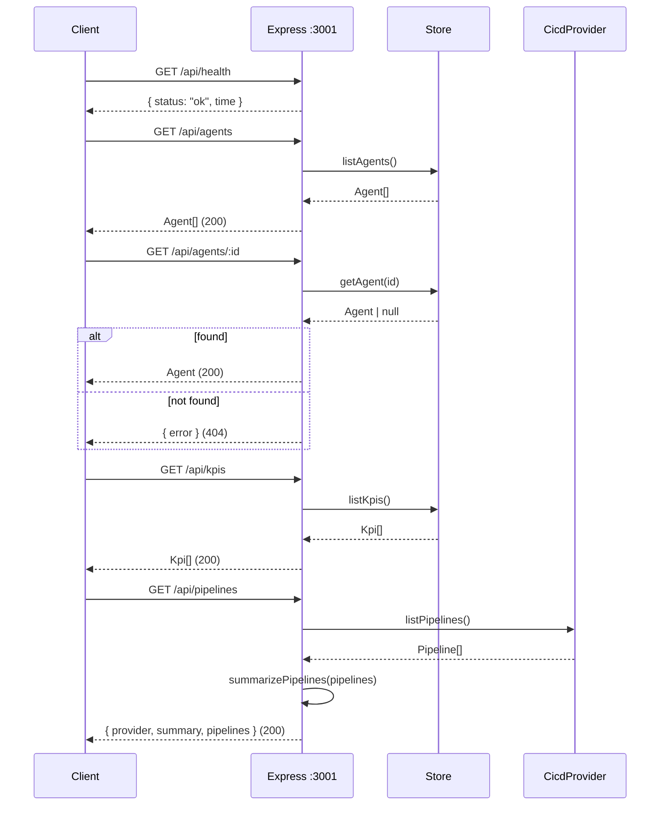

All routes are registered in `server/src/routes.ts`. Handlers are thin: each
reads from the injected store or CI/CD provider and returns JSON. Responses are
JSON throughout; unhandled errors return `500 { "error": "Internal server error" }`
via the catch-all handler in `app.ts`.

The base URL in local development is `http://localhost:3001`.

See [routes.ts](/sdlc-sample-worflow/backend/routes/) for the full
implementation walkthrough.

## Endpoints

| Method & path | Description |
|---------------|-------------|
| `GET /api/health` | Liveness check |
| `GET /api/agents` | Full agent catalogue |
| `GET /api/agents/:id` | A single agent (404 if unknown) |
| `GET /api/kpis` | KPI list |
| `GET /api/pipelines` | CI/CD pipelines + summary |

## Request / response overview



## `GET /api/health`

Returns liveness with a timestamp:

```json
{ "status": "ok", "time": "2026-05-22T10:00:00.000Z" }
```

No dependencies are called. Suitable for health-check probes.

## `GET /api/agents`

Returns the full agent catalogue as an array. From the Postgres store, agents
are ordered by `runs_per_week` descending. See the
[data model](/sdlc-sample-worflow/backend/data-model/) for the `Agent` shape.

## `GET /api/agents/:id`

Returns a single agent by `id`. Responds `404 { "error": "Agent not found" }`
if no agent matches.

## `GET /api/kpis`

Returns the KPI list as an array (ordered by `sort_order` from Postgres). See
the [data model](/sdlc-sample-worflow/backend/data-model/) for the `Kpi` shape.

## `GET /api/pipelines`

Asks the configured CI/CD provider for pipelines, computes a summary, and
returns all three fields:

```json
{
  "provider": "mock",
  "summary": {
    "total": 8,
    "passing": 4,
    "failing": 2,
    "running": 2,
    "passRate": 67
  },
  "pipelines": [
    {
      "id": "p-1041",
      "name": "CI · build & test",
      "provider": "github-actions",
      "branch": "main",
      "status": "passing",
      "durationSeconds": 184,
      "triggeredBy": "a.kapoor",
      "updatedAt": "2026-05-22T09:54:00.000Z"
    }
  ]
}
```

`provider` is the active provider's name (`mock` or `github-actions`). The
`summary.passRate` is calculated over **finished** (passing + failing) pipelines
only — running pipelines are excluded from the denominator. See
[CI/CD integration](/sdlc-sample-worflow/backend/cicd-integration/).

:::note
This is the only endpoint the frontend currently calls. `/api/agents` and
`/api/kpis` are implemented and tested but not yet consumed by the dashboard.
:::
