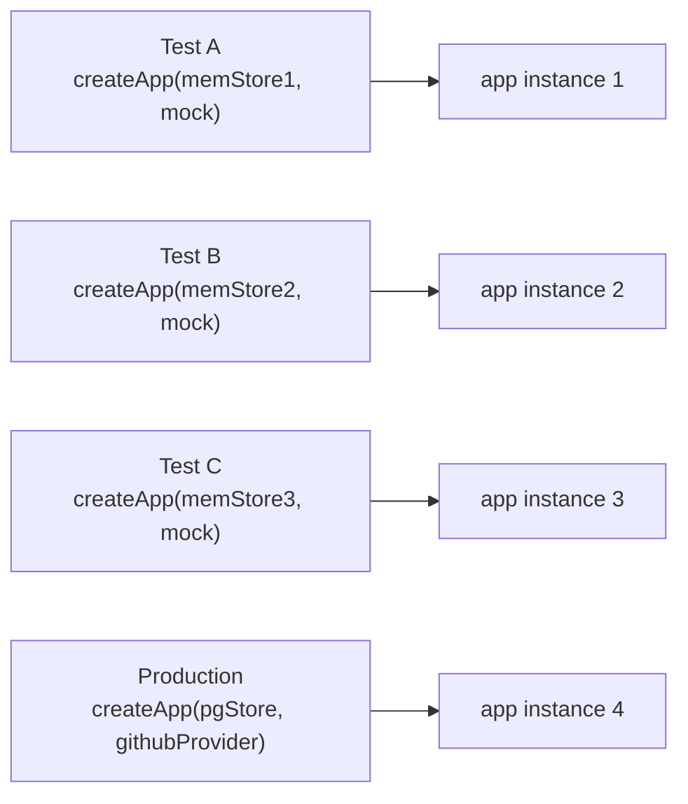

**File:** `server/src/app.ts`

The Express application factory. Takes injected dependencies and returns a fully configured Express app. Separating app creation from server bootstrap enables clean dependency injection and isolated test instances.

## Full source

```ts
import express from 'express'
import type { NextFunction, Request, Response } from 'express'
import cors from 'cors'
import type { Store } from './store'
import type { CicdProvider } from './integrations/cicd'
import { registerRoutes } from './routes'

export interface AppDeps {
  store: Store
  cicd: CicdProvider
}

export function createApp(deps: AppDeps) {
  const app = express()
  app.use(cors())
  app.use(express.json())
  registerRoutes(app, deps)
  app.use((err: unknown, _req: Request, res: Response, _next: NextFunction) => {
    console.error('Unhandled API error:', err)
    res.status(500).json({ error: 'Internal server error' })
  })
  return app
}
```

## `AppDeps` interface

```ts
export interface AppDeps {
  store: Store
  cicd: CicdProvider
}
```

| Field | Type | Purpose |
|---|---|---|
| `store` | `Store` | Data access for agents and KPIs. In production: `createPostgresStore(pool)`. In tests: `createMemoryStore(agents, kpis)`. |
| `cicd` | `CicdProvider` | CI/CD pipeline data source. In production: result of `getCicdProvider(env)`. In tests: `createMockCicdProvider()`. |

Both fields are interfaces, not concrete classes. `app.ts` has no import of any implementation — it only imports the types.

## `createApp(deps)`

```ts
export function createApp(deps: AppDeps): express.Application
```

**Parameters:** `deps: AppDeps` — the two injected collaborators.

**Returns:** A configured `express.Application`. The app has all middleware and routes registered but is not yet bound to any port.

**Side effects at call time:** None — no network calls, no database queries, no file I/O.

## Middleware stack

The following middleware are registered in order on every incoming request:

### 1. `cors()`

```ts
app.use(cors())
```

Adds `Access-Control-Allow-Origin: *` (and related CORS headers) to every response. This is required because the Vite dev server runs on port 5173 while the API runs on port 3001 — without CORS headers, browsers would block cross-origin requests.

The default `cors()` configuration allows all origins and all standard headers. For a production deployment, this can be tightened with `cors({ origin: 'https://your-domain.com' })`.

### 2. `express.json()`

```ts
app.use(express.json())
```

Parses request bodies with `Content-Type: application/json` and populates `req.body`. All current routes are read-only (GET), so `req.body` is never used today. The middleware is included to support future write endpoints without requiring a middleware change.

### 3. `registerRoutes(app, deps)`

```ts
registerRoutes(app, deps)
```

Registers all five REST routes, passing `deps` so handlers can call `deps.store` and `deps.cicd`. See [routes.ts](/backend/routes/) for the full route list.

### 4. Catch-all error handler

```ts
app.use((err: unknown, _req: Request, res: Response, _next: NextFunction) => {
  console.error('Unhandled API error:', err)
  res.status(500).json({ error: 'Internal server error' })
})
```

Express identifies a four-argument middleware function as an error handler. Any unhandled error thrown (or rejected promise) inside a route handler propagates here.

The handler:
1. Logs the full error to `stderr` with `console.error`.
2. Responds with HTTP 500 and a JSON body `{ "error": "Internal server error" }`.

This ensures the client always receives structured JSON rather than an Express HTML crash page, even in unexpected failure scenarios.

The `_req` and `_next` parameters use a leading underscore to signal intentional non-use and suppress TypeScript/ESLint unused-variable warnings. Express requires the four-argument signature regardless — omitting any parameter would cause Express not to recognize it as an error handler.

:::caution
Express 5 automatically propagates async route-handler rejections to the next error handler. In Express 4, async errors required explicit `next(err)` calls. If you downgrade to Express 4, add `try/catch` or a wrapper in each async route.
:::

## Factory pattern benefits

Creating a new `express.Application` on every `createApp()` call means:

- Each test file can spin up its own isolated app instance with fresh middleware and a fresh in-memory store.
- Tests do not share state — one test's mutations to the store do not bleed into another test's store.
- No singleton Express instance exists that tests could accidentally contaminate.



Each instance has its own middleware chain, its own route handlers, and its own reference to the injected store. Changing one does not affect the others.

## Used by

- **`server/src/index.ts`** — production entry point, injects `createPostgresStore(pool)` and the result of `getCicdProvider(env)`.
- **`server/src/__tests__/api.test.ts`** — injects `createMemoryStore(SEED_AGENTS, SEED_KPIS)` and `createMockCicdProvider()`.
