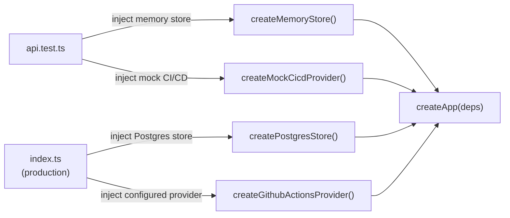

**File:** `server/src/app.ts`

The Express application factory. Takes injected dependencies and returns a
fully configured Express app. The separation of app creation from server
bootstrap enables clean dependency injection in tests.

## Types

### `AppDeps`

```ts
export interface AppDeps {
  store: Store
  cicd: CicdProvider
}
```

| Field | Type | Purpose |
|-------|------|---------|
| `store` | `Store` | Data access — agents and KPIs. Injected as either `createMemoryStore` (tests) or `createPostgresStore` (production). |
| `cicd` | `CicdProvider` | CI/CD pipeline provider. Injected as either `createMockCicdProvider` (default) or `createGithubActionsProvider` (when credentials set). |

## `createApp`

```ts
export function createApp(deps: AppDeps): express.Application
```

**Parameters:** `deps: AppDeps` — the two injected dependencies.

**Returns:** A configured Express `Application` instance, not yet listening.

**Side effects:** None at creation time. Registers middleware and routes on the
app instance.

## Implementation walkthrough

```ts
export function createApp(deps: AppDeps) {
  const app = express()
  app.use(cors())
  app.use(express.json())

  registerRoutes(app, deps)

  app.use((err: unknown, _req: Request, res: Response, _next: NextFunction) => {
    console.error('Unhandled API error:', err)
    res.status(500).json({ error: 'Internal server error' })
  })

  return app
}
```

### Middleware stack

Three middleware are applied in order:

1. **`cors()`** — enables Cross-Origin Resource Sharing for all origins. This
   allows the Vite dev server (port 5173) to call the API (port 3001). The
   default `cors()` configuration sends `Access-Control-Allow-Origin: *`.

2. **`express.json()`** — parses request bodies with `Content-Type: application/json`
   into `req.body`. No routes currently use request bodies, but it is included
   for future write endpoints.

3. **`registerRoutes(app, deps)`** — adds all API routes. Routes receive the
   injected `deps` so they can read from the store and CI/CD provider.

### Catch-all error handler

```ts
app.use((err: unknown, _req: Request, res: Response, _next: NextFunction) => {
  console.error('Unhandled API error:', err)
  res.status(500).json({ error: 'Internal server error' })
})
```

Express identifies a 4-argument middleware as an error handler. Any error
thrown by a route handler that is not caught there reaches this handler.
It logs the error and responds with a JSON error object so the client receives
structured JSON rather than an HTML crash page.

The `_req` and `_next` parameters are prefixed with `_` to silence unused-
variable linter warnings. Express requires the 4-argument signature regardless
of whether all parameters are used.

:::caution
Async Express 5 route handlers propagate rejections automatically — no
explicit `next(err)` call needed. In Express 4, async errors would have
required explicit rejection forwarding.
:::

## Dependency injection pattern



This pattern means `npm test` never touches Postgres or the GitHub API — tests
are fast, hermetic, and repeatable.

## Used by

- `server/src/index.ts` — production entry point, injects real dependencies.
- `server/src/__tests__/api.test.ts` — injects in-memory store + mock CI/CD.
