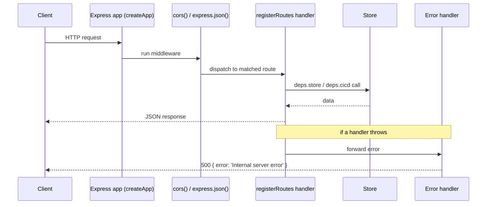

<!-- structure:1c3466c3ddf6 -->

**File:** `server/src/app.ts` · **Lines:** 33

<!-- fill:file:summary -->
`app.ts` assembles the Express application via the `createApp` factory, wiring in middleware (CORS and JSON body parsing), delegating route registration to `registerRoutes` from `routes.ts`, and installing a catch-all error handler. It uses dependency injection through the `AppDeps` interface so the same app can run against either the `Store` from `store.ts`/`postgresStore.ts` and a `CicdProvider` from `integrations/cicd`. `index.ts` calls `createApp` with the Postgres store and configured provider for the running server, while `__tests__/api.test.ts` calls it with an in-memory store and a mock provider.
<!-- /fill:file:summary -->

## Imports

This file pulls in the following modules. Relative imports point to other documented files; external imports are libraries from `node_modules`.

| Module | Imports | Kind |
| --- | --- | --- |
| `express` | `default as express` | external |
| `express` | `NextFunction`, `Request`, `Response` | type-only · external |
| `cors` | `default as cors` | external |
| `./store` | `Store` | type-only · internal |
| `./integrations/cicd` | `CicdProvider` | type-only · internal |
| `./routes` | `registerRoutes` | internal |


## Symbols

This file exports 2 symbols. Every export is documented below, in declaration order.

| Name | Kind | Default |
| --- | --- | --- |
| createApp | function | no |
| AppDeps | interface | no |

## createApp

**Kind:** `function`

```ts
export function createApp(deps: AppDeps) { ... }
```

> Build the Express app from injected dependencies.
> Tests pass an in-memory store + mock CI/CD provider; the running server
> passes the Postgres store and the configured provider.

### Parameters

| Name | Type | Default | Required | Purpose |
| --- | --- | --- | --- | --- |
| deps | `AppDeps` | — | yes | Injected collaborators — the `Store` for agent/KPI reads and the `CicdProvider` for pipeline reads — handed straight to `registerRoutes`. |

**Returns:** `any`

<!-- fill:sym:createApp:return -->
Returns the fully configured Express application instance, with middleware, all REST routes, and the error handler already attached. It is never null — `createApp` always returns a ready-to-use app. Callers either invoke `.listen()` on it (as `index.ts` does) or pass it to `supertest` for testing (as `api.test.ts` does).
<!-- /fill:sym:createApp:return -->

### Line-by-line walkthrough

Each top-level statement of `createApp`, in execution order. The line numbers reference the source file as it appears today.

**Line 19 — `FirstStatement`**

```ts
const app = express()
```

<!-- fill:sym:createApp:walk:0 -->
Calls the `express()` factory to create a fresh application instance and binds it to the local `const app`. A new instance is created per `createApp` call so each app (e.g. one per test) is fully isolated rather than shared global state.
<!-- /fill:sym:createApp:walk:0 -->

**Line 20 — `ExpressionStatement`**

```ts
app.use(cors())
```

<!-- fill:sym:createApp:walk:1 -->
Registers the `cors()` middleware on `app`, adding the CORS response headers to every request. This is mounted first so cross-origin browser clients (the frontend) are allowed to call the API before any route runs.
<!-- /fill:sym:createApp:walk:1 -->

**Line 21 — `ExpressionStatement`**

```ts
app.use(express.json())
```

<!-- fill:sym:createApp:walk:2 -->
Mounts `express.json()`, the built-in body parser that reads incoming request bodies and populates `req.body` for JSON payloads. It runs after CORS so request parsing is in place before route handlers execute.
<!-- /fill:sym:createApp:walk:2 -->

**Line 23 — `ExpressionStatement`**

```ts
registerRoutes(app, deps)
```

<!-- fill:sym:createApp:walk:3 -->
Delegates to `registerRoutes` (from `routes.ts`), passing the `app` and the injected `deps` so all `/api/*` endpoints are attached. Keeping route wiring in a separate function keeps `createApp` focused on middleware/app assembly and lets routes reach the store and CI/CD provider via `deps`.
<!-- /fill:sym:createApp:walk:3 -->

**Line 26 — `ExpressionStatement`**

```ts
app.use((err: unknown, _req: Request, res: Response, _next: NextFunction) => {
    console.error('Unhandled API error:', err)
    res.status(500).json({ error: 'Internal server error' })
  })
```

<!-- fill:sym:createApp:walk:4 -->
Registers a four-argument Express error-handling middleware (Express identifies it as an error handler precisely because it takes `err` plus the request/response/next trio). Mounted last so it catches anything thrown or passed to `next()` by the routes above; it logs the error with `console.error` and responds with a generic `500` JSON body so a failed route returns structured JSON instead of crashing the process. The `_req` and `_next` prefixes mark those parameters as intentionally unused.
<!-- /fill:sym:createApp:walk:4 -->

**Line 31 — `ReturnStatement`**

```ts
return app
```

<!-- fill:sym:createApp:walk:5 -->
Returns the assembled `app` to the caller so it can be started with `.listen()` or handed to a test harness. Returning the instance (rather than starting the server here) keeps `createApp` side-effect-free with respect to networking, which is what lets the test suite drive it via `supertest`.
<!-- /fill:sym:createApp:walk:5 -->

### Examples

<!-- fill:sym:createApp:example -->
From the test suite (`__tests__/api.test.ts`), `createApp` is built with an in-memory store and a mock CI/CD provider, then driven with `supertest`:

```ts
import request from 'supertest'
import { createApp } from '../app'
import { createMemoryStore } from '../store'
import { createMockCicdProvider } from '../integrations/cicd'
import { SEED_AGENTS, SEED_KPIS } from '../seed'

const app = createApp({
  store: createMemoryStore(SEED_AGENTS, SEED_KPIS),
  cicd: createMockCicdProvider(),
})

const res = await request(app).get('/api/health')
// res.status === 200, res.body === { status: 'ok', time: '...' }
```

In production (`index.ts`) the same call instead receives the Postgres store and configured provider, then `app.listen(config.port)`.
<!-- /fill:sym:createApp:example -->

### Used by

- `server/src/index.ts`
- `server/src/__tests__/api.test.ts`

## AppDeps

**Kind:** `interface`

```ts
export interface AppDeps { ... }
```

<!-- fill:sym:AppDeps:summary -->
`AppDeps` is the dependency-injection bundle passed to `createApp`, declaring the two collaborators the API needs: a `store` (a `Store` from `store.ts`) for agent and KPI data, and a `cicd` (a `CicdProvider` from `integrations/cicd`) for pipeline data. It exists so the concrete implementations are chosen at the edges — Postgres + real provider in `index.ts`, in-memory + mock in tests — keeping the app itself decoupled from where data comes from. `routes.ts` reads both fields off `deps` when wiring handlers.
<!-- /fill:sym:AppDeps:summary -->

### Shape

| Name | Type | Description |
| --- | --- | --- |
| store | `Store` | Read access to agents and KPIs — Postgres-backed in production, in-memory in tests. |
| cicd | `CicdProvider` | Adapter that lists CI/CD pipelines — `mock` in dev/tests, `github-actions` when credentials are set. |

### Used by

- `server/src/routes.ts`

## Diagrams

<!-- fill:file:diagrams -->

<!-- /fill:file:diagrams -->
