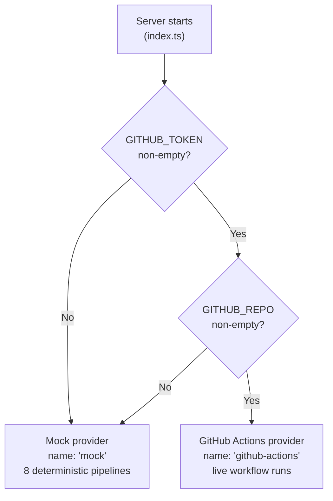

The Snabbit backend integrates with CI/CD systems through the `CicdProvider` interface. Two implementations are available: a built-in mock (default) and a live GitHub Actions adapter. Switching between them requires only environment variables — no code changes.

## Provider overview

| Provider | Name | When active | Data source |
|---|---|---|---|
| Mock | `mock` | `GITHUB_TOKEN` or `GITHUB_REPO` is unset / empty | 8 hardcoded pipelines with live timestamps |
| GitHub Actions | `github-actions` | Both `GITHUB_TOKEN` and `GITHUB_REPO` are set | Live GitHub Actions workflow runs API |

The active provider's name is printed at startup and included in every `GET /api/pipelines` response under the `provider` field.

## Provider selection flowchart



## Using the mock provider (default)

No configuration is needed. Start the server normally:

```bash
npm run dev
```

The startup log shows:
```
Snabbit API listening on http://localhost:3001  ·  CI/CD provider: mock
```

The mock returns 8 deterministic pipelines on every `GET /api/pipelines` request:

| ID | Name | Branch | Status | Duration |
|---|---|---|---|---|
| `p-1041` | CI · build & test | main | passing | 184s |
| `p-1040` | E2E suite | main | running | 312s |
| `p-1039` | Deploy · staging | release/4.19 | passing | 96s |
| `p-1038` | Lint & typecheck | feat/agent-drawer | failing | 47s |
| `p-1037` | Docker image | main | passing | 268s |
| `p-1036` | DB migration check | feat/pg-store | passing | 38s |
| `p-1035` | Nightly regression | main | failing | 904s |
| `p-1034` | Release · production | release/4.19 | running | 140s |

The `updatedAt` timestamps are generated fresh on each call (relative to the current time), so they always appear recent.

The mock summary: 4 passing, 2 failing, 2 running → `passRate = 67`.

## Switching to live GitHub Actions

Set both environment variables before starting the server:

```bash
export GITHUB_TOKEN=ghp_your_token_here
export GITHUB_REPO=your-org/your-repo
npm run dev
```

Or using a `.env` file with a tool like `dotenv-cli`:

```bash
GITHUB_TOKEN=ghp_your_token_here
GITHUB_REPO=your-org/your-repo
```

The startup log changes to:
```
Snabbit API listening on http://localhost:3001  ·  CI/CD provider: github-actions
```

### GitHub token permissions

The token must have the following permissions:

| Scope | Why |
|---|---|
| `repo` | Required to access private repository workflow runs |
| `actions:read` | Required to list workflow runs via the Actions API |

For public repositories, a token with only `actions:read` (or even a token with no scopes) may be sufficient depending on your organization's settings.

### Repository format

`GITHUB_REPO` must be in `owner/repo` format:

```bash
GITHUB_REPO=snabbit/app            # organization repo
GITHUB_REPO=your-username/your-repo  # personal repo
```

## What the live provider fetches

```
GET https://api.github.com/repos/{owner}/{repo}/actions/runs?per_page=20
Authorization: Bearer {token}
Accept: application/vnd.github+json
X-GitHub-Api-Version: 2022-11-28
```

Returns the 20 most recent workflow runs. Each run is mapped to the `Pipeline` type:

| GitHub field | Pipeline field | Mapping logic |
|---|---|---|
| `id` | `id` | Converted to string |
| `name` / `display_title` | `name` | `name ?? display_title` |
| — | `provider` | Always `'github-actions'` |
| `head_branch` | `branch` | `head_branch ?? 'unknown'` |
| `status` + `conclusion` | `status` | See status mapping below |
| `run_started_at` / `updated_at` | `durationSeconds` | `(updated_at - run_started_at) / 1000` |
| `actor.login` | `triggeredBy` | `actor?.login ?? 'unknown'` |
| `updated_at` | `updatedAt` | Direct ISO 8601 string |

### Status mapping

| GitHub `status` | GitHub `conclusion` | `PipelineStatus` |
|---|---|---|
| `queued` | any | `'running'` |
| `in_progress` | any | `'running'` |
| `waiting` | any | `'running'` |
| `completed` | `'success'` | `'passing'` |
| `completed` | `'failure'` | `'failing'` |
| `completed` | `'cancelled'` | `'failing'` |
| `completed` | `'timed_out'` | `'failing'` |
| `completed` | any other | `'failing'` |

## `passRate` calculation

Whether using mock or live data, `GET /api/pipelines` always returns a `summary.passRate`. The rate is calculated over **finished** (passing + failing) pipelines only:

```
passRate = round(passing / (passing + failing) × 100)
passRate = 0  when no finished pipelines exist
```

Running pipelines are excluded from the denominator because their outcome is not yet known. This prevents actively-running pipelines from artificially depressing the pass rate.

## Failure mode (GitHub provider)

If the GitHub API returns a non-2xx HTTP status code, `listPipelines()` throws:

```
Error: GitHub Actions API responded 401
```

This error propagates to the `GET /api/pipelines` route handler, which passes it to the Express catch-all error handler in `app.ts`. The client receives:

```json
{ "error": "Internal server error" }
```

HTTP status `500`.

Common non-2xx responses from GitHub:

| Status | Cause |
|---|---|
| `401` | Invalid or expired `GITHUB_TOKEN` |
| `403` | Token lacks `actions:read` permission |
| `404` | Repository not found, or token has no access to it |
| `429` | Rate limit exceeded |

:::caution
The live provider does not cache responses. Every `GET /api/pipelines` call issues a fresh GitHub API request. GitHub's rate limit for authenticated requests is 5000 per hour. With a 1-minute polling interval, this endpoint uses approximately 60 requests per hour — well within the limit for a single user.
:::
