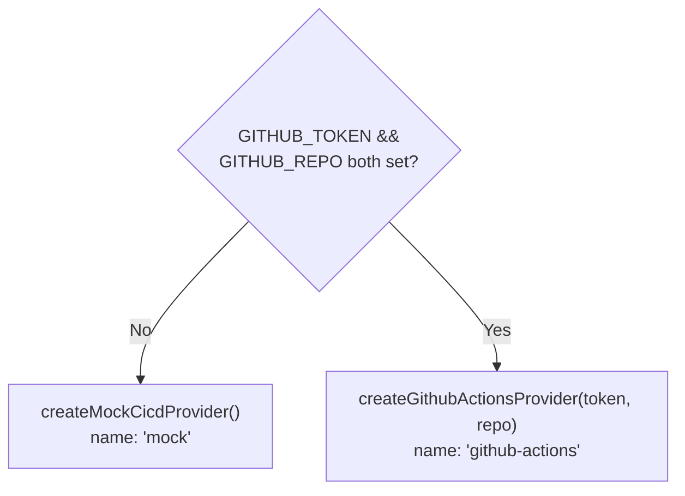

The CI/CD integration (`server/src/integrations/cicd.ts`) is a pluggable
adapter behind the `CicdProvider` interface. The mock provider is the default;
the live GitHub Actions provider activates when credentials are set.

See [integrations/cicd.ts](/sdlc-sample-worflow/backend/integrations/cicd/) for the
full implementation reference.

## The provider interface

```ts
interface CicdProvider {
  readonly name: string
  listPipelines(): Promise<Pipeline[]>
}
```

## Provider selection



```ts
export function getCicdProvider(env: {
  githubToken: string
  githubRepo?: string
}): CicdProvider
```

## Mock provider

`createMockCicdProvider()` — returns 8 deterministic pipelines with live
timestamps. No credentials required.

| Status | Count |
|--------|-------|
| passing | 4 |
| failing | 2 |
| running | 2 |
| **passRate** | **67%** |

## Live GitHub Actions provider

`createGithubActionsProvider(token, repo)` — fetches the 20 most recent
workflow runs:

```
GET https://api.github.com/repos/{repo}/actions/runs?per_page=20
Authorization: Bearer {token}
```

Requires `repo` + `actions:read` token scope.

**Status mapping:** GitHub `status !== 'completed'` → `'running'`;
`conclusion === 'success'` → `'passing'`; anything else → `'failing'`.

## `summarizePipelines`

```ts
export function summarizePipelines(pipelines: Pipeline[]): PipelineSummary
```

Pure aggregation. Counts statuses and computes `passRate` over finished
(passing + failing) pipelines only.

```
passRate = round(passing / (passing + failing) × 100)
passRate = 0 when no finished pipelines
```

## Tests

`server/src/__tests__/cicd.test.ts` covers `summarizePipelines`, `getCicdProvider`,
and the mock provider. See [Testing](/sdlc-sample-worflow/testing/) for details.
