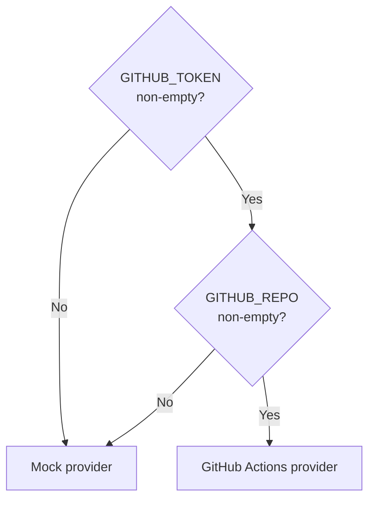

**File:** `server/src/config.ts`

Reads runtime configuration from environment variables with local-friendly
defaults. All fields have defaults, so `npm run dev` works out of the box
without any environment setup.

## The `config` object

```ts
export const config = {
  port: Number(process.env.PORT ?? 3001),
  databaseUrl:
    process.env.DATABASE_URL ?? 'postgres://localhost:5432/snabbit_dash',
  githubToken: process.env.GITHUB_TOKEN ?? '',
  githubRepo:  process.env.GITHUB_REPO  ?? '',
}
```

| Field | Env var | Default | Purpose |
|-------|---------|---------|---------|
| `port` | `PORT` | `3001` | TCP port the Express server binds to |
| `databaseUrl` | `DATABASE_URL` | `postgres://localhost:5432/snabbit_dash` | PostgreSQL connection string passed to `pg.Pool` |
| `githubToken` | `GITHUB_TOKEN` | `''` | Personal access token for the GitHub Actions API |
| `githubRepo` | `GITHUB_REPO` | `''` | GitHub `owner/repo` string (e.g. `'snabbit/app'`) |

### `port`

Parsed with `Number()`. If `PORT` is set to a non-numeric string, `Number()`
returns `NaN`, and Express will fail to bind. Validate the env var if deploying
to a platform that sets custom `PORT` values.

### `databaseUrl`

The full PostgreSQL connection string. Passed directly to `new Pool({ connectionString: config.databaseUrl })`.
The default `postgres://localhost:5432/snabbit_dash` assumes a local Postgres
instance with no password and a database named `snabbit_dash`.

### `githubToken` / `githubRepo`

Both default to `''`. `getCicdProvider` in `integrations/cicd.ts` uses
`if (env.githubToken && env.githubRepo)` — the empty string is falsy, so the
mock provider is selected when neither is set.

## CI/CD activation



## Used by

- `server/src/index.ts` — reads `config.port`, `config.databaseUrl`,
  `config.githubToken`, `config.githubRepo`.
- `server/src/db/setup.ts` — reads `config.databaseUrl`.
