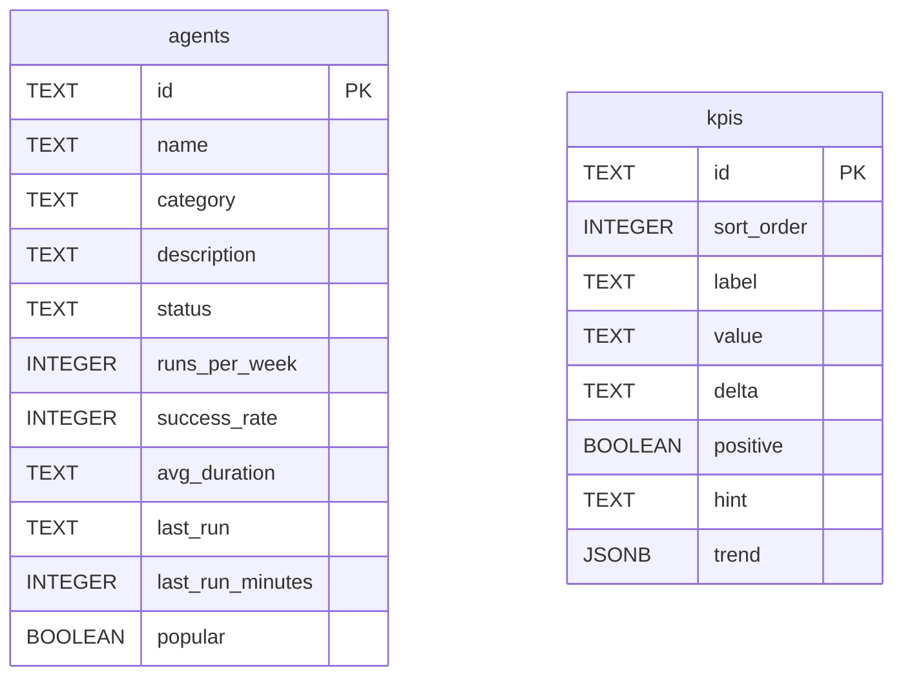

The backend domain types live in `server/src/domain.ts`. The Postgres schema
is in `server/src/db/schema.ts`. The mapping between rows and types is done in
`server/src/postgresStore.ts`.

## Domain types

### `Agent`

```ts
type AgentStatus   = 'running' | 'idle' | 'attention'
type AgentCategory = 'Review' | 'Deploy' | 'Reliability' | 'Quality' | 'Docs'

interface Agent {
  id: string
  name: string
  category: AgentCategory
  description: string
  status: AgentStatus
  runsPerWeek: number
  successRate: number
  avgDuration: string
  lastRun: string
  lastRunMinutes: number
  popular: boolean
}
```

### `Kpi`

```ts
interface Kpi {
  id: string
  label: string
  value: string
  delta: string
  positive: boolean
  hint: string
  trend: number[]
}
```

## Database schema



`agents` and `kpis` are independent tables — no foreign-key relationship.

## Column mapping

### agents

| Domain field | Postgres column | Notes |
|-------------|-----------------|-------|
| `id` | `id` TEXT PK | Kebab slug |
| `name` | `name` TEXT | — |
| `category` | `category` TEXT | Cast `as AgentCategory` at read time |
| `description` | `description` TEXT | — |
| `status` | `status` TEXT | Cast `as AgentStatus` at read time |
| `runsPerWeek` | `runs_per_week` INTEGER | — |
| `successRate` | `success_rate` INTEGER | — |
| `avgDuration` | `avg_duration` TEXT | — |
| `lastRun` | `last_run` TEXT | — |
| `lastRunMinutes` | `last_run_minutes` INTEGER | — |
| `popular` | `popular` BOOLEAN | — |

### kpis

| Domain field | Postgres column | Notes |
|-------------|-----------------|-------|
| `id` | `id` TEXT PK | — |
| — | `sort_order` INTEGER | Not on domain type; ordering only |
| `label` | `label` TEXT | — |
| `value` | `value` TEXT | — |
| `delta` | `delta` TEXT | — |
| `positive` | `positive` BOOLEAN | — |
| `hint` | `hint` TEXT | — |
| `trend` | `trend` JSONB | JSON array; `pg` parses automatically |

## Relationship to the frontend

The frontend (`src/data/agents.ts`, `src/data/kpis.ts`) defines identical
`Agent`, `Kpi`, `AgentStatus`, and `AgentCategory` types. They are kept in sync
by hand — there is no shared package. Any change to the domain shape must be
mirrored in both places.

## Seed data

`server/src/seed.ts` exports `SEED_AGENTS` (12 agents) and `SEED_KPIS` (4 KPIs),
used by:
- `db/setup.ts` to populate Postgres.
- The test suite in `createMemoryStore`.

See [seed.ts](/sdlc-sample-worflow/backend/seed/) for the full catalogue and
[db/schema.ts](/sdlc-sample-worflow/backend/db/schema/) for the full SQL.
