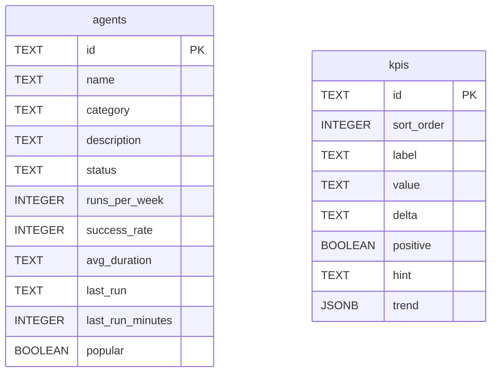

The Snabbit backend uses two Postgres tables: `agents` and `kpis`. The domain types are defined in `server/src/domain.ts`, the SQL schema in `server/src/db/schema.ts`, and the row-to-type mapping in `server/src/postgresStore.ts`.

## Entity-relationship diagram

`agents` and `kpis` are independent tables with no foreign-key relationship between them.

## `agents` table

| Column | SQL type | Nullable | Domain field | Description |
|---|---|---|---|---|
| `id` | `TEXT` | PK (not null) | `id` | Stable kebab-case slug (e.g. `'pr-reviewer'`) |
| `name` | `TEXT NOT NULL` | no | `name` | Human-readable display name |
| `category` | `TEXT NOT NULL` | no | `category` | One of `Review`, `Deploy`, `Reliability`, `Quality`, `Docs` — stored as plain text, not an enum |
| `description` | `TEXT NOT NULL` | no | `description` | One-sentence summary of the agent's purpose |
| `status` | `TEXT NOT NULL` | no | `status` | One of `running`, `idle`, `attention` — stored as plain text |
| `runs_per_week` | `INTEGER NOT NULL` | no | `runsPerWeek` | Weekly execution count; used for `ORDER BY` in `listAgents` |
| `success_rate` | `INTEGER NOT NULL` | no | `successRate` | Success percentage 0–100 |
| `avg_duration` | `TEXT NOT NULL` | no | `avgDuration` | Human-readable average duration (e.g. `'2m 40s'`) |
| `last_run` | `TEXT NOT NULL` | no | `lastRun` | Human-readable recency label (e.g. `'3m ago'`) |
| `last_run_minutes` | `INTEGER NOT NULL` | no | `lastRunMinutes` | Numeric minutes since last run; used for programmatic sorting |
| `popular` | `BOOLEAN NOT NULL` | no | `popular` | Filters into the "popular" tab on the dashboard |

:::note
`category` and `status` are stored as `TEXT` rather than Postgres `ENUM` types. Using `TEXT` means adding new values requires no `ALTER TYPE` migration — only a code change and a data update. The TypeScript union type narrowing is applied at read time in `rowToAgent()`.
:::

## `kpis` table

| Column | SQL type | Nullable | Domain field | Description |
|---|---|---|---|---|
| `id` | `TEXT` | PK (not null) | `id` | Stable identifier (e.g. `'agent-runs'`) |
| `sort_order` | `INTEGER NOT NULL` | no | — | Display ordering position (not in the `Kpi` domain type) |
| `label` | `TEXT NOT NULL` | no | `label` | Metric display name (e.g. `'Agent runs · 7d'`) |
| `value` | `TEXT NOT NULL` | no | `value` | Pre-formatted current value (e.g. `'1,284'`) |
| `delta` | `TEXT NOT NULL` | no | `delta` | Pre-formatted period change (e.g. `'+18%'`) |
| `positive` | `BOOLEAN NOT NULL` | no | `positive` | `true` when the delta is a favorable outcome |
| `hint` | `TEXT NOT NULL` | no | `hint` | Sub-label shown beneath the sparkline |
| `trend` | `JSONB NOT NULL` | no | `trend` | JSON array of 7 numbers for the sparkline chart |

### `sort_order` column

`sort_order` does not appear in the `Kpi` domain type. It exists solely to preserve the intended display order of KPIs in a way that is independent of the `id` column's alphabetical order. It is set to the array index at seeding time (`0` through `3`) and used only in `ORDER BY sort_order ASC`. After the query executes, the value is discarded — it never appears in an API response.

### `trend` storage

The `trend` field is stored as `JSONB` (binary JSON), not `JSON` (text JSON). Benefits of `JSONB` over `JSON`:

- Faster read access (stored in parsed binary form)
- Supports GIN indexes for future JSON path queries
- Deduplicates object keys (not relevant for arrays)

`pg` automatically deserializes `JSONB` columns into native JavaScript values on read — no `JSON.parse()` call is needed. On write (`db/setup.ts`), the array is serialized with `JSON.stringify(k.trend)` before passing to `pg`.

## Domain type relationship to the frontend

The frontend defines identical types in `src/data/agents.ts` and `src/data/kpis.ts`. There is no shared TypeScript package — the two sets are kept in sync manually. Any change to a field name, type, or union value must be mirrored in both places.

## Seed data

The initial data for both tables is in `server/src/seed.ts`:

- `SEED_AGENTS` — 12 agents
- `SEED_KPIS` — 4 KPIs

`db/setup.ts` upserts this data into Postgres using `INSERT … ON CONFLICT (id) DO UPDATE`. Running the setup script on an already-seeded database refreshes all rows back to seed values.

See [seed.ts](/backend/seed/) for the full data tables and [db/schema.ts](/backend/db/schema/) for the full SQL.
