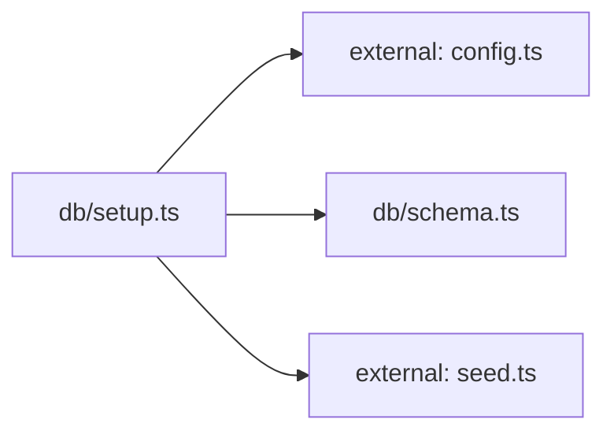

**Folder:** `server/src/db/`

<!-- fill:folder:summary -->
This folder owns the Postgres persistence layer's setup. [`schema.ts`](../db/schema) holds the idempotent `CREATE TABLE` SQL for the `agents` and `kpis` tables, and [`setup.ts`](../db/setup) is the one-shot bootstrap that applies that schema and upserts the seed data. Files that define database structure or perform schema/seed bootstrapping belong here; request handling, domain types, and the runtime query layer (`postgresStore.ts`) live outside this folder.
<!-- /fill:folder:summary -->

## Files

| File | Hint |
| --- | --- |
| [`schema.ts`](../db/schema) | Postgres schema for the Snabbit Agent Console. Idempotent. |
| [`setup.ts`](../db/setup) | One-shot database setup: create tables and upsert seed data. |

## Dependencies

### Module dependency subgraph

## Key flows

<!-- fill:folder:flows -->
- `npm run db:setup` runs [`setup.ts`](../db/setup), which connects a `pg` `Pool` using `config.databaseUrl`, executes `SCHEMA_SQL` from [`schema.ts`](../db/schema) to create the tables if absent, then upserts every entry from `SEED_AGENTS` and `SEED_KPIS` (see the dependency subgraph above).
- Each seed row is written with `INSERT ... ON CONFLICT (id) DO UPDATE`, so re-running setup refreshes existing rows instead of failing — the whole flow is idempotent and ends by closing the pool.
<!-- /fill:folder:flows -->
