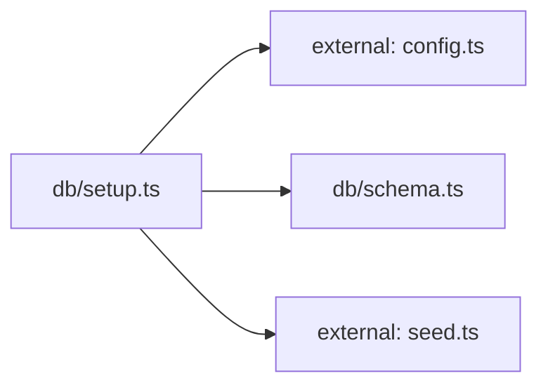

**Folder:** `server/src/db/`

<FILL: 2-4 sentences on what this folder is for, what kinds of modules belong here, and what does NOT belong here.>

## Files

| File | Hint |
| --- | --- |
| [`schema.ts`](../db/schema) | Postgres schema for the Snabbit Agent Console. Idempotent. |
| [`setup.ts`](../db/setup) | One-shot database setup: create tables and upsert seed data. |

## Dependencies

### Module dependency subgraph

## Key flows

<FILL: 1-3 short descriptions of how modules in this folder cooperate at runtime.>
