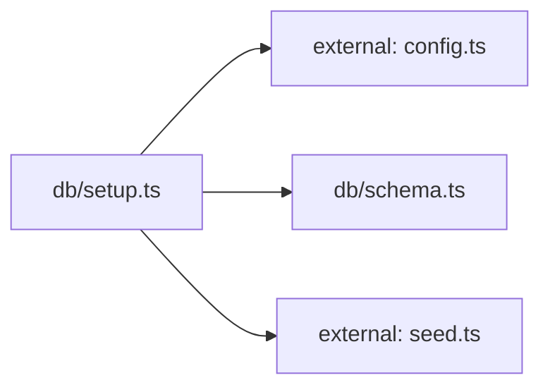

**Folder:** `server/src/db/`

<!-- fill:folder:summary -->
`server/src/db/` holds the database bootstrap code: `schema.ts` exports the idempotent `CREATE TABLE` SQL for the `agents` and `kpis` tables, and `setup.ts` is the one-shot script (`npm run db:setup`) that applies that schema and upserts the seed catalogue. As the subgraph shows, `setup.ts` pulls the connection string from `config.ts`, the DDL from `schema.ts`, and the rows from `seed.ts`. Runtime query logic does not belong here — that lives in `postgresStore.ts`; this folder is only concerned with creating and populating the schema.
<!-- /fill:folder:summary -->

## Files

| File | Hint |
| --- | --- |
| [`schema.ts`](../db/schema) | Postgres schema for the Snabbit Agent Console. Idempotent. |
| [`setup.ts`](../db/setup) | One-shot database setup: create tables and upsert seed data. |

## Dependencies

### Module dependency subgraph

## Key flows

<!-- fill:folder:flows -->
- **Database setup:** Running `npm run db:setup` executes `setup.ts`, which opens a `pg` Pool from `config.databaseUrl`, runs `SCHEMA_SQL` from `schema.ts` to create the tables if absent, then loops over `SEED_AGENTS` and `SEED_KPIS` from `seed.ts`, upserting each row with `ON CONFLICT (id) DO UPDATE` so the command is safe to re-run.
<!-- /fill:folder:flows -->
