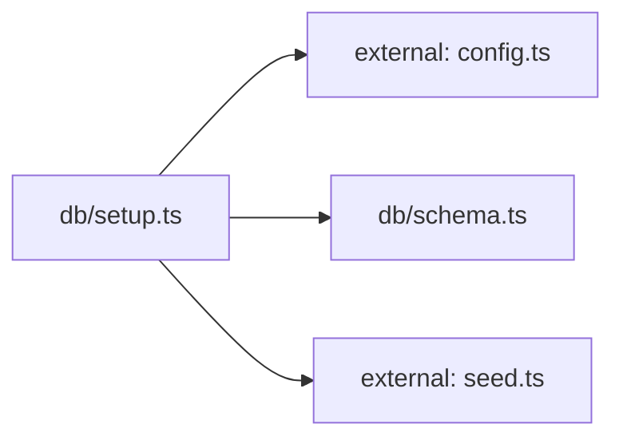

**Folder:** `server/src/db/`

<!-- fill:folder:summary -->
This folder owns the database's physical layout and one-time provisioning. `schema.ts` exports the idempotent `SCHEMA_SQL` that creates the `agents` and `kpis` tables, and `setup.ts` is the `npm run db:setup` script that runs that SQL and upserts the seed rows from `seed.ts`. DDL and seeding scripts belong here. The runtime query logic that the server uses to read rows lives outside this folder in `postgresStore.ts`, and the seed data itself lives in `seed.ts`.
<!-- /fill:folder:summary -->

## Files

| File | Hint |
| --- | --- |
| [`schema.ts`](../db/schema) | Postgres schema for the Snabbit Agent Console. Idempotent. |
| [`setup.ts`](../db/setup) | One-shot database setup: create tables and upsert seed data. |

## Dependencies

### Module dependency subgraph

## Key flows

<!-- fill:folder:flows -->
As the module dependency subgraph above shows, `setup.ts` is the orchestrator: it reads `config.ts` for the `DATABASE_URL`, runs the `SCHEMA_SQL` it imports from `schema.ts` to create the tables, then upserts the `SEED_AGENTS` and `SEED_KPIS` it imports from `seed.ts`. The upserts use `ON CONFLICT (id) DO UPDATE`, so re-running `db:setup` refreshes existing rows rather than failing. Once the tables exist, the running server reads from them through `postgresStore.ts` — `setup.ts` does no work at request time.
<!-- /fill:folder:flows -->
