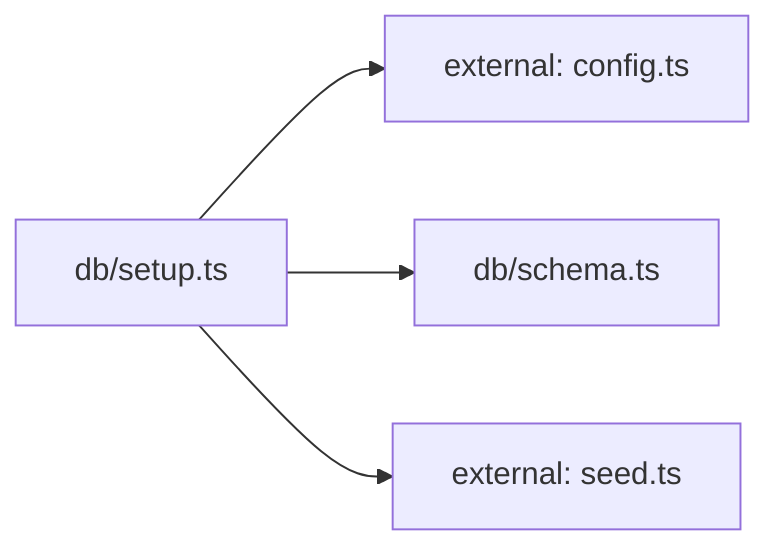

**Folder:** `server/src/db/`

<!-- fill:folder:summary -->
One-shot Postgres scaffolding for the API. `schema.ts` exports the idempotent DDL (`CREATE TABLE IF NOT EXISTS …`) for the `agents` and `kpis` tables; `setup.ts` is the CLI script (`npm run db:setup`) that opens a pool, applies the schema, then upserts every row from `seed.ts`. Live query logic lives in `postgresStore.ts`, not here — this folder is purely for setup/migration.
<!-- /fill:folder:summary -->

## Files

| File | Hint |
| --- | --- |
| [`schema.ts`](../db/schema) | Postgres schema for the Snabbit Agent Console. Idempotent. |
| [`setup.ts`](../db/setup) | One-shot database setup: create tables and upsert seed data. |

## Dependencies

### Module dependency subgraph

## Key flows

<!-- fill:folder:flows -->
- **One-shot setup.** `npm run db:setup` invokes `db/setup.ts`, which builds a `pg` `Pool` from `config.databaseUrl`, runs `SCHEMA_SQL` from `schema.ts`, then iterates `SEED_AGENTS`/`SEED_KPIS` from `seed.ts` and upserts each row via `INSERT … ON CONFLICT (id) DO UPDATE`. Re-running is safe because both DDL and DML are idempotent.
- **KPI ordering.** Inside `setup.ts`, each `SEED_KPI`'s array index `i` is written to the `sort_order` column, which is the same column `postgresStore.ts`'s `listKpis` orders by — so the display order in the dashboard matches the order in `seed.ts`.
<!-- /fill:folder:flows -->
