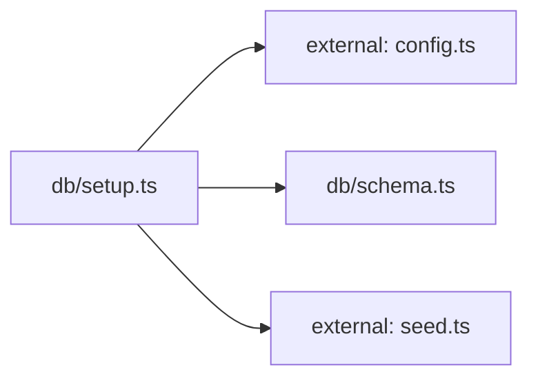

**Folder:** `server/src/db/`

<!-- fill:folder:summary -->
This folder owns the Postgres persistence layer's data definition and bootstrap. [`schema.ts`](../db/schema) exports the idempotent `SCHEMA_SQL` that creates the `agents` and `kpis` tables, and [`setup.ts`](../db/setup) is a one-shot script (`npm run db:setup`) that applies that SQL and upserts the seed rows from `seed.ts`. Files belong here when they define table structure or perform schema/seed migrations. Query logic against these tables does not live here — that is in `postgresStore.ts`, which maps rows to the `domain.ts` types.
<!-- /fill:folder:summary -->

## Files

| File | Hint |
| --- | --- |
| [`schema.ts`](../db/schema) | Postgres schema for the Snabbit Agent Console. Idempotent. |
| [`setup.ts`](../db/setup) | One-shot database setup: create tables and upsert seed data. |

## Dependencies

### Module dependency subgraph

## Key flows

<!-- fill:folder:flows -->
As the dependency subgraph above shows, `setup.ts` is the only active module: its `main()` opens a `pg` `Pool` using `config.databaseUrl`, runs `SCHEMA_SQL` from `schema.ts` to create the tables, then loops over `SEED_AGENTS` and `SEED_KPIS` from `seed.ts` issuing `INSERT ... ON CONFLICT (id) DO UPDATE` statements so reruns are idempotent. The script logs a readiness summary and always closes the pool in a `finally` block; any failure is caught and exits the process with code 1. At normal runtime the tables created here are read by `postgresStore.ts`, not by this folder.
<!-- /fill:folder:flows -->
