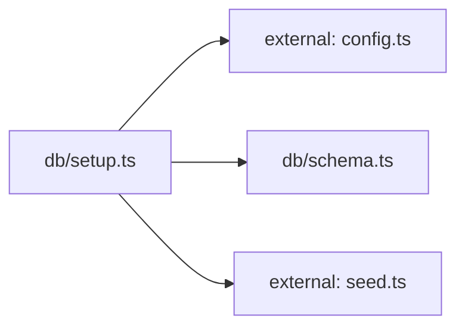

**Folder:** `server/src/db/`

<!-- fill:folder:summary -->
This folder holds Postgres-only concerns: the idempotent table schema (`schema.ts`) and the one-shot setup/seed script (`setup.ts`) invoked via `npm run db:setup`. Both are detached from request handling — `setup.ts` is its own `node` entrypoint. Runtime query code belongs in `../postgresStore.ts`, and domain types belong in `../domain.ts`.
<!-- /fill:folder:summary -->

## Files

| File | Hint |
| --- | --- |
| [`schema.ts`](../db/schema) | Postgres schema for the Snabbit Agent Console. Idempotent. |
| [`setup.ts`](../db/setup) | One-shot database setup: create tables and upsert seed data. |

## Dependencies

### Module dependency subgraph

## Key flows

<!-- fill:folder:flows -->
- **`npm run db:setup`** runs `setup.ts`: it opens a `pg` `Pool` using `config.databaseUrl`, executes `SCHEMA_SQL` from `schema.ts` (creates `agents` and `kpis` tables if missing), then iterates `SEED_AGENTS` and `SEED_KPIS` from `../seed.ts` and runs `INSERT … ON CONFLICT (id) DO UPDATE` for each row so the script is safely re-runnable.
<!-- /fill:folder:flows -->
