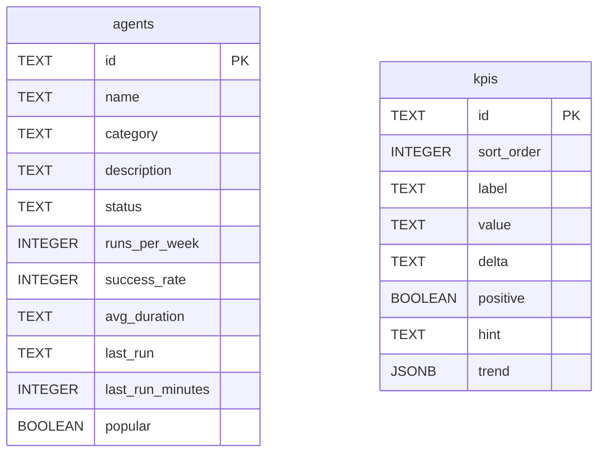

**File:** `server/src/db/schema.ts` · **Lines:** 28

> Postgres schema for the Snabbit Agent Console. Idempotent.

## Symbols

This file exports 1 symbol. Every export is documented below, in declaration order.

| Name | Kind | Default |
| --- | --- | --- |
| SCHEMA_SQL | const | no |

## SCHEMA_SQL

**Kind:** `const`

```ts
const SCHEMA_SQL: "\nCREATE TABLE IF NOT EXISTS agents (\n id TEXT PRIMARY KEY,\n name TEXT NOT NULL,\n category TEXT NOT NULL,\n description TEXT NOT NULL,\n status TEXT NOT NULL,\n runs_per_week INTEGER NOT NULL,\n success_rate INTEGER NOT NULL,\n avg_duration TEXT NOT NULL,\n last_run TEXT NOT NULL,\n last_run_minutes INTEGER NOT NULL,\n popular BOOLEAN NOT NULL\n);\n\nCREATE TABLE IF NOT EXISTS kpis (\n id TEXT PRIMARY KEY,\n sort_order INTEGER NOT NULL,\n label TEXT NOT NULL,\n value TEXT NOT NULL,\n delta TEXT NOT NULL,\n positive BOOLEAN NOT NULL,\n hint TEXT NOT NULL,\n trend JSONB NOT NULL\n);\n"
```

> Postgres schema for the Snabbit Agent Console. Idempotent.

### Used by

- `server/src/db/setup.ts`

## Diagrams

<!-- fill:file:diagrams -->
The two standalone tables defined by `SCHEMA_SQL` (there are no foreign keys between them):


<!-- /fill:file:diagrams -->

## Source

Full file source for `server/src/db/schema.ts` (28 lines). The line-by-line walkthroughs above reference these line numbers.

<details>
<summary>View source (28 lines)</summary>

````ts
/** Postgres schema for the Snabbit Agent Console. Idempotent. */
export const SCHEMA_SQL = `
CREATE TABLE IF NOT EXISTS agents (
  id               TEXT PRIMARY KEY,
  name             TEXT NOT NULL,
  category         TEXT NOT NULL,
  description      TEXT NOT NULL,
  status           TEXT NOT NULL,
  runs_per_week    INTEGER NOT NULL,
  success_rate     INTEGER NOT NULL,
  avg_duration     TEXT NOT NULL,
  last_run         TEXT NOT NULL,
  last_run_minutes INTEGER NOT NULL,
  popular          BOOLEAN NOT NULL
);

CREATE TABLE IF NOT EXISTS kpis (
  id         TEXT PRIMARY KEY,
  sort_order INTEGER NOT NULL,
  label      TEXT NOT NULL,
  value      TEXT NOT NULL,
  delta      TEXT NOT NULL,
  positive   BOOLEAN NOT NULL,
  hint       TEXT NOT NULL,
  trend      JSONB NOT NULL
);
`

````

</details>
