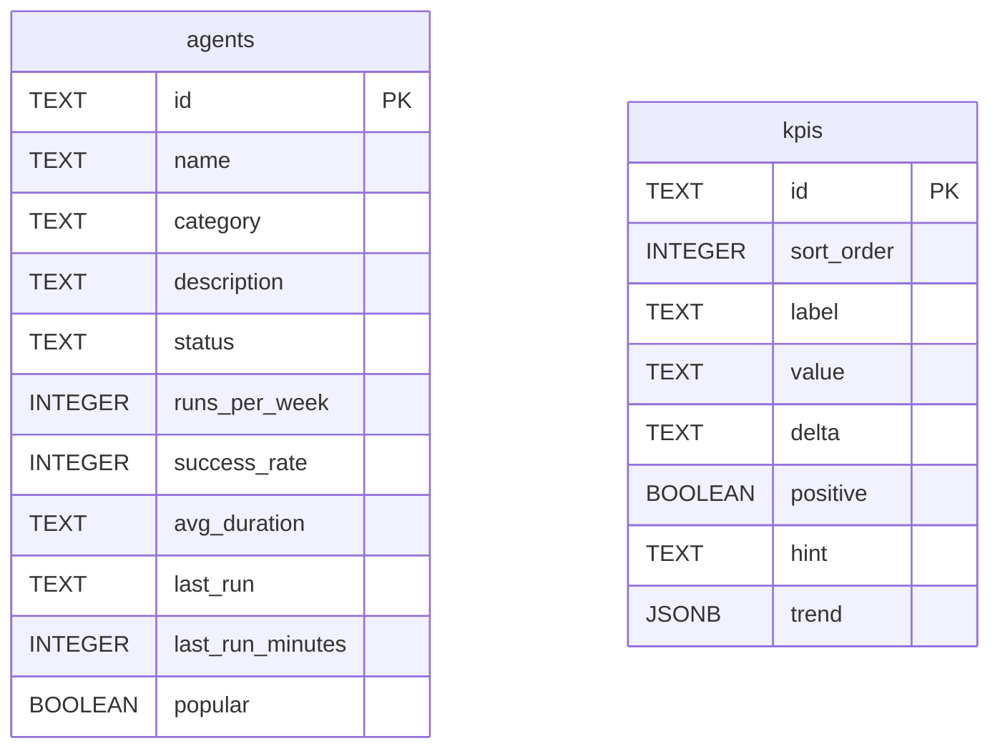

**File:** `server/src/db/schema.ts`

Exports the SQL string that creates the `agents` and `kpis` tables.

## `SCHEMA_SQL`

```ts
export const SCHEMA_SQL: string
```

A single SQL string containing two `CREATE TABLE IF NOT EXISTS` statements.
The `IF NOT EXISTS` clause makes the script idempotent — running it on a
database that already has the tables is a no-op.

## Full schema

```sql
CREATE TABLE IF NOT EXISTS agents (
  id               TEXT PRIMARY KEY,
  name             TEXT NOT NULL,
  category         TEXT NOT NULL,
  description      TEXT NOT NULL,
  status           TEXT NOT NULL,
  runs_per_week    INTEGER NOT NULL,
  success_rate     INTEGER NOT NULL,
  avg_duration     TEXT NOT NULL,
  last_run         TEXT NOT NULL,
  last_run_minutes INTEGER NOT NULL,
  popular          BOOLEAN NOT NULL
);

CREATE TABLE IF NOT EXISTS kpis (
  id         TEXT PRIMARY KEY,
  sort_order INTEGER NOT NULL,
  label      TEXT NOT NULL,
  value      TEXT NOT NULL,
  delta      TEXT NOT NULL,
  positive   BOOLEAN NOT NULL,
  hint       TEXT NOT NULL,
  trend      JSONB NOT NULL
);
```

## Table: `agents`

| Column | Type | Notes |
|--------|------|-------|
| `id` | `TEXT PRIMARY KEY` | Stable kebab-case slug |
| `name` | `TEXT NOT NULL` | Display name |
| `category` | `TEXT NOT NULL` | One of the 5 categories; stored as plain text |
| `description` | `TEXT NOT NULL` | One-sentence summary |
| `status` | `TEXT NOT NULL` | `'running'`, `'idle'`, or `'attention'` |
| `runs_per_week` | `INTEGER NOT NULL` | Weekly execution count |
| `success_rate` | `INTEGER NOT NULL` | 0–100 percentage |
| `avg_duration` | `TEXT NOT NULL` | Human-readable (e.g. `'2m 40s'`) |
| `last_run` | `TEXT NOT NULL` | Human-readable (e.g. `'3m ago'`) |
| `last_run_minutes` | `INTEGER NOT NULL` | Numeric minutes for sorting |
| `popular` | `BOOLEAN NOT NULL` | Popular-tab flag |

`category` and `status` are stored as `TEXT` rather than Postgres `ENUM` types.
This simplifies schema migrations when new values are added — a `TEXT` column
does not require `ALTER TYPE ... ADD VALUE`. The application layer (`postgresStore.ts`)
casts to the TypeScript union types at read time.

## Table: `kpis`

| Column | Type | Notes |
|--------|------|-------|
| `id` | `TEXT PRIMARY KEY` | Stable identifier |
| `sort_order` | `INTEGER NOT NULL` | Controls `SELECT … ORDER BY sort_order ASC` |
| `label` | `TEXT NOT NULL` | Metric name |
| `value` | `TEXT NOT NULL` | Pre-formatted display value |
| `delta` | `TEXT NOT NULL` | Pre-formatted change string |
| `positive` | `BOOLEAN NOT NULL` | Outcome sentiment |
| `hint` | `TEXT NOT NULL` | Sub-label text |
| `trend` | `JSONB NOT NULL` | JSON array of numbers |

`trend` is stored as `JSONB` (binary JSON) rather than `JSON` for better query
performance and the ability to index into it in future. `pg` automatically
parses JSONB columns into JavaScript arrays on read.

`sort_order` is not part of the domain `Kpi` type — it exists only in the
database to preserve the intended display order independently of `id` ordering.

## ER diagram



## Used by

`server/src/db/setup.ts`:

```ts
await pool.query(SCHEMA_SQL)
```
