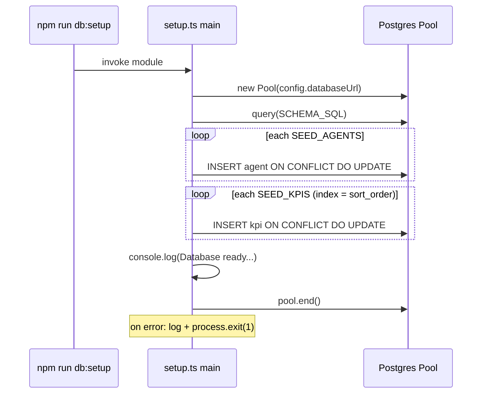

**File:** `server/src/db/setup.ts` · **Lines:** 68

<!-- fill:file:summary -->
This is the one-shot database bootstrap script, run via `npm run db:setup`. It opens a `pg` `Pool` against `config.databaseUrl`, executes `SCHEMA_SQL` from `./schema` to create the `agents` and `kpis` tables if they do not exist, then upserts every row from `SEED_AGENTS` and `SEED_KPIS` (imported from `../seed`). It has no exports — running the module is the side effect; on success it logs a ready message, and on failure it logs the error and exits with code 1.
<!-- /fill:file:summary -->

## Imports

This file pulls in the following modules. Relative imports point to other documented files; external imports are libraries from `node_modules`.

| Module | Imports | Kind |
| --- | --- | --- |
| `pg` | `Pool` | external |
| `../config` | `config` | internal |
| `./schema` | `SCHEMA_SQL` | internal |
| `../seed` | `SEED_AGENTS`, `SEED_KPIS` | internal |

:::note
No exported symbols detected by the AST. This file is a side-effect entrypoint, a re-export barrel, or a runtime bootstrap — open `server/src/db/setup.ts` directly to read the source.
:::

## Diagrams

<!-- fill:file:diagrams -->
The `main()` bootstrap sequence:

<!-- /fill:file:diagrams -->
