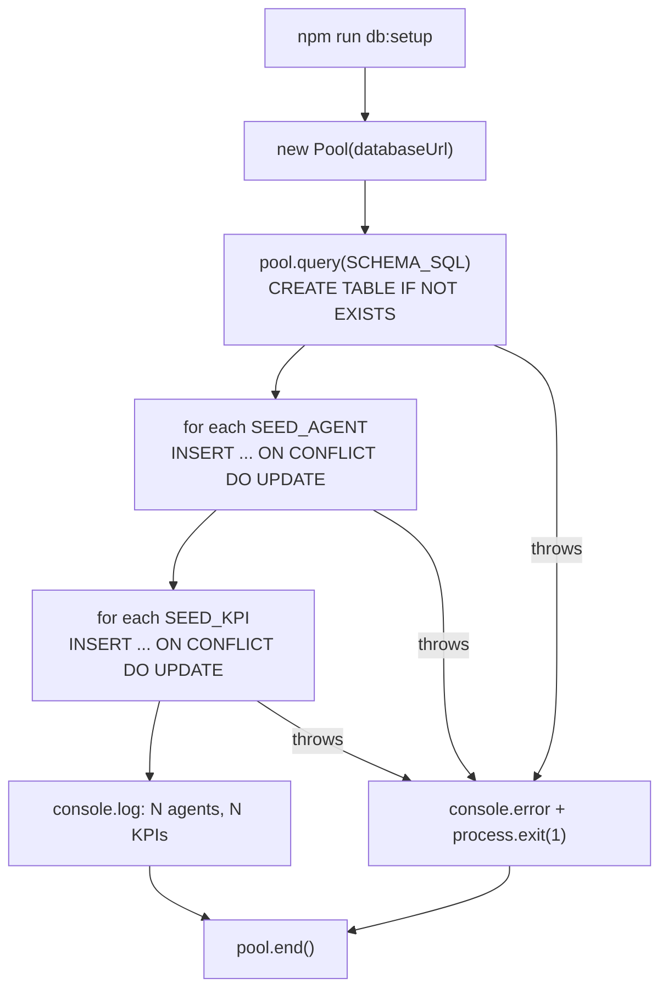

**File:** `server/src/db/setup.ts`

A standalone script run via `npm run db:setup`. Creates the Postgres schema and
upserts the seed agents and KPIs. Safe to re-run — the upsert logic refreshes
existing data rather than duplicating it.

## Running it

```bash
cd server
export DATABASE_URL="postgres://localhost:5432/snabbit_dash"
npm run db:setup
```

On success it prints:

```
Database ready: 12 agents, 4 KPIs.
```

On failure it prints the error and exits with code 1.

## `main` function

```ts
async function main(): Promise<void>
```

The top-level async function. Not exported — it is invoked immediately at the
bottom of the file:

```ts
main().catch((err) => {
  console.error('Database setup failed:', err)
  process.exit(1)
})
```

### Step 1: Create tables

```ts
await pool.query(SCHEMA_SQL)
```

Runs the idempotent `CREATE TABLE IF NOT EXISTS` statements from `schema.ts`.
No-op if tables already exist.

### Step 2: Upsert agents

```ts
for (const a of SEED_AGENTS) {
  await pool.query(
    `INSERT INTO agents
       (id, name, category, description, status, runs_per_week,
        success_rate, avg_duration, last_run, last_run_minutes, popular)
     VALUES ($1,$2,$3,$4,$5,$6,$7,$8,$9,$10,$11)
     ON CONFLICT (id) DO UPDATE SET
       name = EXCLUDED.name,
       category = EXCLUDED.category,
       ...`,
    [a.id, a.name, a.category, a.description, a.status, a.runsPerWeek,
     a.successRate, a.avgDuration, a.lastRun, a.lastRunMinutes, a.popular],
  )
}
```

Each agent is upserted with `INSERT … ON CONFLICT (id) DO UPDATE`. If a row
with the same `id` exists, all non-key columns are updated to the seed values.
This means re-running the script refreshes live data back to the seed state.

The parameters (`$1` through `$11`) are positional placeholders — `pg` handles
escaping. The mapping is:

| `$n` | `Agent` field | Column |
|------|--------------|--------|
| `$1` | `id` | `id` |
| `$2` | `name` | `name` |
| `$3` | `category` | `category` |
| `$4` | `description` | `description` |
| `$5` | `status` | `status` |
| `$6` | `runsPerWeek` | `runs_per_week` |
| `$7` | `successRate` | `success_rate` |
| `$8` | `avgDuration` | `avg_duration` |
| `$9` | `lastRun` | `last_run` |
| `$10` | `lastRunMinutes` | `last_run_minutes` |
| `$11` | `popular` | `popular` |

### Step 3: Upsert KPIs

```ts
for (let i = 0; i < SEED_KPIS.length; i++) {
  const k = SEED_KPIS[i]
  await pool.query(
    `INSERT INTO kpis (id, sort_order, label, value, delta, positive, hint, trend)
     VALUES ($1,$2,$3,$4,$5,$6,$7,$8)
     ON CONFLICT (id) DO UPDATE SET ...`,
    [k.id, i, k.label, k.value, k.delta, k.positive, k.hint, JSON.stringify(k.trend)],
  )
}
```

`sort_order` is set to the loop index `i` (0-based). This preserves the display
order of the KPIs as defined in `SEED_KPIS`.

`k.trend` is serialized with `JSON.stringify()` before passing to `pg`. The
column is `JSONB` — Postgres accepts either a JSON string or a JavaScript object
from `pg`, but explicit serialization here makes the intent clear.

### Step 4: Close pool

```ts
} finally {
  await pool.end()
}
```

The `finally` block ensures the pool is closed even if the upserts fail, which
prevents the Node process from hanging on an open connection.

## Script flow


