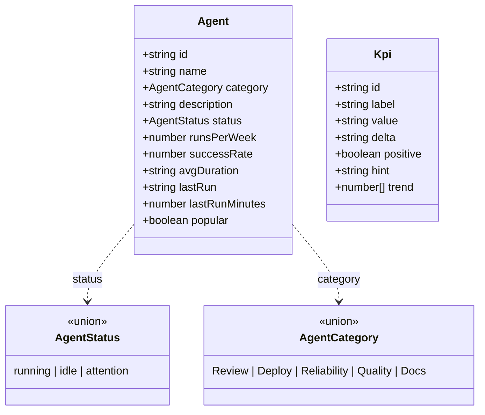

<!-- structure:354170a781cb -->

**File:** `server/src/domain.ts` · **Lines:** 33

<!-- fill:file:summary -->
`domain.ts` defines the core data types for the Snabbit Agent Console API: the `AgentStatus` and `AgentCategory` string unions and the `Agent` and `Kpi` interfaces. These shapes are designed to mirror exactly what the frontend expects, so the same vocabulary flows from the database through the API to the UI. They are consumed by `store.ts` (the `Store` interface and in-memory store), `postgresStore.ts` (which maps SQL rows into `Agent` and `Kpi`), and `seed.ts` (which provides the seed catalogue). This file is pure type declarations with no runtime logic.
<!-- /fill:file:summary -->

## Symbols

This file exports 4 symbols. Every export is documented below, in declaration order.

| Name | Kind | Default |
| --- | --- | --- |
| AgentStatus | type | no |
| AgentCategory | type | no |
| Agent | interface | no |
| Kpi | interface | no |

## AgentStatus

**Kind:** `type`

```ts
export type AgentStatus = 'running' | 'idle' | 'attention'
```

<!-- fill:sym:AgentStatus:summary -->
`AgentStatus` is a string-literal union restricting an agent's operational state to one of three values: `'running'`, `'idle'`, or `'attention'`. It exists to give the rest of the codebase a closed, type-checked vocabulary for agent state rather than an open `string`. `postgresStore.ts` casts the raw `status` text column to this type when mapping a database row into an `Agent`.
<!-- /fill:sym:AgentStatus:summary -->

### Used by

- `server/src/postgresStore.ts`

## AgentCategory

**Kind:** `type`

```ts
export type AgentCategory = 'Review' | 'Deploy' | 'Reliability' | 'Quality' | 'Docs'
```

<!-- fill:sym:AgentCategory:summary -->
`AgentCategory` is a string-literal union that classifies an agent into one of five fixed buckets: `'Review'`, `'Deploy'`, `'Reliability'`, `'Quality'`, or `'Docs'`. It exists so categories are constrained to a known set the frontend can group and filter on, instead of arbitrary strings. `postgresStore.ts` casts the raw `category` text column to this type when building an `Agent` from a row.
<!-- /fill:sym:AgentCategory:summary -->

### Used by

- `server/src/postgresStore.ts`

## Agent

**Kind:** `interface`

```ts
export interface Agent { ... }
```

<!-- fill:sym:Agent:summary -->
`Agent` is the central record describing a single automation agent in the console, combining identity (`id`, `name`), classification (`category`, `status`), and a set of usage metrics (`runsPerWeek`, `successRate`, `avgDuration`, `lastRun`, `lastRunMinutes`, `popular`). It exists as the canonical shape returned by the `/api/agents` endpoints and consumed by the frontend. The `Store` interface in `store.ts` returns `Agent[]` and `Agent | null`, `postgresStore.ts` assembles it from an `AgentRow`, and `seed.ts` supplies a hard-coded catalogue of these objects.
<!-- /fill:sym:Agent:summary -->

### Shape

| Name | Type | Description |
| --- | --- | --- |
| id | `string` | Stable unique identifier (slug, e.g. `pr-reviewer`); used as the `:id` path parameter and the primary key. |
| name | `string` | Human-readable display name shown in the UI (e.g. `PR Reviewer`). |
| category | `AgentCategory` | Functional grouping the agent belongs to (Review, Deploy, Reliability, Quality, or Docs). |
| description | `string` | One-sentence summary of what the agent does. |
| status | `AgentStatus` | Current operational state: running, idle, or attention. |
| runsPerWeek | `number` | Number of times the agent executed in the last 7 days (count). |
| successRate | `number` | Percentage of runs that succeeded, 0–100. |
| avgDuration | `string` | Pre-formatted mean run duration for display (e.g. `2m 40s`). |
| lastRun | `string` | Pre-formatted relative time of the most recent run (e.g. `3m ago`). |
| lastRunMinutes | `number` | Minutes elapsed since the last run, used for sorting/comparison. |
| popular | `boolean` | Whether the agent is flagged as popular for UI highlighting. |

### Used by

- `server/src/store.ts`
- `server/src/postgresStore.ts`
- `server/src/seed.ts`

## Kpi

**Kind:** `interface`

```ts
export interface Kpi { ... }
```

<!-- fill:sym:Kpi:summary -->
`Kpi` describes a single key-performance-indicator tile for the dashboard, pairing a `label` and pre-formatted `value` with a `delta`, a `positive` flag, a `hint`, and a `trend` array of points for a sparkline. It exists as the shape returned by the `/api/kpis` endpoint and rendered directly by the frontend KPI cards. The `KpiStore` interface in `store.ts` returns `Kpi[]`, `postgresStore.ts` builds it from a `KpiRow`, and `seed.ts` provides the seed list.
<!-- /fill:sym:Kpi:summary -->

### Shape

| Name | Type | Description |
| --- | --- | --- |
| id | `string` | Stable unique identifier for the KPI (slug, e.g. `agent-runs`); primary key. |
| label | `string` | Display label for the KPI tile (e.g. `Agent runs · 7d`). |
| value | `string` | Pre-formatted headline value as shown (e.g. `1,284` or `4h 12m`). |
| delta | `string` | Pre-formatted change vs. the prior period (e.g. `+18%` or `-22%`). |
| positive | `boolean` | Whether the delta represents a good outcome, used to colour the trend. |
| hint | `string` | Tooltip text explaining what the metric measures. |
| trend | `number[]` | Ordered series of data points (oldest to newest) for the sparkline. |

### Used by

- `server/src/store.ts`
- `server/src/postgresStore.ts`
- `server/src/seed.ts`

## Diagrams

<!-- fill:file:diagrams -->

<!-- /fill:file:diagrams -->
