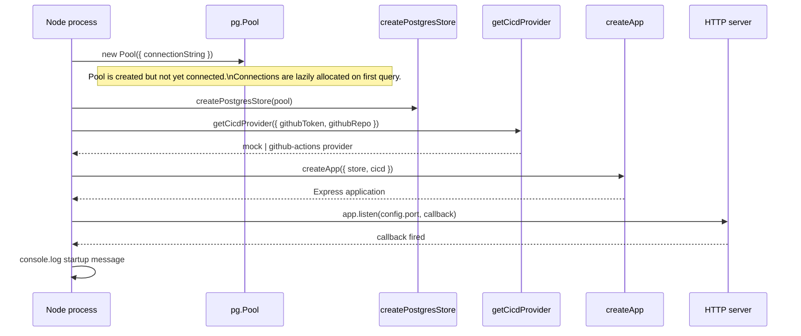

**File:** `server/src/index.ts`

The production server entry point. Creates the `pg` pool, instantiates the
Postgres store and the configured CI/CD provider, builds the Express app via
`createApp`, and starts listening.

## Full source

```ts
import { Pool } from 'pg'
import { config } from './config'
import { createApp } from './app'
import { createPostgresStore } from './postgresStore'
import { getCicdProvider } from './integrations/cicd'

const pool = new Pool({ connectionString: config.databaseUrl })
const store = createPostgresStore(pool)
const cicd = getCicdProvider({
  githubToken: config.githubToken,
  githubRepo: config.githubRepo,
})

const app = createApp({ store, cicd })

app.listen(config.port, () => {
  console.log(
    `Snabbit API listening on http://localhost:${config.port}  ·  CI/CD provider: ${cicd.name}`,
  )
})
```

## Bootstrap sequence



## Connection pool

```ts
const pool = new Pool({ connectionString: config.databaseUrl })
```

A single `pg.Pool` is created at startup and shared across all query operations
via `createPostgresStore`. The pool manages multiple database connections
internally and allocates them lazily on first use. `index.ts` never closes the
pool — it lives for the lifetime of the process.

## Startup log

The `listen` callback logs:

```
Snabbit API listening on http://localhost:3001  ·  CI/CD provider: mock
```

The `cicd.name` field tells operators which provider was selected without
having to inspect environment variables.

## Running

```bash
# Development (auto-reload on file change):
npm run dev      # tsx watch src/index.ts

# Production:
npm start        # tsx src/index.ts
```
