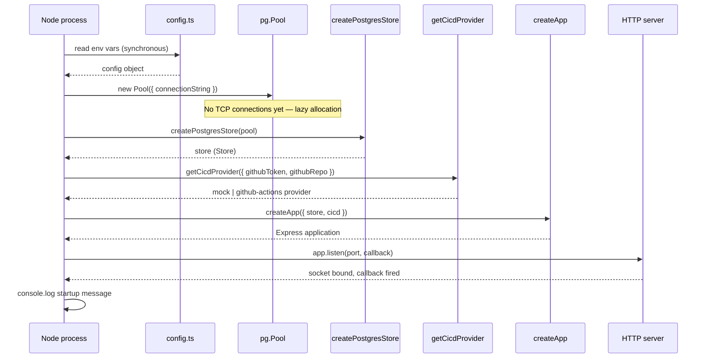

**File:** `server/src/index.ts`

The production server entry point. Every line creates exactly one thing or calls one function. Its sole responsibility is to wire the real dependencies together and start listening.

## Full source

```ts
import { Pool } from 'pg'
import { config } from './config'
import { createApp } from './app'
import { createPostgresStore } from './postgresStore'
import { getCicdProvider } from './integrations/cicd'

const pool = new Pool({ connectionString: config.databaseUrl })
const store = createPostgresStore(pool)
const cicd = getCicdProvider({
  githubToken: config.githubToken,
  githubRepo: config.githubRepo,
})

const app = createApp({ store, cicd })

app.listen(config.port, () => {
  console.log(`Snabbit API listening on http://localhost:${config.port}  ·  CI/CD provider: ${cicd.name}`)
})
```

## Line-by-line documentation

### Imports

```ts
import { Pool } from 'pg'
```

`Pool` is the `node-postgres` connection pool class. A single pool is shared across all store operations for the lifetime of the process. The pool manages multiple underlying TCP connections and allocates them lazily on first use.

```ts
import { config } from './config'
```

Reads all environment variables once at startup. `config` is a plain object — no dynamic re-reading at request time.

```ts
import { createApp } from './app'
```

The Express application factory. Takes `AppDeps` and returns a configured, non-listening `express.Application`.

```ts
import { createPostgresStore } from './postgresStore'
```

The production data access implementation. Accepts a `pg.Pool` and returns a `Store`.

```ts
import { getCicdProvider } from './integrations/cicd'
```

The provider selector. Returns `createMockCicdProvider()` or `createGithubActionsProvider(token, repo)` depending on whether credentials are present.

### Pool creation

```ts
const pool = new Pool({ connectionString: config.databaseUrl })
```

Creates a `pg.Pool` configured with the database URL from config. The pool does **not** open any TCP connections at this point — connections are established lazily when the first query runs. `index.ts` never calls `pool.end()` — the pool lives for the entire process lifetime.

### Store creation

```ts
const store = createPostgresStore(pool)
```

Wraps the pool in the `Store` interface. `createPostgresStore` is a synchronous factory — it does not issue any queries at construction time.

### CI/CD provider selection

```ts
const cicd = getCicdProvider({
  githubToken: config.githubToken,
  githubRepo: config.githubRepo,
})
```

`getCicdProvider` examines both values. If `githubToken` and `githubRepo` are both non-empty strings, it returns a live `createGithubActionsProvider(token, repo)`. Otherwise it returns `createMockCicdProvider()`. The resulting `cicd.name` field (`'mock'` or `'github-actions'`) is printed in the startup log.

### Application factory call

```ts
const app = createApp({ store, cicd })
```

Builds the Express application: registers CORS and JSON middleware, all routes, and the catch-all error handler. Returns the `app` without binding any port yet.

### Server listen

```ts
app.listen(config.port, () => {
  console.log(`Snabbit API listening on http://localhost:${config.port}  ·  CI/CD provider: ${cicd.name}`)
})
```

Binds the TCP socket to `config.port`. The callback fires once the socket is ready to accept connections. The log message tells operators the bound address and which CI/CD provider was selected.

## Startup log message format

```
Snabbit API listening on http://localhost:3001  ·  CI/CD provider: mock
```

or, with GitHub credentials set:

```
Snabbit API listening on http://localhost:3001  ·  CI/CD provider: github-actions
```

The `cicd.name` field is printed verbatim from the provider's `readonly name` property. This avoids the need to inspect environment variables to determine which provider is active.

## Bootstrap sequence



## Running

```bash
# Development (auto-reload on file save):
npm run dev

# Production (compiled output):
npm run build && npm start
```

:::note
`index.ts` is never imported by tests. Tests call `createApp` directly with injected in-memory dependencies, bypassing the pool and environment entirely.
:::
