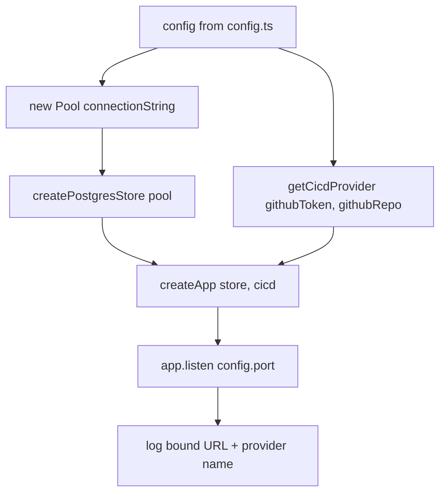

**File:** `server/src/index.ts` · **Lines:** 21

<!-- fill:file:summary -->
`index.ts` is the server's runtime entry point — the file Node executes to start the API. It reads runtime settings from `config.ts`, opens a `pg` connection `Pool` against `config.databaseUrl`, wraps it with `createPostgresStore` from `postgresStore.ts`, and selects a CI/CD provider via `getCicdProvider` from `integrations/cicd`. It then hands both collaborators to `createApp` (`app.ts`) and calls `app.listen(config.port)`, logging the bound URL and the active provider name. Nothing imports this file; it is invoked directly as the process bootstrap.
<!-- /fill:file:summary -->

## Imports

This file pulls in the following modules. Relative imports point to other documented files; external imports are libraries from `node_modules`.

| Module | Imports | Kind |
| --- | --- | --- |
| `pg` | `Pool` | external |
| `./config` | `config` | internal |
| `./app` | `createApp` | internal |
| `./postgresStore` | `createPostgresStore` | internal |
| `./integrations/cicd` | `getCicdProvider` | internal |

:::note
No exported symbols detected by the AST. This file is a side-effect entrypoint, a re-export barrel, or a runtime bootstrap — open `server/src/index.ts` directly to read the source.
:::

## Diagrams

<!-- fill:file:diagrams -->

<!-- /fill:file:diagrams -->
