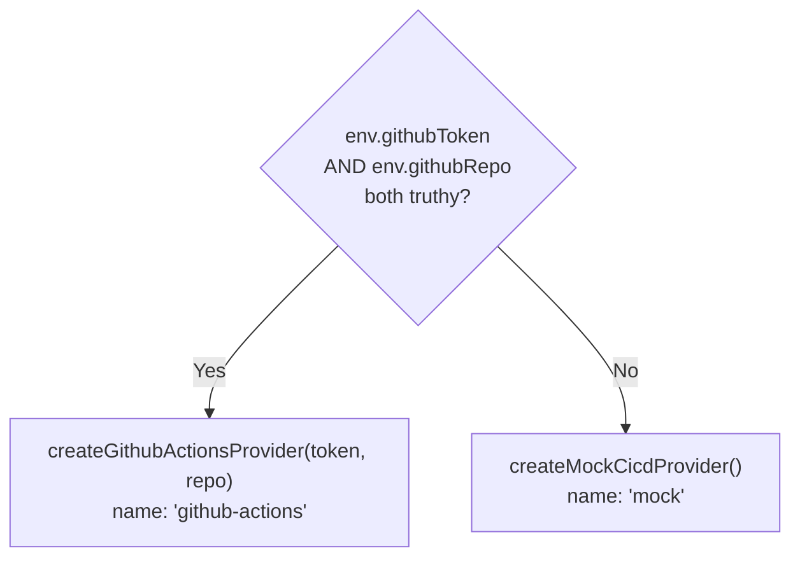

**File:** `server/src/integrations/cicd.ts`

The CI/CD integration layer. Defines all types, provides two provider implementations (mock and GitHub Actions), exports a pure aggregation function, and selects the appropriate provider at startup based on environment credentials.

## Types

### `PipelineStatus`

```ts
export type PipelineStatus = 'passing' | 'failing' | 'running'
```

| Value | Meaning |
|---|---|
| `'passing'` | The run completed successfully |
| `'failing'` | The run completed with a failure conclusion (failure, cancelled, timed_out, etc.) |
| `'running'` | The run has not completed yet (queued or in progress) |

### `Pipeline`

```ts
export interface Pipeline {
  id: string
  name: string
  provider: 'github-actions' | 'jenkins'
  branch: string
  status: PipelineStatus
  durationSeconds: number
  triggeredBy: string
  updatedAt: string
}
```

| Field | Type | Description |
|---|---|---|
| `id` | `string` | Unique run identifier (e.g. `'p-1041'` for mock; GitHub run ID as string for live) |
| `name` | `string` | Workflow or pipeline display name |
| `provider` | `'github-actions' \| 'jenkins'` | Source CI/CD system |
| `branch` | `string` | Git branch the run was triggered on |
| `status` | `PipelineStatus` | Current run state |
| `durationSeconds` | `number` | Elapsed or final run time in seconds |
| `triggeredBy` | `string` | Actor login or system name |
| `updatedAt` | `string` | ISO 8601 timestamp of the last status update |

### `PipelineSummary`

```ts
export interface PipelineSummary {
  total: number
  passing: number
  failing: number
  running: number
  passRate: number
}
```

| Field | Type | Description |
|---|---|---|
| `total` | `number` | Total count of all pipelines |
| `passing` | `number` | Count with `status === 'passing'` |
| `failing` | `number` | Count with `status === 'failing'` |
| `running` | `number` | Count with `status === 'running'` |
| `passRate` | `number` | Integer 0–100; calculated over finished pipelines only |

### `CicdProvider`

```ts
export interface CicdProvider {
  readonly name: string
  listPipelines(): Promise<Pipeline[]>
}
```

| Member | Type | Description |
|---|---|---|
| `name` | `string` (readonly) | Provider identifier. Either `'mock'` or `'github-actions'`. Printed in the startup log and returned in `GET /api/pipelines`. |
| `listPipelines` | `() => Promise<Pipeline[]>` | Returns the current pipeline list. May perform a network call (GitHub) or resolve immediately (mock). |

## `summarizePipelines`

```ts
export function summarizePipelines(pipelines: Pipeline[]): PipelineSummary
```

A pure function — no I/O, no side effects. Counts pipelines by status and calculates a pass rate.

```ts
const passing  = pipelines.filter((p) => p.status === 'passing').length
const failing  = pipelines.filter((p) => p.status === 'failing').length
const running  = pipelines.filter((p) => p.status === 'running').length
const finished = passing + failing
return {
  total: pipelines.length,
  passing,
  failing,
  running,
  passRate: finished === 0 ? 0 : Math.round((passing / finished) * 100),
}
```

`passRate` divides `passing` by `finished` (passing + failing), not by `total`. Running pipelines are excluded from the denominator because their outcome is not yet known. When `finished === 0` (all pipelines are running, or the list is empty), `passRate` is `0`.

**Example:**
- 4 passing + 2 failing + 2 running
- `finished = 6`
- `passRate = Math.round(4 / 6 × 100) = 67`

## Mock provider

### `minutesAgo` helper (private)

```ts
function minutesAgo(minutes: number): string {
  return new Date(Date.now() - minutes * 60_000).toISOString()
}
```

Returns an ISO 8601 timestamp that is `minutes` minutes in the past. Used to give mock pipelines plausible `updatedAt` values that remain recent on every invocation, regardless of when the server started.

### Mock pipeline table

Eight hardcoded pipelines returned by `createMockCicdProvider().listPipelines()`:

| ID | Name | Provider | Branch | Status | Duration | Triggered by |
|---|---|---|---|---|---|---|
| `p-1041` | CI · build & test | github-actions | main | passing | 184s | a.kapoor |
| `p-1040` | E2E suite | github-actions | main | running | 312s | m.osei |
| `p-1039` | Deploy · staging | github-actions | release/4.19 | passing | 96s | release-bot |
| `p-1038` | Lint & typecheck | github-actions | feat/agent-drawer | failing | 47s | j.reyes |
| `p-1037` | Docker image | jenkins | main | passing | 268s | ci-system |
| `p-1036` | DB migration check | github-actions | feat/pg-store | passing | 38s | p.zhao |
| `p-1035` | Nightly regression | jenkins | main | failing | 904s | cron |
| `p-1034` | Release · production | github-actions | release/4.19 | running | 140s | release-bot |

Summary: 4 passing + 2 failing + 2 running → `passRate = Math.round(4/6×100) = 67`.

### `createMockCicdProvider()`

```ts
export function createMockCicdProvider(): CicdProvider
```

**Returns:** A `CicdProvider` with `name = 'mock'`. `listPipelines()` calls the internal `buildMockPipelines()` function and returns `Promise.resolve(pipelines)` — no network call.

The mock provider is selected by default (when `GITHUB_TOKEN` or `GITHUB_REPO` is unset) and is always used in tests.

## Live GitHub Actions provider

### `GithubRun` interface (private)

```ts
interface GithubRun {
  id: number
  name: string | null
  display_title: string
  head_branch: string | null
  status: string
  conclusion: string | null
  run_started_at: string | null
  updated_at: string
  actor?: { login: string }
}
```

The subset of fields consumed from the GitHub workflow runs API response. `id` is a `number` in the GitHub API (not a string), converted to a string in `githubRunToPipeline`.

### `githubRunToPipeline` (private)

```ts
function githubRunToPipeline(run: GithubRun): Pipeline
```

Maps a single GitHub API run object to the internal `Pipeline` type.

**Status mapping:**

```ts
const status: PipelineStatus =
  run.status !== 'completed'
    ? 'running'
    : run.conclusion === 'success'
      ? 'passing'
      : 'failing'
```

GitHub's `status` field can be `queued`, `in_progress`, `waiting`, `requested`, or `completed`. Any value that is not `completed` maps to `'running'`. Once `status === 'completed'`:
- `conclusion === 'success'` → `'passing'`
- Anything else (`failure`, `cancelled`, `timed_out`, `action_required`, `neutral`, `skipped`) → `'failing'`

**Duration calculation:**

```ts
const started = run.run_started_at
  ? Date.parse(run.run_started_at)
  : Date.parse(run.updated_at)
const durationSeconds = Math.max(
  0,
  Math.round((Date.parse(run.updated_at) - started) / 1000),
)
```

`run_started_at` is preferred as the start timestamp. For queued runs that have not started yet, `run_started_at` may be `null` — in that case `updated_at` is used as the fallback, giving a duration close to zero. `Math.max(0, ...)` prevents negative values if timestamps are slightly out of order due to clock skew.

### `createGithubActionsProvider`

```ts
export function createGithubActionsProvider(token: string, repo: string): CicdProvider
```

| Parameter | Type | Purpose |
|---|---|---|
| `token` | `string` | GitHub PAT or Actions token with `repo` + `actions:read` scope |
| `repo` | `string` | Repository in `owner/repo` format (e.g. `'snabbit/app'`) |

**Returns:** A `CicdProvider` with `name = 'github-actions'`.

**`listPipelines()` behavior:**

```
GET https://api.github.com/repos/{repo}/actions/runs?per_page=20
Authorization: Bearer {token}
Accept: application/vnd.github+json
X-GitHub-Api-Version: 2022-11-28
```

Returns the 20 most recent workflow runs mapped via `githubRunToPipeline`. Throws `Error('GitHub Actions API responded <status>')` on any non-2xx HTTP response.

## Provider selection

### `getCicdProvider`

```ts
export function getCicdProvider(env: {
  githubToken: string
  githubRepo?: string
}): CicdProvider
```

| Parameter | Type | Purpose |
|---|---|---|
| `env.githubToken` | `string` | Value of `GITHUB_TOKEN` env var; empty string if not set |
| `env.githubRepo` | `string?` | Value of `GITHUB_REPO` env var; empty string or undefined if not set |

**Returns:** `createGithubActionsProvider(token, repo)` when both values are truthy non-empty strings; otherwise `createMockCicdProvider()`.



Empty string is falsy in JavaScript, so leaving `GITHUB_TOKEN` or `GITHUB_REPO` unset (their default from `config.ts` is `''`) automatically selects the mock provider.

## Used by

- **`server/src/index.ts`** — calls `getCicdProvider({ githubToken, githubRepo })` at startup.
- **`server/src/routes.ts`** — calls `deps.cicd.listPipelines()` in `GET /api/pipelines` and passes the result to `summarizePipelines`.
- **`server/src/__tests__/api.test.ts`** — injects `createMockCicdProvider()` via `createApp`.
- **`server/src/__tests__/cicd.test.ts`** — unit tests for `summarizePipelines`, `getCicdProvider`, and the mock provider.
