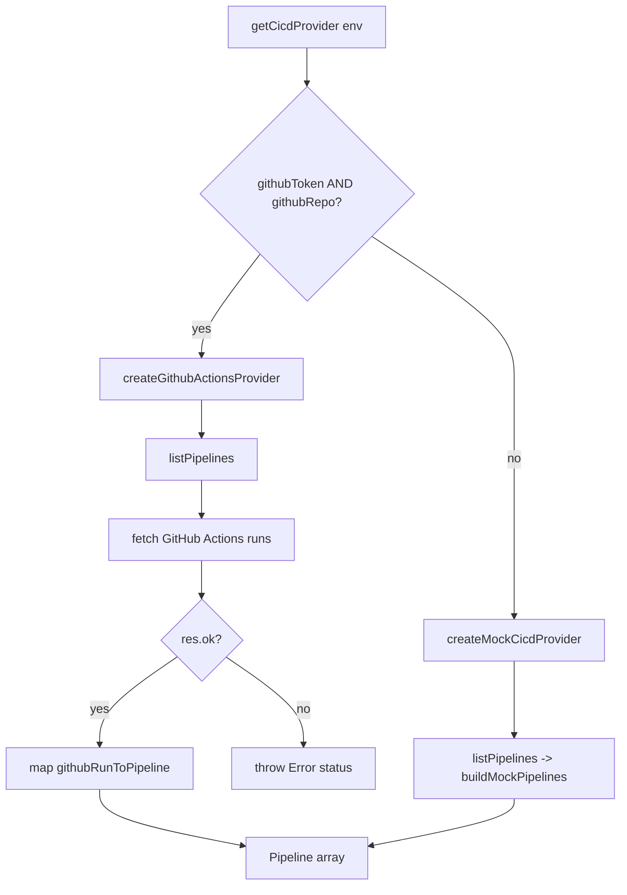

**File:** `server/src/integrations/cicd.ts` · **Lines:** 162

<!-- fill:file:summary -->
This module is the CI/CD integration adapter for the backend. It defines the `Pipeline`, `PipelineSummary`, and `CicdProvider` types and supplies two concrete providers: `createMockCicdProvider`, which returns deterministic in-memory pipeline data with no credentials, and `createGithubActionsProvider`, which calls the live GitHub Actions REST API. `getCicdProvider` chooses between them based on the `githubToken`/`githubRepo` values read from `config.ts`, and `summarizePipelines` aggregates a pipeline list into headline counts. `server/src/index.ts` wires the chosen provider into the app, `server/src/routes.ts` calls `summarizePipelines` to build the pipeline response, and `server/src/app.ts` consumes the `CicdProvider` contract.
<!-- /fill:file:summary -->

## Symbols

This file exports 8 symbols. Every export is documented below, in declaration order.

| Name | Kind | Default |
| --- | --- | --- |
| summarizePipelines | function | no |
| createMockCicdProvider | function | no |
| createGithubActionsProvider | function | no |
| getCicdProvider | function | no |
| PipelineStatus | type | no |
| Pipeline | interface | no |
| PipelineSummary | interface | no |
| CicdProvider | interface | no |

## summarizePipelines

**Kind:** `function`

```ts
export function summarizePipelines(pipelines: Pipeline[]): PipelineSummary { ... }
```

> Aggregate pipeline statuses into a summary. Pure.

### Parameters

| Name | Type | Default | Required | Purpose |
| --- | --- | --- | --- | --- |
| pipelines | `Pipeline[]` | — | yes | The list of pipeline runs to count and reduce into a summary. |

**Returns:** `PipelineSummary`

<!-- fill:sym:summarizePipelines:return -->
A `PipelineSummary` object: `total` (length of the input array), the per-status counts `passing`/`failing`/`running`, and `passRate`, the percentage of finished (passing + failing) pipelines that passed, rounded to an integer 0–100. The function is pure and never returns null or undefined; given an empty array it returns all-zero counts with `passRate` of 0 (running pipelines are excluded from the rate denominator).
<!-- /fill:sym:summarizePipelines:return -->

### Line-by-line walkthrough

Each top-level statement of `summarizePipelines`, in execution order. The line numbers reference the source file as it appears today.

**Line 39 — `FirstStatement`**

```ts
const passing = pipelines.filter((p) => p.status === 'passing').length
```

<!-- fill:sym:summarizePipelines:walk:0 -->
Counts the pipelines whose `status` is `'passing'`. `filter` produces a new array of only the matching entries and `.length` yields the count, stored in the local `passing`. No input mutation occurs.
<!-- /fill:sym:summarizePipelines:walk:0 -->

**Line 40 — `FirstStatement`**

```ts
const failing = pipelines.filter((p) => p.status === 'failing').length
```

<!-- fill:sym:summarizePipelines:walk:1 -->
Same pattern as the previous line, but for the `'failing'` status. The resulting count is stored in `failing`.
<!-- /fill:sym:summarizePipelines:walk:1 -->

**Line 41 — `FirstStatement`**

```ts
const running = pipelines.filter((p) => p.status === 'running').length
```

<!-- fill:sym:summarizePipelines:walk:2 -->
Counts the in-flight pipelines whose `status` is `'running'`, stored in `running`. These are deliberately excluded from the pass-rate denominator computed below.
<!-- /fill:sym:summarizePipelines:walk:2 -->

**Line 42 — `FirstStatement`**

```ts
const finished = passing + failing
```

<!-- fill:sym:summarizePipelines:walk:3 -->
Computes the number of finished pipelines as `passing + failing`. Running pipelines have no final outcome yet, so they are not part of this total; `finished` becomes the denominator for the pass-rate calculation.
<!-- /fill:sym:summarizePipelines:walk:3 -->

**Line 43 — `ReturnStatement`**

```ts
return {
    total: pipelines.length,
    passing,
    failing,
    running,
    passRate: finished === 0 ? 0 : Math.round((passing / finished) * 100),
  }
```

<!-- fill:sym:summarizePipelines:walk:4 -->
Returns the assembled `PipelineSummary`. `total` is the full input length, the three counts come from the locals above, and `passRate` guards against division by zero: when `finished === 0` it is `0`, otherwise it is `passing / finished` scaled to a 0–100 percentage and rounded with `Math.round`.
<!-- /fill:sym:summarizePipelines:walk:4 -->

### Examples

<!-- fill:sym:summarizePipelines:example -->
```ts
const summary = summarizePipelines([
  { id: 'p-1', status: 'passing', /* ...other fields */ } as Pipeline,
  { id: 'p-2', status: 'failing', /* ... */ } as Pipeline,
  { id: 'p-3', status: 'running', /* ... */ } as Pipeline,
])
// => { total: 3, passing: 1, failing: 1, running: 1, passRate: 50 }
```

The two finished pipelines (one passing, one failing) give a `passRate` of `Math.round((1 / 2) * 100) === 50`; the running pipeline is excluded from that rate.
<!-- /fill:sym:summarizePipelines:example -->

### Used by

- `server/src/routes.ts`
- `server/src/__tests__/cicd.test.ts`

## createMockCicdProvider

**Kind:** `function`

```ts
export function createMockCicdProvider(): CicdProvider { ... }
```

<!-- fill:sym:createMockCicdProvider:summary -->
Builds a `CicdProvider` named `'mock'` whose `listPipelines` returns a fixed set of eight sample pipelines from the internal `buildMockPipelines` helper. It requires no credentials or network access, which makes it the zero-config default used in local development and tests. The sample data is deterministic except for the relative timestamps, which are computed as offsets from `Date.now()` via `minutesAgo`.
<!-- /fill:sym:createMockCicdProvider:summary -->

**Returns:** `CicdProvider`

<!-- fill:sym:createMockCicdProvider:return -->
A `CicdProvider` object with `name: 'mock'` and an async `listPipelines()` that resolves to the eight-element mock `Pipeline[]`. It is always returned (never null/undefined) and never throws or makes network calls.
<!-- /fill:sym:createMockCicdProvider:return -->

### Line-by-line walkthrough

Each top-level statement of `createMockCicdProvider`, in execution order. The line numbers reference the source file as it appears today.

**Line 72 — `ReturnStatement`**

```ts
return {
    name: 'mock',
    async listPipelines() {
      return buildMockPipelines()
    },
  }
```

<!-- fill:sym:createMockCicdProvider:walk:0 -->
Returns the provider object literal. `name` is the constant `'mock'` so callers can identify the active provider, and `listPipelines` is an async method that delegates to `buildMockPipelines()` and resolves to its array. Because it is `async`, the synchronous helper result is wrapped in a resolved promise, satisfying the `Promise<Pipeline[]>` shape of the `CicdProvider` contract.
<!-- /fill:sym:createMockCicdProvider:walk:0 -->

### Examples

<!-- fill:sym:createMockCicdProvider:example -->
```ts
const provider = createMockCicdProvider()
provider.name // => 'mock'
const pipelines = await provider.listPipelines()
pipelines.length // => 8
pipelines[0].name // => 'CI · build & test'
```
<!-- /fill:sym:createMockCicdProvider:example -->

### Used by

- `server/src/__tests__/api.test.ts`
- `server/src/__tests__/cicd.test.ts`

## createGithubActionsProvider

**Kind:** `function`

```ts
export function createGithubActionsProvider(
  token: string,
  repo: string,
): CicdProvider { ... }
```

<!-- fill:sym:createGithubActionsProvider:summary -->
Builds a live `CicdProvider` named `'github-actions'` that fetches the 20 most recent workflow runs for `repo` from the GitHub Actions REST API, authenticating with the supplied `token`. Each raw run is mapped to the internal `Pipeline` shape by `githubRunToPipeline`, which derives `status` from the run's `status`/`conclusion` and computes `durationSeconds` from the start and update timestamps. It exists so the dashboard can show real CI data when credentials are configured, and is selected automatically by `getCicdProvider`.
<!-- /fill:sym:createGithubActionsProvider:summary -->

### Parameters

| Name | Type | Default | Required | Purpose |
| --- | --- | --- | --- | --- |
| token | `string` | — | yes | GitHub access token sent as the `Authorization: Bearer` header for the Actions API. |
| repo | `string` | — | yes | The `owner/repo` slug whose workflow runs are fetched (interpolated into the API URL). |

**Returns:** `CicdProvider`

<!-- fill:sym:createGithubActionsProvider:return -->
A `CicdProvider` with `name: 'github-actions'` and an async `listPipelines()` that resolves to a `Pipeline[]` derived from the live API. The factory itself always returns an object (never null), but `listPipelines()` performs a network call and will reject with an `Error` (`"GitHub Actions API responded <status>"`) when the API responds with a non-2xx status.
<!-- /fill:sym:createGithubActionsProvider:return -->

### Line-by-line walkthrough

Each top-level statement of `createGithubActionsProvider`, in execution order. The line numbers reference the source file as it appears today.

**Line 130 — `ReturnStatement`**

```ts
return {
    name: 'github-actions',
    async listPipelines() {
      const res = await fetch(
        `https://api.github.com/repos/${repo}/actions/runs?per_page=20`,
        {
          headers: {
            Authorization: `Bearer ${token}`,
            Accept: 'application/vnd.github+json',
            'X-GitHub-Api-Version': '2022-11-28',
          },
        },
      )
      if (!res.ok) {
        throw new Error(`GitHub Actions API responded ${res.status}`)
      }
      const data = (await res.json()) as GithubRunsResponse
      return data.workflow_runs.map(githubRunToPipeline)
    },
  }
```

<!-- fill:sym:createGithubActionsProvider:walk:0 -->
Returns the provider literal. Its `listPipelines` awaits a `fetch` to `https://api.github.com/repos/${repo}/actions/runs?per_page=20`, sending the bearer `token` plus the GitHub-recommended `Accept` and `X-GitHub-Api-Version` headers. If `res.ok` is false it throws an `Error` carrying the HTTP status, so failures surface to the caller rather than producing a malformed list. On success it parses the JSON as `GithubRunsResponse` and maps each `workflow_runs` entry through `githubRunToPipeline` to produce the normalized `Pipeline[]`.
<!-- /fill:sym:createGithubActionsProvider:walk:0 -->

### Examples

<!-- fill:sym:createGithubActionsProvider:example -->
```ts
const provider = createGithubActionsProvider(
  process.env.GITHUB_TOKEN!,
  'snabbit/changelog-automation',
)
provider.name // => 'github-actions'
const pipelines = await provider.listPipelines() // live call to GitHub Actions
// throws Error('GitHub Actions API responded 401') if the token is invalid
```
<!-- /fill:sym:createGithubActionsProvider:example -->

## getCicdProvider

**Kind:** `function`

```ts
export function getCicdProvider(env: {
  githubToken: string
  githubRepo?: string
}): CicdProvider { ... }
```

> Pick the live provider when credentials are present, else the mock.

### Parameters

| Name | Type | Default | Required | Purpose |
| --- | --- | --- | --- | --- |
| env | `{ githubToken: string; githubRepo?: string; }` | — | yes | Resolved configuration (typically from `config.ts`) whose `githubToken`/`githubRepo` decide which provider is returned. |

**Returns:** `CicdProvider`

<!-- fill:sym:getCicdProvider:return -->
A `CicdProvider`: the live GitHub Actions provider when both `githubToken` and `githubRepo` are non-empty, otherwise the mock provider. It always returns a usable provider and never null/undefined, so callers can unconditionally call `listPipelines()`.
<!-- /fill:sym:getCicdProvider:return -->

### Line-by-line walkthrough

Each top-level statement of `getCicdProvider`, in execution order. The line numbers reference the source file as it appears today.

**Line 157 — `IfStatement`**

```ts
if (env.githubToken && env.githubRepo) {
    return createGithubActionsProvider(env.githubToken, env.githubRepo)
  }
```

<!-- fill:sym:getCicdProvider:walk:0 -->
Checks whether both credentials are present. `env.githubToken && env.githubRepo` is truthy only when neither is an empty string (the defaults from `config.ts`), in which case it returns `createGithubActionsProvider(env.githubToken, env.githubRepo)` and the live provider is used. The early return means the mock fallback below is skipped.
<!-- /fill:sym:getCicdProvider:walk:0 -->

**Line 160 — `ReturnStatement`**

```ts
return createMockCicdProvider()
```

<!-- fill:sym:getCicdProvider:walk:1 -->
The default fallback: when one or both credentials are missing, returns `createMockCicdProvider()` so the app still serves deterministic pipeline data with zero configuration.
<!-- /fill:sym:getCicdProvider:walk:1 -->

### Examples

<!-- fill:sym:getCicdProvider:example -->
```ts
// No credentials -> mock provider
getCicdProvider({ githubToken: '' }).name // => 'mock'

// Both credentials present -> live provider
getCicdProvider({
  githubToken: 'ghp_xxx',
  githubRepo: 'snabbit/changelog-automation',
}).name // => 'github-actions'
```
<!-- /fill:sym:getCicdProvider:example -->

### Used by

- `server/src/index.ts`
- `server/src/__tests__/cicd.test.ts`

## PipelineStatus

**Kind:** `type`

```ts
export type PipelineStatus = 'passing' | 'failing' | 'running'
```

<!-- fill:sym:PipelineStatus:summary -->
A string-literal union of the three lifecycle states a pipeline can be in: `'passing'`, `'failing'`, or `'running'`. It constrains the `status` field of `Pipeline` to a closed set, which lets `summarizePipelines` exhaustively count each state and `githubRunToPipeline` map raw GitHub statuses onto a normalized value.
<!-- /fill:sym:PipelineStatus:summary -->

### Used by

- `server/src/__tests__/cicd.test.ts`

## Pipeline

**Kind:** `interface`

```ts
export interface Pipeline { ... }
```

<!-- fill:sym:Pipeline:summary -->
The normalized shape of a single CI/CD run as exposed by the API, independent of which provider produced it. Both `createMockCicdProvider` and `createGithubActionsProvider` emit objects of this shape so downstream code (`summarizePipelines`, routes, tests) never has to know the underlying source. It carries identity, branch, status, duration, who triggered it, and a last-updated timestamp.
<!-- /fill:sym:Pipeline:summary -->

### Shape

| Name | Type | Description |
| --- | --- | --- |
| id | `string` | Unique pipeline/run identifier (the GitHub run id, stringified, for live runs). |
| name | `string` | Human-readable pipeline name (workflow name or display title). |
| provider | `"github-actions" \| "jenkins"` | Which CI system produced the run. |
| branch | `string` | The branch the run executed against; `'unknown'` when not reported. |
| status | `PipelineStatus` | Current lifecycle state: passing, failing, or running. |
| durationSeconds | `number` | Elapsed run time in seconds, clamped to a non-negative integer. |
| triggeredBy | `string` | Login of the user or bot that triggered the run; `'unknown'` if absent. |
| updatedAt | `string` | ISO-8601 timestamp of the run's last update. |

### Used by

- `server/src/__tests__/cicd.test.ts`

## PipelineSummary

**Kind:** `interface`

```ts
export interface PipelineSummary { ... }
```

<!-- fill:sym:PipelineSummary:summary -->
The aggregate produced by `summarizePipelines`: a count of total pipelines, per-status counts, and a derived pass rate. It exists to give the dashboard headline metrics without re-scanning the full pipeline list on the client.
<!-- /fill:sym:PipelineSummary:summary -->

### Shape

| Name | Type | Description |
| --- | --- | --- |
| total | `number` | Total number of pipelines in the input list. |
| passing | `number` | Count of pipelines with status `'passing'`. |
| failing | `number` | Count of pipelines with status `'failing'`. |
| running | `number` | Count of pipelines still `'running'` (excluded from the pass rate). |
| passRate | `number` | Pass rate over finished (passing + failing) pipelines, 0–100. |

## CicdProvider

**Kind:** `interface`

```ts
export interface CicdProvider { ... }
```

<!-- fill:sym:CicdProvider:summary -->
The provider contract that decouples the rest of the app from any specific CI system. It requires a `readonly name` for identification and an async `listPipelines(): Promise<Pipeline[]>` method. Both the mock and the GitHub Actions implementations satisfy it, so `app.ts` and the routes can depend on the interface and let `getCicdProvider` decide which concrete provider is wired in.
<!-- /fill:sym:CicdProvider:summary -->

### Shape

| Name | Type | Description |
| --- | --- | --- |
| name | `string` | Identifier of the active provider (`'mock'` or `'github-actions'`). |

### Used by

- `server/src/app.ts`

## Diagrams

<!-- fill:file:diagrams -->
Provider selection and the live `listPipelines` call:


<!-- /fill:file:diagrams -->

## Source

Full file source for `server/src/integrations/cicd.ts` (162 lines). The line-by-line walkthroughs above reference these line numbers.

<details>
<summary>View source (162 lines)</summary>

````ts
/*
 * CI/CD integration adapter.
 *
 * `createMockCicdProvider` returns deterministic data and needs no
 * credentials — the default. `createGithubActionsProvider` makes real calls
 * to the GitHub Actions API and is selected automatically when both
 * GITHUB_TOKEN and GITHUB_REPO are set.
 */

export type PipelineStatus = 'passing' | 'failing' | 'running'

export interface Pipeline {
  id: string
  name: string
  provider: 'github-actions' | 'jenkins'
  branch: string
  status: PipelineStatus
  durationSeconds: number
  triggeredBy: string
  updatedAt: string
}

export interface PipelineSummary {
  total: number
  passing: number
  failing: number
  running: number
  /** Pass rate over finished (passing + failing) pipelines, 0–100. */
  passRate: number
}

export interface CicdProvider {
  readonly name: string
  listPipelines(): Promise<Pipeline[]>
}

/** Aggregate pipeline statuses into a summary. Pure. */
export function summarizePipelines(pipelines: Pipeline[]): PipelineSummary {
  const passing = pipelines.filter((p) => p.status === 'passing').length
  const failing = pipelines.filter((p) => p.status === 'failing').length
  const running = pipelines.filter((p) => p.status === 'running').length
  const finished = passing + failing
  return {
    total: pipelines.length,
    passing,
    failing,
    running,
    passRate: finished === 0 ? 0 : Math.round((passing / finished) * 100),
  }
}

// --- Mock provider -------------------------------------------------------

function minutesAgo(minutes: number): string {
  return new Date(Date.now() - minutes * 60_000).toISOString()
}

function buildMockPipelines(): Pipeline[] {
  return [
    { id: 'p-1041', name: 'CI · build & test', provider: 'github-actions', branch: 'main', status: 'passing', durationSeconds: 184, triggeredBy: 'a.kapoor', updatedAt: minutesAgo(6) },
    { id: 'p-1040', name: 'E2E suite', provider: 'github-actions', branch: 'main', status: 'running', durationSeconds: 312, triggeredBy: 'ci-bot', updatedAt: minutesAgo(2) },
    { id: 'p-1039', name: 'Deploy · staging', provider: 'github-actions', branch: 'release/4.19', status: 'passing', durationSeconds: 96, triggeredBy: 'deploy-bot', updatedAt: minutesAgo(24) },
    { id: 'p-1038', name: 'Lint & typecheck', provider: 'github-actions', branch: 'feat/agent-drawer', status: 'failing', durationSeconds: 47, triggeredBy: 'guna', updatedAt: minutesAgo(38) },
    { id: 'p-1037', name: 'Docker image', provider: 'jenkins', branch: 'main', status: 'passing', durationSeconds: 268, triggeredBy: 'ci-bot', updatedAt: minutesAgo(51) },
    { id: 'p-1036', name: 'DB migration check', provider: 'github-actions', branch: 'feat/pg-store', status: 'passing', durationSeconds: 38, triggeredBy: 'm.silva', updatedAt: minutesAgo(72) },
    { id: 'p-1035', name: 'Nightly regression', provider: 'jenkins', branch: 'main', status: 'failing', durationSeconds: 904, triggeredBy: 'scheduler', updatedAt: minutesAgo(143) },
    { id: 'p-1034', name: 'Release · production', provider: 'github-actions', branch: 'release/4.19', status: 'running', durationSeconds: 140, triggeredBy: 'deploy-bot', updatedAt: minutesAgo(4) },
  ]
}

export function createMockCicdProvider(): CicdProvider {
  return {
    name: 'mock',
    async listPipelines() {
      return buildMockPipelines()
    },
  }
}

// --- Live provider: GitHub Actions --------------------------------------

interface GithubRun {
  id: number
  name: string | null
  display_title: string
  head_branch: string | null
  status: string
  conclusion: string | null
  run_started_at: string | null
  updated_at: string
  actor?: { login: string }
}

interface GithubRunsResponse {
  workflow_runs: GithubRun[]
}

function githubRunToPipeline(run: GithubRun): Pipeline {
  const status: PipelineStatus =
    run.status !== 'completed'
      ? 'running'
      : run.conclusion === 'success'
        ? 'passing'
        : 'failing'

  const started = run.run_started_at
    ? Date.parse(run.run_started_at)
    : Date.parse(run.updated_at)
  const durationSeconds = Math.max(
    0,
    Math.round((Date.parse(run.updated_at) - started) / 1000),
  )

  return {
    id: String(run.id),
    name: run.name ?? run.display_title,
    provider: 'github-actions',
    branch: run.head_branch ?? 'unknown',
    status,
    durationSeconds,
    triggeredBy: run.actor?.login ?? 'unknown',
    updatedAt: run.updated_at,
  }
}

export function createGithubActionsProvider(
  token: string,
  repo: string,
): CicdProvider {
  return {
    name: 'github-actions',
    async listPipelines() {
      const res = await fetch(
        `https://api.github.com/repos/${repo}/actions/runs?per_page=20`,
        {
          headers: {
            Authorization: `Bearer ${token}`,
            Accept: 'application/vnd.github+json',
            'X-GitHub-Api-Version': '2022-11-28',
          },
        },
      )
      if (!res.ok) {
        throw new Error(`GitHub Actions API responded ${res.status}`)
      }
      const data = (await res.json()) as GithubRunsResponse
      return data.workflow_runs.map(githubRunToPipeline)
    },
  }
}

/** Pick the live provider when credentials are present, else the mock. */
export function getCicdProvider(env: {
  githubToken: string
  githubRepo?: string
}): CicdProvider {
  if (env.githubToken && env.githubRepo) {
    return createGithubActionsProvider(env.githubToken, env.githubRepo)
  }
  return createMockCicdProvider()
}

````

</details>
