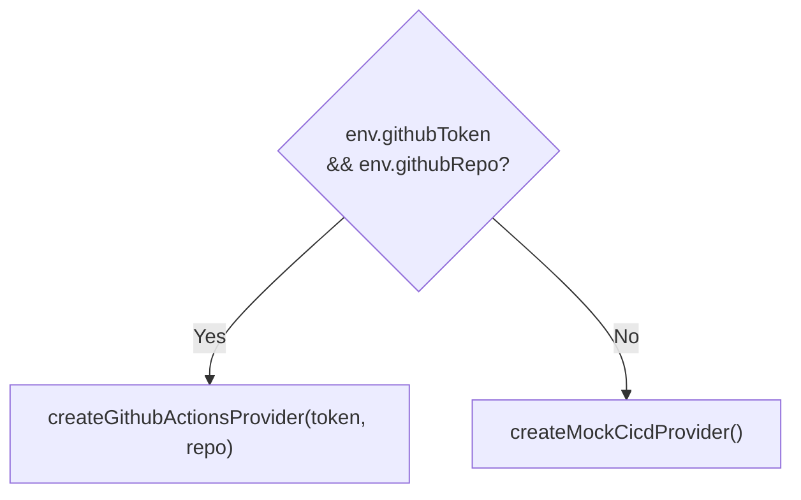

**File:** `server/src/integrations/cicd.ts`

The CI/CD integration layer. Defines the `CicdProvider` interface, two
implementations (mock and GitHub Actions), and a pure aggregation function.
The provider is selected at startup based on environment credentials.

## Types

### `PipelineStatus`

```ts
export type PipelineStatus = 'passing' | 'failing' | 'running'
```

### `Pipeline`

```ts
export interface Pipeline {
  id: string
  name: string
  provider: 'github-actions' | 'jenkins'
  branch: string
  status: PipelineStatus
  durationSeconds: number
  triggeredBy: string
  updatedAt: string
}
```

| Field | Type | Description |
|-------|------|-------------|
| `id` | `string` | Unique run identifier |
| `name` | `string` | Workflow or pipeline display name |
| `provider` | `'github-actions' \| 'jenkins'` | Source CI/CD system |
| `branch` | `string` | Git branch the run was triggered on |
| `status` | `PipelineStatus` | Current run state |
| `durationSeconds` | `number` | Elapsed or final run time |
| `triggeredBy` | `string` | Actor login or system name |
| `updatedAt` | `string` | ISO 8601 timestamp |

### `PipelineSummary`

```ts
export interface PipelineSummary {
  total: number
  passing: number
  failing: number
  running: number
  passRate: number
}
```

`passRate` is 0–100, computed over **finished** pipelines only (passing + failing).
Running pipelines are excluded from the denominator.

### `CicdProvider`

```ts
export interface CicdProvider {
  readonly name: string
  listPipelines(): Promise<Pipeline[]>
}
```

| Member | Type | Description |
|--------|------|-------------|
| `name` | `string` (readonly) | Provider identifier (`'mock'` or `'github-actions'`) |
| `listPipelines` | `() => Promise<Pipeline[]>` | Returns the current pipeline list |

## `summarizePipelines`

```ts
export function summarizePipelines(pipelines: Pipeline[]): PipelineSummary
```

**Parameters:** `pipelines: Pipeline[]` — the pipeline list to aggregate.

**Returns:** `PipelineSummary` with counts and pass rate.

**Side effects:** None — pure function.

### Implementation

```ts
const passing  = pipelines.filter((p) => p.status === 'passing').length
const failing  = pipelines.filter((p) => p.status === 'failing').length
const running  = pipelines.filter((p) => p.status === 'running').length
const finished = passing + failing
return {
  total: pipelines.length,
  passing,
  failing,
  running,
  passRate: finished === 0 ? 0 : Math.round((passing / finished) * 100),
}
```

`passRate` divides passing by `finished` (not `total`) to exclude in-progress
runs from the denominator. When `finished === 0` (all pipelines running, or
empty list), `passRate` is 0.

**Example:** 2 passing + 1 failing + 1 running:
- `finished = 3`
- `passRate = round(2 / 3 × 100) = 67`

## Mock provider

### `minutesAgo` (private)

```ts
function minutesAgo(minutes: number): string {
  return new Date(Date.now() - minutes * 60_000).toISOString()
}
```

Produces an ISO 8601 timestamp that is `minutes` minutes in the past. Used to
give mock pipelines plausible `updatedAt` values that stay recent on every
invocation.

### `buildMockPipelines` (private)

Returns a fixed list of 8 hardcoded pipelines. Called on every `listPipelines()`
invocation so timestamps remain current.

| ID | Name | Provider | Branch | Status | Duration |
|----|------|----------|--------|--------|----------|
| p-1041 | CI · build & test | github-actions | main | passing | 184s |
| p-1040 | E2E suite | github-actions | main | running | 312s |
| p-1039 | Deploy · staging | github-actions | release/4.19 | passing | 96s |
| p-1038 | Lint & typecheck | github-actions | feat/agent-drawer | failing | 47s |
| p-1037 | Docker image | jenkins | main | passing | 268s |
| p-1036 | DB migration check | github-actions | feat/pg-store | passing | 38s |
| p-1035 | Nightly regression | jenkins | main | failing | 904s |
| p-1034 | Release · production | github-actions | release/4.19 | running | 140s |

Summary: 4 passing, 2 failing, 2 running → `passRate = round(4/6×100) = 67`.

### `createMockCicdProvider`

```ts
export function createMockCicdProvider(): CicdProvider
```

**Returns:** A `CicdProvider` with `name = 'mock'`. `listPipelines()` calls
`buildMockPipelines()` and resolves immediately — no network call.

## Live GitHub Actions provider

### Internal types

```ts
interface GithubRun {
  id: number
  name: string | null
  display_title: string
  head_branch: string | null
  status: string
  conclusion: string | null
  run_started_at: string | null
  updated_at: string
  actor?: { login: string }
}
```

The subset of fields from GitHub's workflow run API that the adapter uses.

### `githubRunToPipeline` (private)

```ts
function githubRunToPipeline(run: GithubRun): Pipeline
```

Maps a single GitHub API run object to the internal `Pipeline` type.

**Status mapping:**

```ts
const status: PipelineStatus =
  run.status !== 'completed'
    ? 'running'
    : run.conclusion === 'success'
      ? 'passing'
      : 'failing'
```

GitHub's `status` can be `queued`, `in_progress`, `completed`, etc. Anything
that isn't `completed` maps to `'running'`. Once completed: `success` → `'passing'`,
anything else (failure, cancelled, timed_out, etc.) → `'failing'`.

**Duration calculation:**

```ts
const started = run.run_started_at
  ? Date.parse(run.run_started_at)
  : Date.parse(run.updated_at)
const durationSeconds = Math.max(
  0,
  Math.round((Date.parse(run.updated_at) - started) / 1000),
)
```

`run_started_at` is preferred as the start time; `updated_at` is used as a
fallback for queued runs that haven't started yet. `Math.max(0, ...)` prevents
negative durations if timestamps are slightly out of order.

### `createGithubActionsProvider`

```ts
export function createGithubActionsProvider(
  token: string,
  repo: string,
): CicdProvider
```

**Parameters:**

| Param | Type | Purpose |
|-------|------|---------|
| `token` | `string` | GitHub Personal Access Token with `repo` + `actions:read` scope |
| `repo` | `string` | Repository in `owner/repo` format |

**Returns:** A `CicdProvider` with `name = 'github-actions'`.

**`listPipelines()` behavior:**

```
GET https://api.github.com/repos/{repo}/actions/runs?per_page=20
Authorization: Bearer {token}
Accept: application/vnd.github+json
X-GitHub-Api-Version: 2022-11-28
```

Throws `Error("GitHub Actions API responded {status}")` on a non-OK response.
Returns the 20 most recent runs mapped via `githubRunToPipeline`.

## Provider selection

### `getCicdProvider`

```ts
export function getCicdProvider(env: {
  githubToken: string
  githubRepo?: string
}): CicdProvider
```

**Parameters:**

| Param | Type | Purpose |
|-------|------|---------|
| `env.githubToken` | `string` | Value of `GITHUB_TOKEN` env var (empty string = not set) |
| `env.githubRepo` | `string?` | Value of `GITHUB_REPO` env var |

**Returns:** `createGithubActionsProvider` when both are truthy; otherwise
`createMockCicdProvider`.



## Tests

`server/src/__tests__/cicd.test.ts` — 6 tests:

| Test | Asserts |
|------|---------|
| `summarizePipelines` — counts each status | 2+1+1 → `{ total:4, passing:2, failing:1, running:1 }` |
| `summarizePipelines` — pass rate over finished | 2 passing + 1 failing + 1 running → `passRate:67` |
| `summarizePipelines` — empty list | All zeros |
| `getCicdProvider` — no credentials | Returns mock |
| `getCicdProvider` — with credentials | Returns live provider |
| Mock provider — well-formed list | Non-empty list, all valid statuses |
