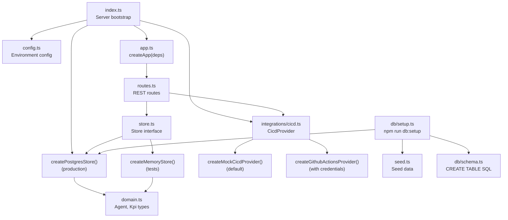

The backend is an **Express 5 + TypeScript** API run with `tsx`. It serves the
agent catalogue, KPIs and CI/CD pipelines, backed by PostgreSQL and a pluggable
CI/CD integration. It lives in `server/`.

## Architecture



## App factory and dependency injection

The central architectural decision: `createApp({ store, cicd })` takes both
dependencies by injection:

```ts
export interface AppDeps {
  store: Store       // createMemoryStore (tests) | createPostgresStore (prod)
  cicd: CicdProvider // createMockCicdProvider (default) | createGithubActionsProvider
}

export function createApp(deps: AppDeps) {
  const app = express()
  app.use(cors())
  app.use(express.json())
  registerRoutes(app, deps)
  app.use(/* catch-all error handler */)
  return app
}
```

Tests inject the in-memory store + mock provider → `npm test` needs no database,
no network. The running server injects real dependencies.

## Source structure

| File | Purpose |
|------|---------|
| `src/index.ts` | Server bootstrap, wires real dependencies |
| `src/app.ts` | `createApp` factory + error handler |
| `src/routes.ts` | REST route registration |
| `src/config.ts` | Environment configuration |
| `src/domain.ts` | `Agent` / `Kpi` domain types |
| `src/store.ts` | Store interfaces + in-memory implementation |
| `src/postgresStore.ts` | Postgres-backed store |
| `src/seed.ts` | Seed agents and KPIs |
| `src/db/schema.ts` | `CREATE TABLE` SQL |
| `src/db/setup.ts` | `db:setup` script |
| `src/integrations/cicd.ts` | CI/CD adapter (mock + GitHub Actions) |
| `src/__tests__/` | Vitest test suites |

## Configuration

| Field | Env var | Default |
|-------|---------|---------|
| `port` | `PORT` | `3001` |
| `databaseUrl` | `DATABASE_URL` | `postgres://localhost:5432/snabbit_dash` |
| `githubToken` | `GITHUB_TOKEN` | `''` |
| `githubRepo` | `GITHUB_REPO` | `''` |

## Per-file reference

- [index.ts](/sdlc-sample-worflow/backend/index-ts/) — server entry point
- [app.ts](/sdlc-sample-worflow/backend/app/) — Express factory
- [config.ts](/sdlc-sample-worflow/backend/config/) — runtime configuration
- [domain.ts](/sdlc-sample-worflow/backend/domain/) — domain types
- [routes.ts](/sdlc-sample-worflow/backend/routes/) — REST routes
- [store.ts](/sdlc-sample-worflow/backend/store/) — Store interface + in-memory store
- [postgresStore.ts](/sdlc-sample-worflow/backend/postgresstore/) — Postgres store
- [seed.ts](/sdlc-sample-worflow/backend/seed/) — seed data
- [db/schema.ts](/sdlc-sample-worflow/backend/db/schema/) — SQL schema
- [db/setup.ts](/sdlc-sample-worflow/backend/db/setup/) — setup script
- [integrations/cicd.ts](/sdlc-sample-worflow/backend/integrations/cicd/) — CI/CD adapter
- [vitest.config.ts](/sdlc-sample-worflow/backend/vitest-config/) — backend test configuration
