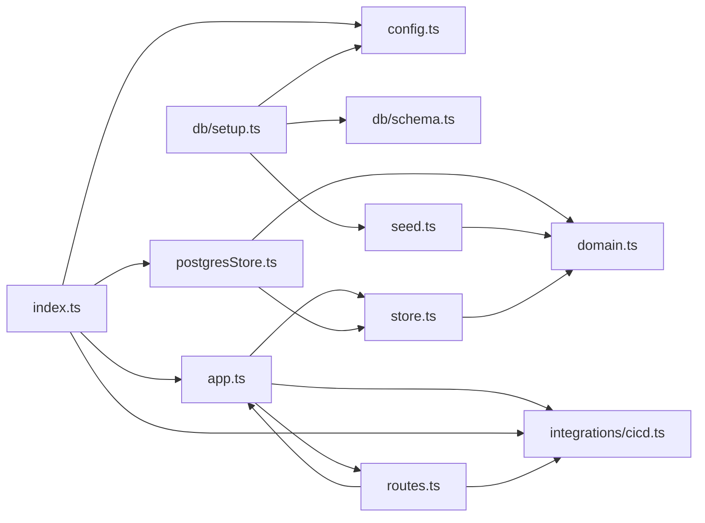

**Section root:** `server/src`

> Express + TypeScript API server. Serves agent, KPI, and pipeline data.

<!-- fill:overview:summary -->
The `server/src` subsystem is the Express + TypeScript API that backs the dashboard, exposing read-only JSON endpoints for agents, KPIs, and CI/CD pipelines. As the **Module dependency graph** above shows, `index.ts` bootstraps the process — it builds the Postgres-backed `Store` (`postgresStore.ts`) and a `CicdProvider` (`integrations/cicd.ts`), then hands both to `createApp` (`app.ts`), which registers the routes from `routes.ts`. Data flows from two boundaries: the Postgres database (agents and KPIs, defined by `domain.ts` and populated by the `db/` setup script from `seed.ts`) and the CI/CD provider (live GitHub Actions or a mock). Everything is dependency-injected through the `AppDeps` interface, so the same app runs against Postgres + a real provider in production or an in-memory store + mock in tests. The subsystem produces JSON consumed by the frontend's `lib/api.ts`; it does not render any UI itself.
<!-- /fill:overview:summary -->

## Top-level structure

| Folder | Purpose |
| --- | --- |
| [`db/`](./backend/db/overview/) | Schema DDL and the one-shot setup script; add a file here for database bootstrap, not query logic. |
| [`integrations/`](./backend/integrations/overview/) | Adapters to external systems behind a stable interface; add a file here for a new third-party integration. |

### Files at the root of this section

| File | Hint |
| --- | --- |
| [`app.ts`](./app) | `createApp` factory that assembles the Express app from injected dependencies. |
| [`config.ts`](./config) | Runtime configuration, read from environment variables. |
| [`domain.ts`](./domain) | Domain types for the Snabbit Agent Console API. |
| [`index.ts`](./index) | Process entry point that wires up Postgres, the CI/CD provider, and starts the server. |
| [`postgresStore.ts`](./postgresstore) | Production Postgres implementation of the `Store` contract. |
| [`routes.ts`](./routes) | Registers all REST endpoints on the Express app. |
| [`seed.ts`](./seed) | Seed catalogue of agents and KPIs for the database and tests. |
| [`store.ts`](./store) | Data-access interfaces plus the in-memory store used in tests. |

## Architecture

### Module dependency graph

## Key flows

<!-- fill:overview:flows -->
- **Startup:** [`index.ts`](./index) reads [`config.ts`](./config), opens a `pg` Pool, wraps it with [`createPostgresStore`](./postgresstore), selects a provider via `getCicdProvider` from [`integrations/cicd`](./backend/integrations/cicd/), then calls [`createApp`](./app) and `listen`s on the configured port.
- **Agent/KPI reads:** A `GET /api/agents`, `/api/agents/:id`, or `/api/kpis` request hits a handler in [`routes.ts`](./routes), which awaits the matching method on `deps.store` and returns the result as JSON (404 for a missing agent id).
- **Pipeline reads:** `GET /api/pipelines` calls `deps.cicd.listPipelines()`, runs the result through `summarizePipelines` from [`integrations/cicd`](./backend/integrations/cicd/), and returns `{ provider, summary, pipelines }`.
<!-- /fill:overview:flows -->

## When to add code here

<!-- fill:overview:when-to-add -->
Add code here when it runs server-side: new REST endpoints go in `routes.ts`, new shared shapes in `domain.ts`, new persistence queries in `postgresStore.ts` (with matching DDL in `db/schema.ts`), and new external-system clients under `integrations/`. Keep handlers thin — they should read through the injected `Store`/`CicdProvider` rather than reaching for a database or HTTP client directly, so the in-memory test path keeps working. Anything that renders UI or runs in the browser belongs in the frontend `src/` instead; the docs chatbot belongs in `chat-worker/`.
<!-- /fill:overview:when-to-add -->
