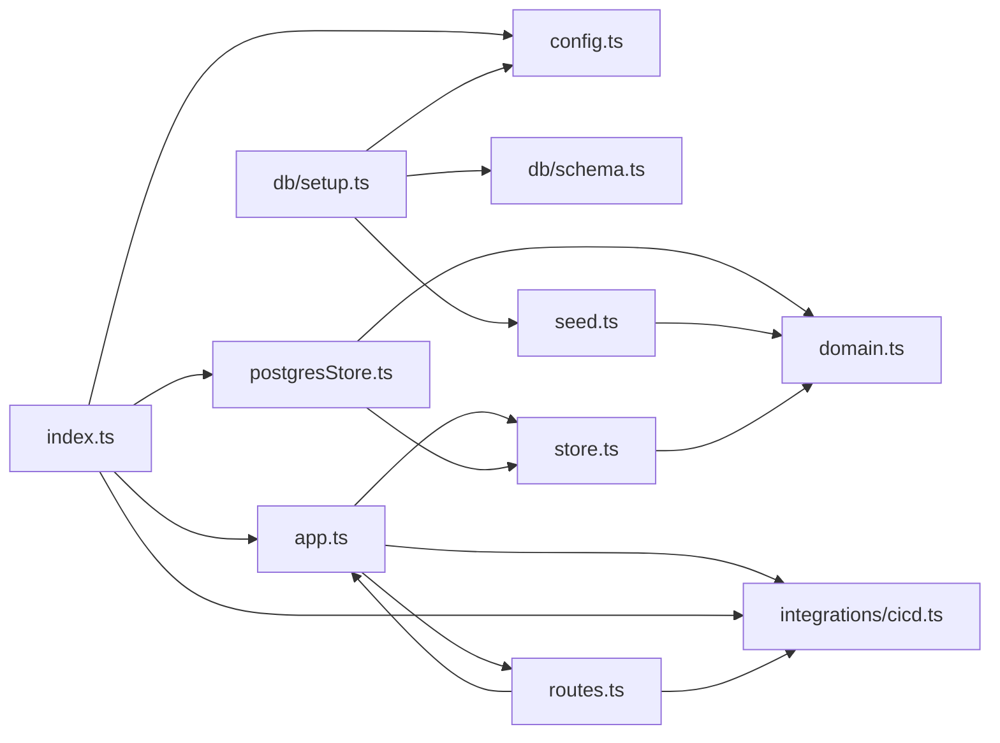

**Section root:** `server/src`

> Express + TypeScript API server. Serves agent, KPI, and pipeline data.

<!-- fill:overview:summary -->
This subsystem is the Express + TypeScript API server that backs the Snabbit Agent Console. It owns the REST surface (`/api/health`, `/api/agents`, `/api/agents/:id`, `/api/kpis`, `/api/pipelines`) and serves three kinds of data: an agent catalogue and KPI list read from a store, plus CI/CD pipeline data from an integration adapter. As the module dependency graph below shows, `index.ts` is the runtime entry point — it reads `config.ts`, builds the Postgres-backed store and the configured CI/CD provider, and hands them to `createApp` in `app.ts`. The store and provider are injected as dependencies, so the HTTP layer (`routes.ts`) depends only on the `Store` and `CicdProvider` interfaces and never talks to Postgres or GitHub directly. The server consumes a Postgres database (and optionally the live GitHub Actions API) and produces JSON responses for the frontend.
<!-- /fill:overview:summary -->

## Top-level structure

| Folder | Purpose |
| --- | --- |
| [`db/`](./backend/db/overview/) | Postgres schema and the one-shot setup/seed script; add a file here for table definitions or migrations. |
| [`integrations/`](./backend/integrations/overview/) | Adapters to external services behind swappable interfaces; add a file here to wrap a third-party API (e.g. CI/CD). |

### Files at the root of this section

| File | Hint |
| --- | --- |
| [`app.ts`](./app) | Builds the Express app from injected dependencies (store + CI/CD provider) and wires routes plus the error handler. |
| [`config.ts`](./config) | Runtime configuration, read from environment variables. |
| [`domain.ts`](./domain) | Domain types for the Snabbit Agent Console API. |
| [`index.ts`](./index) | Server entry point: assembles the Postgres store and CI/CD provider and starts listening on the configured port. |
| [`postgresStore.ts`](./postgresstore) | Postgres-backed `Store` implementation that queries the agents/kpis tables and maps rows to domain types. |
| [`routes.ts`](./routes) | Registers the REST routes on the Express app, delegating to the injected store and CI/CD provider. |
| [`seed.ts`](./seed) | Seed data (`SEED_AGENTS`, `SEED_KPIS`) used by the in-memory store and the db setup script. |
| [`store.ts`](./store) | `Store` interface and the in-memory implementation used by tests and quick local runs. |

## Architecture

### Module dependency graph

## Key flows

<!-- fill:overview:flows -->
**Boot:** [`index.ts`](./index) reads [`config.ts`](./config), creates a `pg` `Pool`, builds the Postgres store via `createPostgresStore` ([`postgresStore.ts`](./postgresstore)) and selects the CI/CD provider via `getCicdProvider` ([`integrations/cicd.ts`](./backend/integrations/cicd)), then passes both into `createApp` ([`app.ts`](./app)) and calls `app.listen`.

**Data requests:** A `GET /api/agents` (or `/api/kpis`) hits a handler in [`routes.ts`](./routes) that awaits the injected store's `listAgents`/`listKpis`, which `postgresStore.ts` resolves with a SQL query mapped to `domain.ts` types.

**Pipelines:** A `GET /api/pipelines` calls the provider's `listPipelines()` and runs the result through `summarizePipelines` ([`integrations/cicd.ts`](./backend/integrations/cicd)), returning the provider name, summary, and pipeline list as JSON.
<!-- /fill:overview:flows -->

## When to add code here

<!-- fill:overview:when-to-add -->
Add code here when it is part of the API server: a new REST endpoint (extend `routes.ts`), a new domain type (`domain.ts`), a new persistence query (`postgresStore.ts`, with table changes in `db/`), or a new external-service adapter (`integrations/`). Keep dependencies injected through `AppDeps` so handlers depend on interfaces, not concrete stores or providers. Frontend UI, the docs site, and the standalone chat worker are separate subsystems and do not belong here; anything that wraps a third-party service should go under `integrations/` rather than directly into a route handler.
<!-- /fill:overview:when-to-add -->
