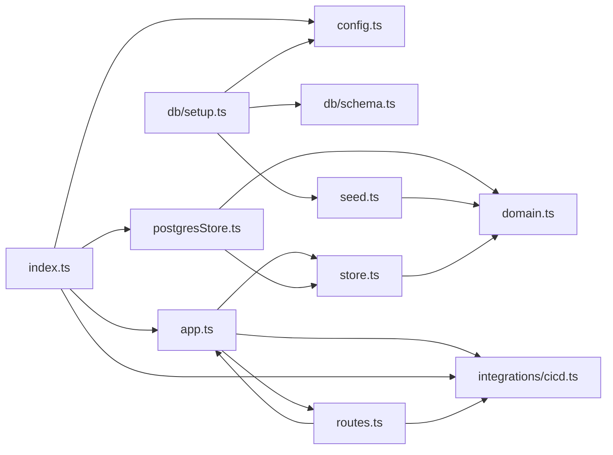

**Section root:** `server/src`

> Express + TypeScript API server. Serves agent, KPI, and pipeline data.

<FILL: 3-5 sentences on what this subsystem owns, the runtime boundaries, and the data it produces or consumes. Reference the diagrams below by name.>

## Top-level structure

| Folder | Purpose |
| --- | --- |
| [`db/`](./backend/db/overview/) | <FILL: one line on what lives in db/ and when to add a file here.> |
| [`integrations/`](./backend/integrations/overview/) | <FILL: one line on what lives in integrations/ and when to add a file here.> |

### Files at the root of this section

| File | Hint |
| --- | --- |
| [`app.ts`](./app) | <FILL: one-line purpose for app.ts> |
| [`config.ts`](./config) | Runtime configuration, read from environment variables. |
| [`domain.ts`](./domain) | Domain types for the Snabbit Agent Console API. |
| [`index.ts`](./index) | <FILL: one-line purpose for index.ts> |
| [`postgresStore.ts`](./postgresstore) | <FILL: one-line purpose for postgresStore.ts> |
| [`routes.ts`](./routes) | <FILL: one-line purpose for routes.ts> |
| [`seed.ts`](./seed) | <FILL: one-line purpose for seed.ts> |
| [`store.ts`](./store) | <FILL: one-line purpose for store.ts> |

## Architecture

### Module dependency graph

## Key flows

<FILL: 2-3 short flow descriptions — the most important runtime sequences in this subsystem. Reference symbols by their documented file (use relative links).>

## When to add code here

<FILL: practical guidance for someone deciding whether a new module belongs in this subsystem or somewhere else.>
