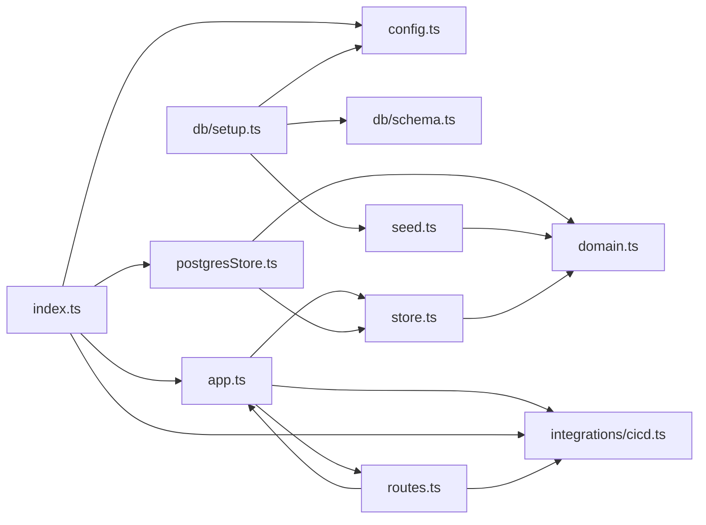

**Section root:** `server/src`

> Express + TypeScript API server. Serves agent, KPI, and pipeline data.

<!-- fill:overview:summary -->
The `server/src` subsystem is the Express + TypeScript API server that owns all of the agent, KPI, and CI/CD pipeline data the frontend renders. As shown in the module dependency graph below, `index.ts` is the runtime entry point: it reads `config.ts`, constructs a Postgres-backed `Store` via `postgresStore.ts` and a `CicdProvider` via `integrations/cicd.ts`, then hands both to `createApp` in `app.ts`. `app.ts` builds the Express app and delegates HTTP handling to `routes.ts`, which serves the `/api/agents`, `/api/kpis`, and `/api/pipelines` endpoints. The shapes flowing across this boundary — `Agent` and `Kpi` — are defined once in `domain.ts` and mirror what the UI consumes, while `seed.ts` and the `db/` modules supply the catalogue loaded into Postgres. The pipeline data is fetched from either deterministic mock data or the live GitHub Actions API depending on the configured credentials.
<!-- /fill:overview:summary -->

## Top-level structure

| Folder | Purpose |
| --- | --- |
| [`db/`](./backend/db/overview/) | Database schema (`schema.ts`) and the setup/seed script (`setup.ts`); add files here for table definitions or migration tooling. |
| [`integrations/`](./backend/integrations/overview/) | Adapters to external services such as `cicd.ts`; add a file here when wiring in a new third-party system behind a provider interface. |

### Files at the root of this section

| File | Hint |
| --- | --- |
| [`app.ts`](./app) | Builds the Express app from an injected `Store` and `CicdProvider` and registers routes plus a JSON error handler. |
| [`config.ts`](./config) | Runtime configuration, read from environment variables. |
| [`domain.ts`](./domain) | Domain types for the Snabbit Agent Console API. |
| [`index.ts`](./index) | Process entry point: opens the Postgres pool, selects the CI/CD provider, creates the app, and starts listening. |
| [`postgresStore.ts`](./postgresstore) | Implements the `Store` interface against Postgres, mapping `AgentRow`/`KpiRow` query results into `Agent` and `Kpi` objects. |
| [`routes.ts`](./routes) | Registers the REST endpoints (health, agents, KPIs, pipelines) on the Express app using the injected dependencies. |
| [`seed.ts`](./seed) | Hard-coded agent and KPI catalogue, loaded into Postgres by the setup script and used directly by the in-memory test store. |
| [`store.ts`](./store) | Defines the `Store` interface and an in-memory implementation used by tests so `npm test` needs no database. |

## Architecture

### Module dependency graph

## Key flows

<!-- fill:overview:flows -->
- **Startup wiring.** [`index.ts`](./index) reads [`config.ts`](./config), creates a Postgres-backed store with [`createPostgresStore`](./postgresstore), picks a CI/CD provider with [`getCicdProvider`](./integrations/cicd), and passes both into [`createApp`](./app), which calls [`registerRoutes`](./routes) before the server begins listening.
- **Agent request.** A `GET /api/agents/:id` hits a handler in [`routes.ts`](./routes), which calls `store.getAgent(id)`; [`postgresStore.ts`](./postgresstore) queries Postgres and maps the row to an [`Agent`](./domain), returning 404 JSON when no row matches.
- **Pipelines request.** A `GET /api/pipelines` calls `cicd.listPipelines()` on the active [`CicdProvider`](./integrations/cicd), then runs [`summarizePipelines`](./integrations/cicd) to attach headline counts before responding with the provider name, summary, and pipeline list.
<!-- /fill:overview:flows -->

## When to add code here

<!-- fill:overview:when-to-add -->
Add code here when it belongs to the server-side API: new endpoints go in [`routes.ts`](./routes), shared data shapes in [`domain.ts`](./domain), and new persistence logic in [`postgresStore.ts`](./postgresstore) (or behind the [`Store`](./store) interface). Put adapters to outside systems under `integrations/` behind a provider interface like [`CicdProvider`](./integrations/cicd), and database schema or seed concerns under `db/` and [`seed.ts`](./seed). If the code renders UI, manipulates the DOM, or is React/client logic, it belongs in the frontend instead; if it processes chat messages off the request path, it belongs in the chat worker.
<!-- /fill:overview:when-to-add -->
