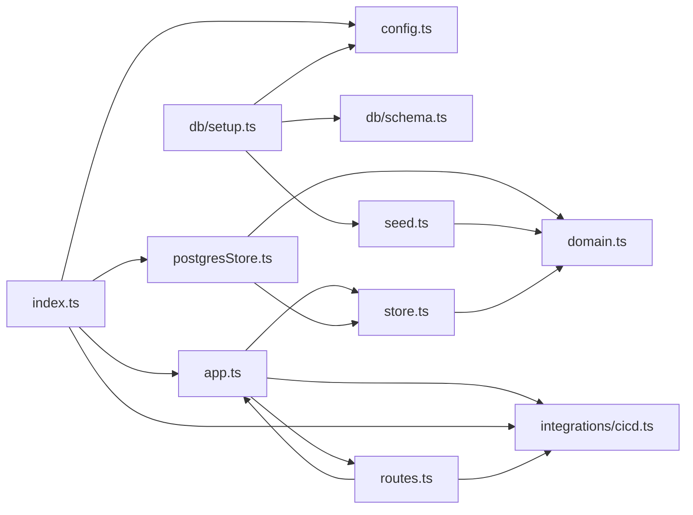

**Section root:** `server/src`

> Express + TypeScript API server. Serves agent, KPI, and pipeline data.

<!-- fill:overview:summary -->
The backend is an Express + TypeScript API server that serves the Snabbit Agent Console's agent catalogue, dashboard KPIs, and CI/CD pipeline data. Its entrypoint `index.ts` reads `config.ts`, builds the app via `app.ts`, wires in a `postgresStore.ts` store and a CI/CD provider from `integrations/cicd.ts`, and exposes the HTTP routes defined in `routes.ts`. Domain shapes live in `domain.ts`, persistence is split between the in-memory `store.ts` and the Postgres-backed `postgresStore.ts`, and `seed.ts` plus the `db/` folder bootstrap the database. The Module dependency graph below shows how these pieces fit together; the boundary is the HTTP API — it consumes environment configuration and a Postgres database and produces JSON responses for the frontend.
<!-- /fill:overview:summary -->

## Top-level structure

| Folder | Purpose |
| --- | --- |
| [`db/`](./backend/db/overview/) | Postgres schema and the one-shot setup/seed bootstrap; add files here for schema definitions or DB bootstrapping. |
| [`integrations/`](./backend/integrations/overview/) | Adapters for external services (e.g. CI/CD); add a file here when wrapping a third-party API behind a provider interface. |

### Files at the root of this section

| File | Hint |
| --- | --- |
| [`app.ts`](./app) | Assembles the Express app via `createApp`, wiring middleware, routes, and injected dependencies. |
| [`config.ts`](./config) | Runtime configuration, read from environment variables. |
| [`domain.ts`](./domain) | Domain types for the Snabbit Agent Console API. |
| [`index.ts`](./index) | Server entrypoint: reads config, builds the app with the Postgres store and CI/CD provider, and listens. |
| [`postgresStore.ts`](./postgresstore) | Postgres-backed implementation of the `Store` contract for production. |
| [`routes.ts`](./routes) | Registers all REST endpoints (health, agents, KPIs, pipelines) onto the app. |
| [`seed.ts`](./seed) | Seed data — the agent catalogue and dashboard KPIs. |
| [`store.ts`](./store) | Data-access `Store` interfaces plus an in-memory implementation for tests. |

## Architecture

### Module dependency graph

## Key flows

<!-- fill:overview:flows -->
- Startup: [`index.ts`](./index) reads [`config.ts`](./config), picks a CI/CD provider with `getCicdProvider` from [`integrations/cicd`](./integrations/cicd), constructs a Postgres store from [`postgresStore.ts`](./postgresstore), and calls `createApp` in [`app.ts`](./app) to build and start the server.
- Request handling: [`app.ts`](./app) registers the endpoints from [`routes.ts`](./routes); handlers read agents/KPIs through the injected `Store` ([`store.ts`](./store)/[`postgresStore.ts`](./postgresstore)) and serve pipeline summaries via `summarizePipelines` in [`integrations/cicd`](./integrations/cicd).
- Database bootstrap: `npm run db:setup` runs [`db/setup.ts`](./backend/db/setup/), which applies `SCHEMA_SQL` from [`db/schema.ts`](./backend/db/schema/) and upserts the constants from [`seed.ts`](./seed).
<!-- /fill:overview:flows -->

## When to add code here

<!-- fill:overview:when-to-add -->
Add code here when it is part of the server-side API: a new endpoint goes in [`routes.ts`](./routes), shared types in [`domain.ts`](./domain), new persistence methods on the `Store` interfaces in [`store.ts`](./store) (with parallel implementations in [`postgresStore.ts`](./postgresstore)), and external-service adapters under [`integrations/`](./backend/integrations/overview/). Schema or seed-bootstrap changes belong in [`db/`](./backend/db/overview/) and [`seed.ts`](./seed). UI, rendering, and anything that runs in the browser does not belong here — it lives in the frontend; the chatbot Worker lives in its own `chat-worker` section.
<!-- /fill:overview:when-to-add -->
