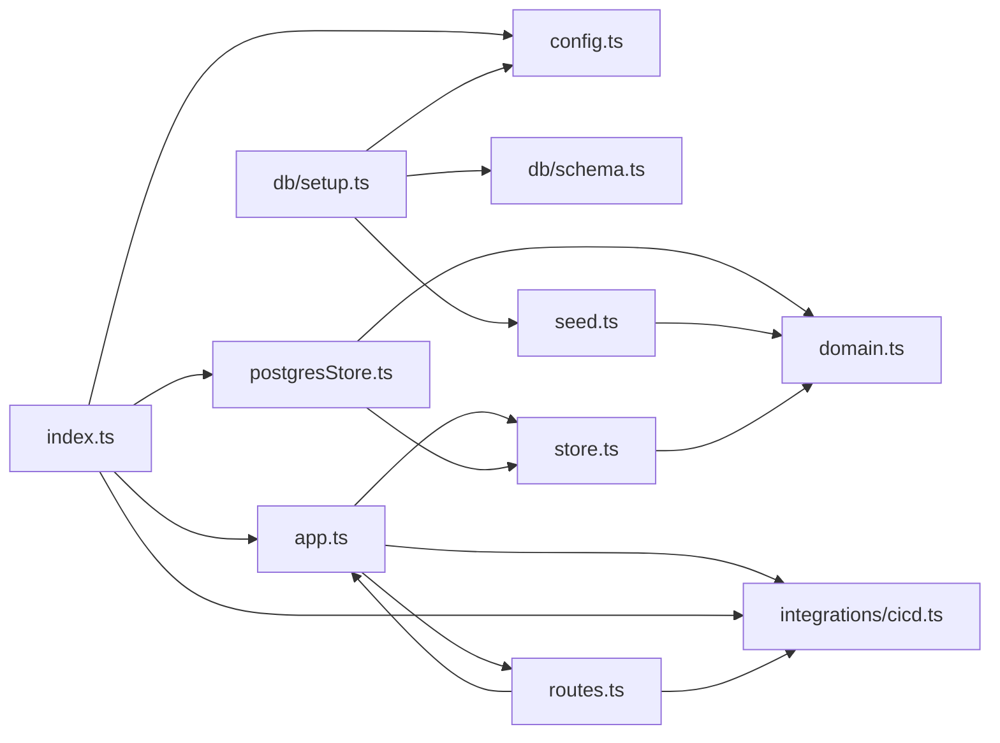

**Section root:** `server/src`

> Express + TypeScript API server. Serves agent, KPI, and pipeline data.

<!-- fill:overview:summary -->
`server/src` is the Express + TypeScript API that the React frontend talks to. It owns the REST surface (`/api/health`, `/api/agents`, `/api/agents/:id`, `/api/kpis`, `/api/pipelines`) and the storage and integration adapters that back it. The runtime boundary is HTTP-in / Postgres-and-GitHub-Actions-out: `index.ts` boots a Postgres pool and the live or mock CI/CD adapter, then hands them to `createApp` as dependencies. The **Module dependency graph** below shows how `index.ts` composes `app.ts`, `routes.ts`, `postgresStore.ts`, and `integrations/cicd.ts`, with `domain.ts` providing the shared types that `seed.ts`, `store.ts`, and `db/` all build on.
<!-- /fill:overview:summary -->

## Top-level structure

| Folder | Purpose |
| --- | --- |
| [`db/`](./backend/db/overview/) | Postgres schema SQL and the one-shot `db:setup` script — add a file here for new migrations or schema-related tooling. |
| [`integrations/`](./backend/integrations/overview/) | Adapters for external services (CI/CD today, more later) — add a file here for each new third-party provider. |

### Files at the root of this section

| File | Hint |
| --- | --- |
| [`app.ts`](./app) | `createApp({ store, cicd })` builds the Express app from injected dependencies and adds the JSON error handler. |
| [`config.ts`](./config) | Runtime configuration, read from environment variables. |
| [`domain.ts`](./domain) | Domain types for the Snabbit Agent Console API. |
| [`index.ts`](./index) | Process entrypoint — wires Postgres + the chosen CI/CD provider into `createApp` and calls `app.listen(port)`. |
| [`postgresStore.ts`](./postgresstore) | `createPostgresStore(pool)` — Postgres-backed `Store` that maps snake_case rows into the camelCase domain types. |
| [`routes.ts`](./routes) | `registerRoutes(app, deps)` — declares every REST route and binds it to the store and CI/CD adapter. |
| [`seed.ts`](./seed) | Hard-coded `SEED_AGENTS` and `SEED_KPIS` arrays used by `db:setup` and the in-memory store in tests. |
| [`store.ts`](./store) | `Store` interface (agents + KPIs) and `createMemoryStore` — used by the test suite and as the local fallback. |

## Architecture

### Module dependency graph

## Key flows

<!-- fill:overview:flows -->
- **Boot:** [`index.ts`](./index) reads `config`, opens a `pg` `Pool`, builds a `Store` with [`createPostgresStore`](./postgresstore), picks a CI/CD adapter with [`getCicdProvider`](./integrations/cicd), then calls [`createApp({ store, cicd })`](./app) and starts listening on `config.port`.
- **Request:** A frontend `fetch` hits an endpoint registered in [`routes.ts`](./routes); the handler delegates to either `deps.store` (agents/KPIs) or `deps.cicd.listPipelines()` (pipelines, wrapped through `summarizePipelines`) and serialises the result as JSON. Unhandled errors fall through to the `createApp` error middleware, which logs the exception and returns `{ error: 'Internal server error' }` with status 500.
- **Schema setup:** [`db/setup.ts`](./backend/db/setup/) (`npm run db:setup`) runs the idempotent `SCHEMA_SQL` from [`db/schema.ts`](./backend/db/schema/) and upserts every record from [`seed.ts`](./seed) into the `agents` and `kpis` tables.
<!-- /fill:overview:flows -->

## When to add code here

<!-- fill:overview:when-to-add -->
Add code here when it must run on the server. New REST endpoints go in [`routes.ts`](./routes); new persistence shapes go through [`store.ts`](./store) (the interface) plus [`postgresStore.ts`](./postgresstore) (Postgres implementation) and the in-memory `createMemoryStore` so tests stay hermetic. New shared types belong in [`domain.ts`](./domain); seed records in [`seed.ts`](./seed). Third-party services (CI/CD, observability, etc.) belong under [`integrations/`](./backend/integrations/overview/) behind a small provider interface like `CicdProvider`. Browser-only code belongs under [`frontend`](../frontend/overview/), and the docs chatbot lives in [`chat-worker`](../chat-worker/overview/).
<!-- /fill:overview:when-to-add -->
