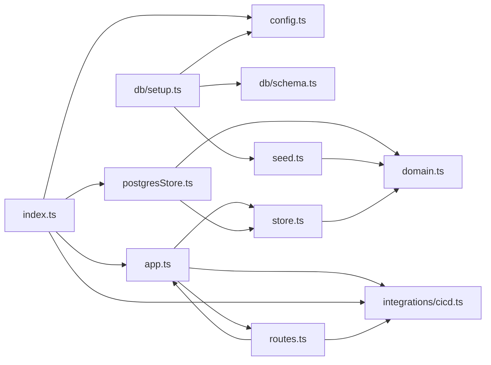

**Section root:** `server/src`

> Express + TypeScript API server. Serves agent, KPI, and pipeline data.

<!-- fill:overview:summary -->
The backend is an Express + TypeScript API server that serves agent, KPI, and CI/CD pipeline data to the frontend over REST. It is built with dependency injection: `app.ts` assembles an Express app from a `Store` and a `CicdProvider`, and `routes.ts` maps `/api/*` endpoints onto them. As the **Module dependency graph** shows, `index.ts` is the production entrypoint — it wires the Postgres-backed store (`postgresStore.ts`) and the auto-selected CI/CD provider (`integrations/cicd.ts`) into `createApp`. The data boundary runs through the `Store` interface (`store.ts`): agents/KPIs come from Postgres in production or an in-memory store in tests, while pipeline data comes from either the GitHub Actions API or a deterministic mock. `domain.ts` defines the shared shapes, and `seed.ts` plus `db/` own the schema and initial data.
<!-- /fill:overview:summary -->

## Top-level structure

| Folder | Purpose |
| --- | --- |
| [`db/`](./backend/db/overview/) | Postgres schema SQL and the one-shot setup/seed script; add a file here for database structure or migration tooling. |
| [`integrations/`](./backend/integrations/overview/) | Adapters to external systems (the CI/CD providers); add a file here when wiring in another third-party data source. |

### Files at the root of this section

| File | Hint |
| --- | --- |
| [`app.ts`](./app) | Builds the Express app from injected `store` + `cicd` deps and adds CORS, JSON parsing, and an error handler. |
| [`config.ts`](./config) | Runtime configuration, read from environment variables. |
| [`domain.ts`](./domain) | Domain types for the Snabbit Agent Console API. |
| [`index.ts`](./index) | Production entrypoint: wires the Postgres store and CI/CD provider into `createApp` and starts listening. |
| [`postgresStore.ts`](./postgresstore) | Postgres-backed `Store` implementation that queries the `agents`/`kpis` tables and maps rows to domain types. |
| [`routes.ts`](./routes) | Registers the REST routes (`/api/health`, `/api/agents`, `/api/kpis`, `/api/pipelines`) on the Express app. |
| [`seed.ts`](./seed) | Seed catalogue of agents and KPIs, loaded into Postgres by db setup and used by the in-memory store in tests. |
| [`store.ts`](./store) | The `Store` interface plus an in-memory implementation used by tests and quick local runs. |

## Architecture

### Module dependency graph

## Key flows

<!-- fill:overview:flows -->
- **Startup:** [`index.ts`](./index) reads [`config.ts`](./config), builds a [`createPostgresStore`](./postgresstore) and the provider chosen by [`getCicdProvider`](./integrations/cicd), passes both into [`createApp`](./app), and listens on the configured port.
- **Request handling:** a `GET /api/agents` (or `/kpis`) call routed by [`routes.ts`](./routes) delegates to the injected [`Store`](./store), which queries Postgres; `/api/pipelines` calls the [`CicdProvider`](./integrations/cicd) and wraps the result with [`summarizePipelines`](./integrations/cicd).
- **Database setup:** `npm run db:setup` runs [`db/setup.ts`](./db/setup), applying [`SCHEMA_SQL`](./db/schema) then upserting [`SEED_AGENTS`/`SEED_KPIS`](./seed).
<!-- /fill:overview:flows -->

## When to add code here

<!-- fill:overview:when-to-add -->
Add code here for anything served over HTTP or touching persistence. New endpoints go in `routes.ts`; new data access goes behind the `Store` interface in `store.ts`/`postgresStore.ts` so tests can swap in the in-memory store; new third-party data sources (another CI system, an alerting tool) belong in `integrations/` behind a small provider interface like `CicdProvider`. Schema changes and seed data live in `db/` and `seed.ts`. Keep browser UI in the frontend (`src/`) and the docs chatbot in `chat-worker/` — neither belongs here.
<!-- /fill:overview:when-to-add -->
