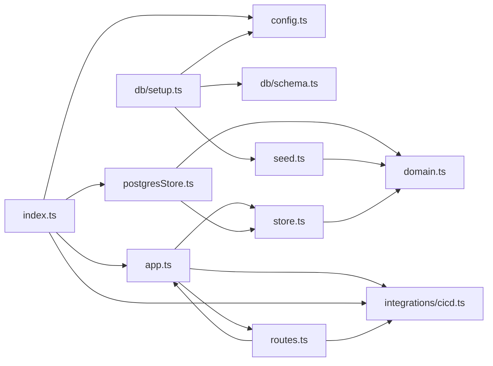

**Section root:** `server/src`

> Express + TypeScript API server. Serves agent, KPI, and pipeline data.

<!-- fill:overview:summary -->
The `server/` tree is the Snabbit API: an Express + TypeScript service on port `3001` that serves `/api/health`, `/api/agents`, `/api/agents/:id`, `/api/kpis`, and `/api/pipelines`. It owns the agent/KPI persistence boundary — either an in-memory store (used by Vitest + supertest) or a Postgres store (used by `npm run dev`), both behind the `Store` interface in `store.ts`. CI/CD pipelines come from a separate adapter in `integrations/cicd.ts` that switches between a deterministic mock and the live GitHub Actions API. The **Module dependency graph** below shows how `index.ts` wires `config` → `Pool` → `createPostgresStore` and `getCicdProvider` into `createApp`, and how `routes.ts` projects each `Store`/`CicdProvider` method onto a REST endpoint.
<!-- /fill:overview:summary -->

## Top-level structure

| Folder | Purpose |
| --- | --- |
| [`db/`](./backend/db/overview/) | One-shot database scaffolding — the `SCHEMA_SQL` DDL and the `setup.ts` script that creates the `agents`/`kpis` tables and upserts the seed rows. |
| [`integrations/`](./backend/integrations/overview/) | External-service adapters; today only `cicd.ts`, which exposes a `CicdProvider` with a mock variant and a live GitHub Actions variant. |

### Files at the root of this section

| File | Hint |
| --- | --- |
| [`app.ts`](./app) | `createApp({ store, cicd })` — builds the Express app, mounts `cors`/`json` middleware, registers routes, and adds a JSON error handler. |
| [`config.ts`](./config) | Runtime configuration, read from environment variables. |
| [`domain.ts`](./domain) | Domain types for the Snabbit Agent Console API. |
| [`index.ts`](./index) | Process entrypoint — builds the `Pool`, picks the CI/CD provider, wires `createApp`, and calls `app.listen(config.port)`. |
| [`postgresStore.ts`](./postgresstore) | Postgres-backed `Store` implementation — `pg` queries plus `rowToAgent`/`rowToKpi` mappers from snake_case columns to camelCase domain types. |
| [`routes.ts`](./routes) | `registerRoutes(app, { store, cicd })` — declares the five REST endpoints and 404 handling for unknown agent ids. |
| [`seed.ts`](./seed) | Static `SEED_AGENTS` and `SEED_KPIS` arrays — used by tests through `createMemoryStore` and by `db/setup.ts` to upsert into Postgres. |
| [`store.ts`](./store) | The `AgentStore`/`KpiStore`/`Store` interfaces plus `createMemoryStore`, the in-memory implementation used by the test suite. |

## Architecture

### Module dependency graph

## Key flows

<!-- fill:overview:flows -->
- **Boot.** [`index.ts`](./index) reads [`config`](./config), opens a `pg` `Pool`, calls [`createPostgresStore`](./postgresstore) and [`getCicdProvider`](./backend/integrations/cicd/), passes both into [`createApp`](./app), and calls `app.listen(config.port)`.
- **Pipelines request.** `GET /api/pipelines` (registered in [`routes.ts`](./routes)) calls `deps.cicd.listPipelines()`, runs the result through [`summarizePipelines`](./backend/integrations/cicd/) to compute the pass rate, and responds with `{ provider, summary, pipelines }`.
- **Agents request.** `GET /api/agents` and `GET /api/agents/:id` call [`Store.listAgents`/`getAgent`](./store); the Postgres implementation queries `SELECT * FROM agents ORDER BY runs_per_week DESC` and maps each row to the camelCase [`Agent`](./domain) type.
<!-- /fill:overview:flows -->

## When to add code here

<!-- fill:overview:when-to-add -->
Add code here if it needs to run on the API server — anything that touches `pg`, environment secrets, or third-party HTTP APIs (GitHub, PagerDuty, etc.). New REST endpoints go in `routes.ts` and project the work onto either the `Store` interface (extend `store.ts`/`postgresStore.ts` together) or an integration adapter (a new file under `integrations/`). Browser-only concerns and pure presentation belong in `src/`; the docs chatbot lives in `chat-worker/`.
<!-- /fill:overview:when-to-add -->
