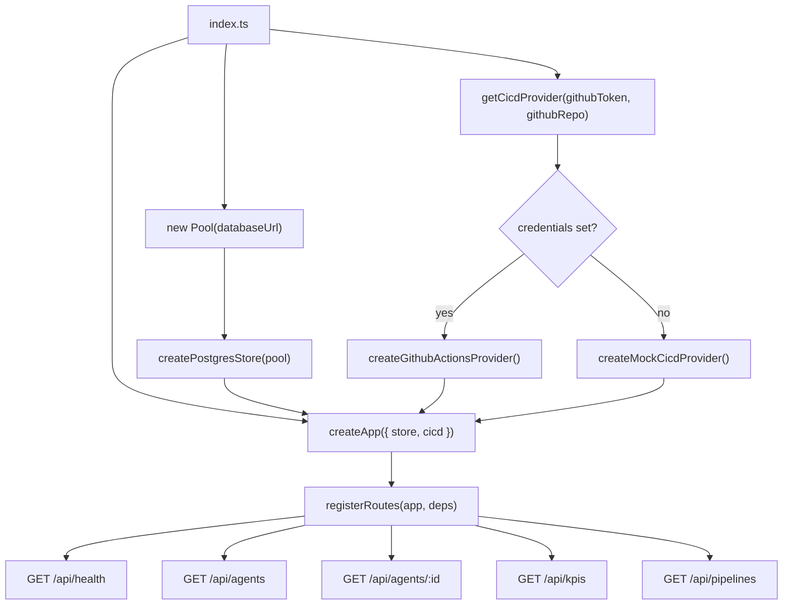

The Snabbit API server is an Express application written in TypeScript. It persists agent and KPI data in PostgreSQL and exposes a thin REST layer consumed by the frontend dashboard. The server lives entirely under `server/`.

## Technology stack

| Concern | Choice |
|---|---|
| Runtime | Node.js |
| TypeScript execution | tsx (no separate compile step during development) |
| Framework | Express 5 |
| Language | TypeScript 6 |
| Database | PostgreSQL via the `pg` connection pool |
| Test runner | Vitest |
| CI/CD integration | GitHub Actions (or built-in mock) |

## Dependency-injection architecture

`createApp` accepts a `deps` object that bundles two collaborators:

- **`store`** — a `Store` implementation that reads agents and KPIs.
- **`cicd`** — a `CicdProvider` implementation that lists CI/CD pipelines.

Neither is imported directly inside `app.ts` or `routes.ts`. The concrete implementations (`createPostgresStore`, `createGithubActionsProvider`) are wired together only in `index.ts`.

### Why dependency injection?

Tests can supply a `createMemoryStore` (in-memory arrays) and `createMockCicdProvider` (eight deterministic pipelines) without any network or database connection. The same application logic is exercised regardless of which implementations are injected. `npm test` requires no running Postgres instance and no GitHub token.

```
index.ts         → injects createPostgresStore + getCicdProvider  → production
api.test.ts      → injects createMemoryStore   + mock provider     → tests
```

## Architecture flowchart



## Source file map

| File | Purpose |
|---|---|
| `src/index.ts` | Server entry point — wires real dependencies and starts listening |
| `src/app.ts` | `createApp` factory — middleware stack and error handler |
| `src/config.ts` | Environment variable configuration with local defaults |
| `src/domain.ts` | `Agent`, `Kpi`, `AgentStatus`, `AgentCategory` types |
| `src/routes.ts` | REST route registration |
| `src/store.ts` | `Store` interface + in-memory implementation |
| `src/postgresStore.ts` | PostgreSQL-backed `Store` implementation |
| `src/seed.ts` | Seed data — 12 agents + 4 KPIs |
| `src/db/schema.ts` | `SCHEMA_SQL` — `CREATE TABLE` statements |
| `src/db/setup.ts` | One-shot database setup script |
| `src/integrations/cicd.ts` | `CicdProvider` interface, mock and GitHub Actions implementations |
| `vitest.config.ts` | Vitest configuration for the backend test suite |

## Package scripts

| Script | Command | Purpose |
|---|---|---|
| `dev` | `tsx watch src/index.ts` | Start with live reload on file changes |
| `build` | `tsc` | Compile TypeScript to `dist/` |
| `start` | `node dist/index.js` | Run compiled production output |
| `db:setup` | `tsx src/db/setup.ts` | Create tables and upsert seed data |
| `test` | `vitest run` | Execute all unit tests once (CI mode) |
| `test:watch` | `vitest` | Run tests in watch mode |

## Configuration summary

All runtime configuration is read from environment variables. Every field has a local-friendly default so `npm run dev` works with no setup.

| Field | Env var | Default |
|---|---|---|
| `port` | `PORT` | `3001` |
| `databaseUrl` | `DATABASE_URL` | `postgres://localhost:5432/snabbit_dash` |
| `githubToken` | `GITHUB_TOKEN` | `''` (empty — selects mock provider) |
| `githubRepo` | `GITHUB_REPO` | `''` (empty — selects mock provider) |

:::tip
For zero-config local development, start a Postgres instance named `snabbit_dash` on port 5432, run `npm run db:setup` once, then `npm run dev`. No environment variables required.
:::
