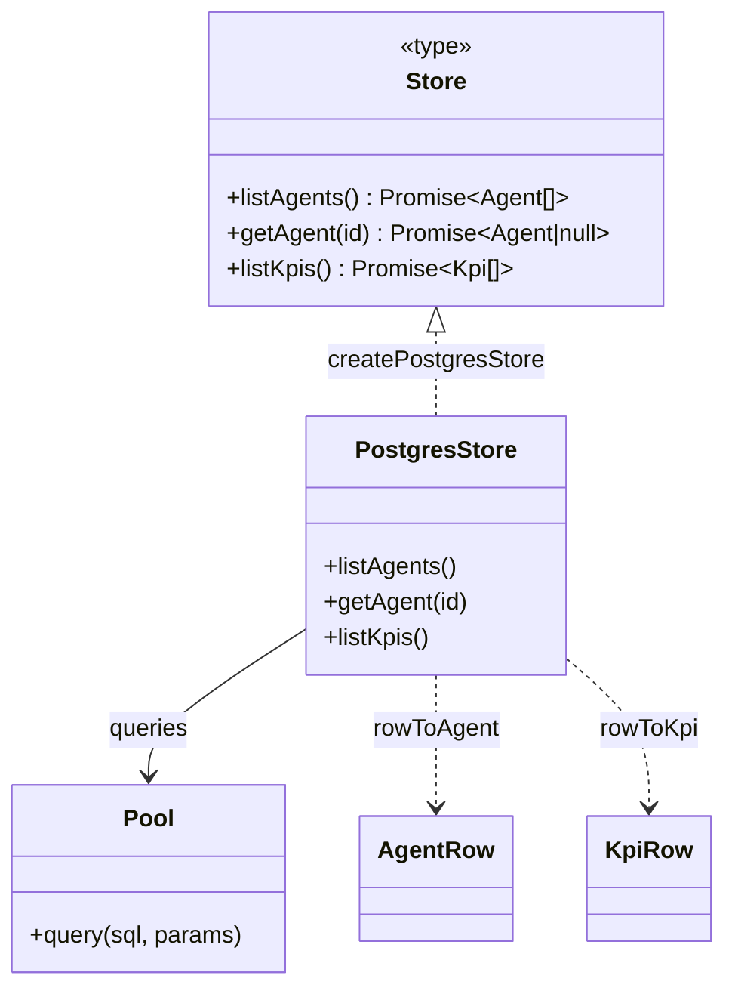

**File:** `server/src/postgresStore.ts` · **Lines:** 81

<!-- fill:file:summary -->
`postgresStore.ts` provides the production, Postgres-backed implementation of the `Store` contract from `store.ts` via `createPostgresStore`. It runs SQL queries through a `pg` `Pool` and maps the raw `agents` and `kpis` rows into the `Agent` and `Kpi` shapes from `domain.ts` using the `rowToAgent`/`rowToKpi` helpers (translating snake_case columns to camelCase fields and casting `category`/`status` to their union types). It is wired up in `index.ts`, which constructs the `Pool` and passes the resulting store into `createApp`, serving as the runtime counterpart to the in-memory `createMemoryStore`.
<!-- /fill:file:summary -->

## Imports

This file pulls in the following modules. Relative imports point to other documented files; external imports are libraries from `node_modules`.

| Module | Imports | Kind |
| --- | --- | --- |
| `pg` | `Pool` | type-only · external |
| `./domain` | `Agent`, `AgentCategory`, `AgentStatus`, `Kpi` | type-only · internal |
| `./store` | `Store` | type-only · internal |


## Symbols

This file exports 1 symbol. Every export is documented below, in declaration order.

| Name | Kind | Default |
| --- | --- | --- |
| createPostgresStore | function | no |

## createPostgresStore

**Kind:** `function`

```ts
export function createPostgresStore(pool: Pool): Store { ... }
```

> Postgres-backed store. Used by the running server.

### Parameters

| Name | Type | Default | Required | Purpose |
| --- | --- | --- | --- | --- |
| pool | `Pool` | — | yes | The `pg` connection pool the store's methods query against; captured in the returned closure. |

**Returns:** `Store`

<!-- fill:sym:createPostgresStore:return -->
Returns a `Store` object that satisfies both `AgentStore` and `KpiStore`, with each method querying the database through the captured `pool`. The store object itself is always returned (never null); its `getAgent` method resolves to `null` when no row matches the requested id, while `listAgents`/`listKpis` resolve to arrays (possibly empty). The methods may reject if the underlying query fails.
<!-- /fill:sym:createPostgresStore:return -->

### Line-by-line walkthrough

Each top-level statement of `createPostgresStore`, in execution order. The line numbers reference the source file as it appears today.

**Line 59 — `ReturnStatement`**

```ts
return {
    async listAgents() {
      const { rows } = await pool.query(
        'SELECT * FROM agents ORDER BY runs_per_week DESC',
      )
      return (rows as AgentRow[]).map(rowToAgent)
    },
    async getAgent(id: string) {
      const { rows } = await pool.query('SELECT * FROM agents WHERE id = $1', [
        id,
      ])
      const row = rows[0] as AgentRow | undefined
      return row ? rowToAgent(row) : null
    },
    async listKpis() {
      const { rows } = await pool.query(
        'SELECT * FROM kpis ORDER BY sort_order ASC',
      )
      return (rows as KpiRow[]).map(rowToKpi)
    },
  }
```

<!-- fill:sym:createPostgresStore:walk:0 -->
Returns the `Store` implementation as an object literal whose three async methods query the captured `pool`. `listAgents` runs `SELECT * FROM agents ORDER BY runs_per_week DESC`, destructures `rows`, and maps each `AgentRow` through `rowToAgent` so the result is fully-typed `Agent[]` sorted by weekly usage. `getAgent(id)` uses a parameterised query (`WHERE id = $1` with `[id]`) to avoid SQL injection, reads `rows[0]` as a possibly-`undefined` `AgentRow`, and returns `rowToAgent(row)` or `null` to honour the `Agent | null` contract. `listKpis` runs `SELECT * FROM kpis ORDER BY sort_order ASC` and maps the `KpiRow[]` through `rowToKpi`, preserving the intended display order. The `rows as AgentRow[]` / `KpiRow[]` casts assert the DB column shapes since `pg` returns untyped rows.
<!-- /fill:sym:createPostgresStore:walk:0 -->

### Examples

<!-- fill:sym:createPostgresStore:example -->
The running server (`index.ts`) builds the store from a `pg` pool and hands it to `createApp`:

```ts
import { Pool } from 'pg'
import { config } from './config'
import { createApp } from './app'
import { createPostgresStore } from './postgresStore'
import { getCicdProvider } from './integrations/cicd'

const pool = new Pool({ connectionString: config.databaseUrl })
const store = createPostgresStore(pool)
const cicd = getCicdProvider({ githubToken: config.githubToken, githubRepo: config.githubRepo })

const app = createApp({ store, cicd })
app.listen(config.port)

// Once running:
await store.getAgent('pr-reviewer') // => Agent from the agents table, or null if absent
```
<!-- /fill:sym:createPostgresStore:example -->

### Used by

- `server/src/index.ts`

## Diagrams

<!-- fill:file:diagrams -->

<!-- /fill:file:diagrams -->
