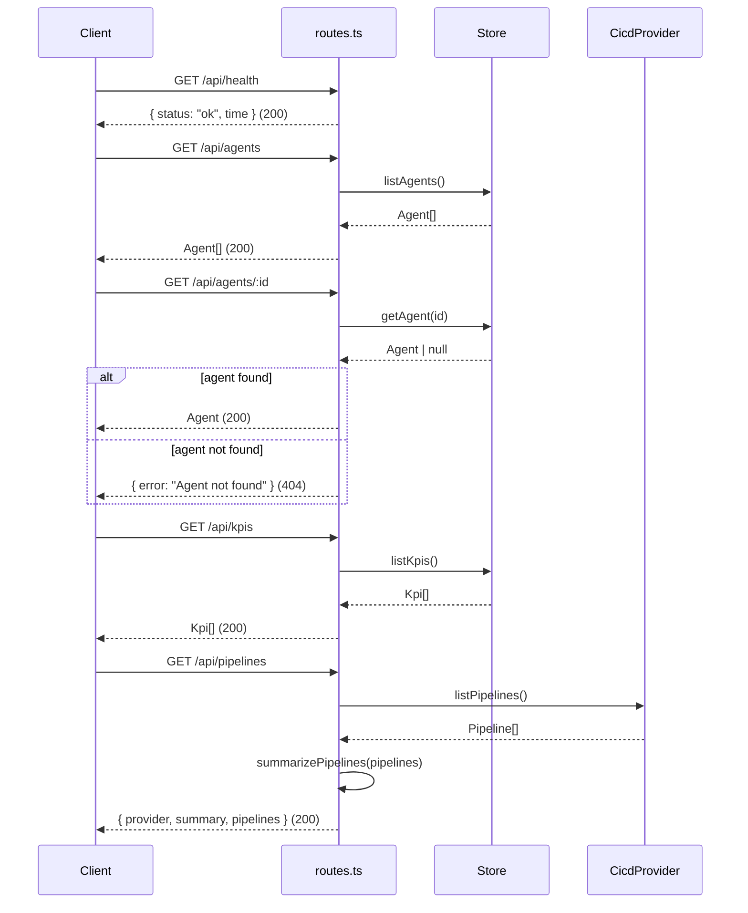

**File:** `server/src/routes.ts`

Registers all REST route handlers on the Express application. Each handler is intentionally thin: it reads from an injected dependency, serializes the result as JSON, and returns. No business logic lives in this file.

## `registerRoutes`

```ts
export function registerRoutes(app: Express, deps: AppDeps): void
```

| Parameter | Type | Purpose |
|---|---|---|
| `app` | `Express` | The Express application instance to attach routes to |
| `deps` | `AppDeps` | Injected `{ store, cicd }` dependencies forwarded to each handler |

**Returns:** `void` — mutates `app` by registering `GET` handlers as a side effect.

## Endpoint table

| Method | Path | Description | Success response | Error response |
|---|---|---|---|---|
| `GET` | `/api/health` | Liveness probe | `200 { status, time }` | — |
| `GET` | `/api/agents` | Full agent catalogue | `200 Agent[]` | `500 { error }` |
| `GET` | `/api/agents/:id` | Single agent by ID | `200 Agent` | `404 { error }` / `500 { error }` |
| `GET` | `/api/kpis` | KPI list | `200 Kpi[]` | `500 { error }` |
| `GET` | `/api/pipelines` | CI/CD pipelines + summary | `200 { provider, summary, pipelines }` | `500 { error }` |

## `GET /api/health`

```ts
app.get('/api/health', (_req, res) => {
  res.json({ status: 'ok', time: new Date().toISOString() })
})
```

A liveness probe that makes no calls to the store or CI/CD provider. Returns immediately with a current timestamp.

**Response shape:**
```json
{ "status": "ok", "time": "2026-05-24T10:00:00.000Z" }
```

`time` is an ISO 8601 UTC string generated at request time. Suitable for health-check polling by load balancers or container orchestrators.

## `GET /api/agents`

```ts
app.get('/api/agents', async (_req, res) => {
  res.json(await deps.store.listAgents())
})
```

Returns the full agent catalogue as a JSON array. When backed by the Postgres store, agents are ordered by `runs_per_week DESC`. When backed by the memory store, agents are returned in the order they appear in `SEED_AGENTS`.

**Response shape:** `Agent[]` — see [domain.ts](/backend/domain/) for the full `Agent` interface.

## `GET /api/agents/:id`

```ts
app.get('/api/agents/:id', async (req, res) => {
  const agent = await deps.store.getAgent(req.params.id)
  if (!agent) { res.status(404).json({ error: 'Agent not found' }); return }
  res.json(agent)
})
```

Returns a single agent by its `id` path parameter. Calls `store.getAgent(req.params.id)` which returns `null` when no agent matches. The `return` statement after the 404 response is required to prevent Express from attempting a second `res.json(agent)` call.

**Response shape (found):** `Agent`

**Response shape (not found):**
```json
{ "error": "Agent not found" }
```
HTTP status `404`.

## `GET /api/kpis`

```ts
app.get('/api/kpis', async (_req, res) => {
  res.json(await deps.store.listKpis())
})
```

Returns the KPI list as a JSON array. When backed by the Postgres store, KPIs are ordered by `sort_order ASC`. When backed by the memory store, KPIs are returned in `SEED_KPIS` array order.

**Response shape:** `Kpi[]` — see [domain.ts](/backend/domain/) for the full `Kpi` interface.

## `GET /api/pipelines`

```ts
app.get('/api/pipelines', async (_req, res) => {
  const pipelines = await deps.cicd.listPipelines()
  res.json({ provider: deps.cicd.name, summary: summarizePipelines(pipelines), pipelines })
})
```

Fetches the current pipeline list from the CI/CD provider and computes a summary in the same request. All three fields are returned together to avoid the client needing a separate aggregation call.

`summarizePipelines` is imported from `integrations/cicd.ts` and is a pure function — it performs no I/O. It counts pipelines by status and computes `passRate` over finished pipelines only (passing + failing; running pipelines are excluded from the denominator).

**Response shape:**
```json
{
  "provider": "mock",
  "summary": {
    "total": 8,
    "passing": 4,
    "failing": 2,
    "running": 2,
    "passRate": 67
  },
  "pipelines": [
    {
      "id": "p-1041",
      "name": "CI · build & test",
      "provider": "github-actions",
      "branch": "main",
      "status": "passing",
      "durationSeconds": 184,
      "triggeredBy": "a.kapoor",
      "updatedAt": "2026-05-24T09:54:00.000Z"
    }
  ]
}
```

`provider` is `deps.cicd.name` — either `'mock'` or `'github-actions'`. See [CI/CD integration](/backend/cicd-integration/) for details on when each is active.

## Request flow diagram



## Error handling

Unhandled errors thrown inside any route handler are caught by the catch-all error handler registered in `createApp` (in `app.ts`). That handler responds with:

```json
{ "error": "Internal server error" }
```

HTTP status `500`.

## Used by

`server/src/app.ts` — called inside `createApp`:

```ts
registerRoutes(app, deps)
```
