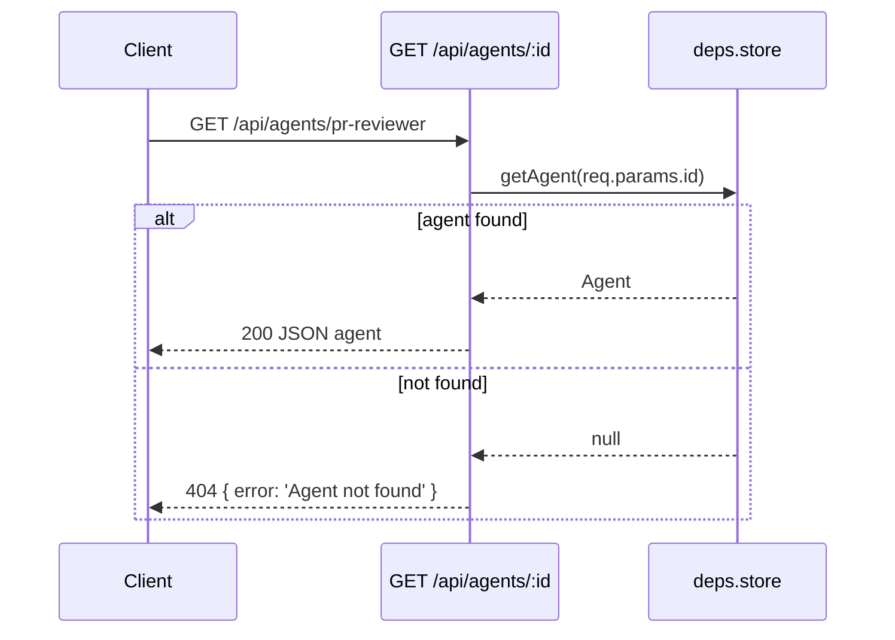

<!-- structure:1d1dec11a389 -->

**File:** `server/src/routes.ts` · **Lines:** 37

<!-- fill:file:summary -->
`routes.ts` defines `registerRoutes`, which attaches every REST endpoint of the API onto an Express app: a health check plus read endpoints for agents, a single agent by id, KPIs, and CI/CD pipelines. Handlers read their data through the injected `deps` (the `Store` for agents/KPIs and the `CicdProvider` for pipelines), and the pipelines route uses `summarizePipelines` from `integrations/cicd` to compute aggregate stats. It is called once by `createApp` in `app.ts` during app assembly, and the `AppDeps` type it consumes is also declared there.
<!-- /fill:file:summary -->

## Imports

This file pulls in the following modules. Relative imports point to other documented files; external imports are libraries from `node_modules`.

| Module | Imports | Kind |
| --- | --- | --- |
| `express` | `Express` | type-only · external |
| `./app` | `AppDeps` | type-only · internal |
| `./integrations/cicd` | `summarizePipelines` | internal |


## Symbols

This file exports 1 symbol. Every export is documented below, in declaration order.

| Name | Kind | Default |
| --- | --- | --- |
| registerRoutes | function | no |

## registerRoutes

**Kind:** `function`

```ts
export function registerRoutes(app: Express, deps: AppDeps): void { ... }
```

> Register all REST routes on the given Express app.

### Parameters

| Name | Type | Default | Required | Purpose |
| --- | --- | --- | --- | --- |
| app | `Express` | — | yes | The Express application instance onto which the route handlers are registered (mutated in place). |
| deps | `AppDeps` | — | yes | Injected collaborators the handlers read from: `store` for agents/KPIs and `cicd` for pipelines. |

**Returns:** `void`

<!-- fill:sym:registerRoutes:return -->
Returns `void`. The function is called purely for its side effect of registering route handlers on the passed-in `app`; it mutates that app in place and produces no value.
<!-- /fill:sym:registerRoutes:return -->

### Line-by-line walkthrough

Each top-level statement of `registerRoutes`, in execution order. The line numbers reference the source file as it appears today.

**Line 7 — `ExpressionStatement`**

```ts
app.get('/api/health', (_req, res) => {
    res.json({ status: 'ok', time: new Date().toISOString() })
  })
```

<!-- fill:sym:registerRoutes:walk:0 -->
Registers a `GET /api/health` handler that responds with a JSON object `{ status: 'ok', time: <ISO timestamp> }`. The handler is synchronous (no store access) and exists as a lightweight liveness probe; the `_req` prefix marks the request argument as unused.
<!-- /fill:sym:registerRoutes:walk:0 -->

**Line 11 — `ExpressionStatement`**

```ts
app.get('/api/agents', async (_req, res) => {
    res.json(await deps.store.listAgents())
  })
```

<!-- fill:sym:registerRoutes:walk:1 -->
Registers a `GET /api/agents` handler that awaits `deps.store.listAgents()` and sends the resulting `Agent[]` as JSON. The handler is `async` because the store method returns a `Promise` (it hits Postgres in production), and `await` is inlined directly into `res.json(...)` since no transformation is needed.
<!-- /fill:sym:registerRoutes:walk:1 -->

**Line 15 — `ExpressionStatement`**

```ts
app.get('/api/agents/:id', async (req, res) => {
    const agent = await deps.store.getAgent(req.params.id)
    if (!agent) {
      res.status(404).json({ error: 'Agent not found' })
      return
    }
    res.json(agent)
  })
```

<!-- fill:sym:registerRoutes:walk:2 -->
Registers `GET /api/agents/:id`, reading the `:id` path parameter via `req.params.id` and awaiting `deps.store.getAgent(id)`. Because `getAgent` returns `Agent | null`, the handler guards on `if (!agent)`: a missing agent yields a `404` with `{ error: 'Agent not found' }` and an early `return`, otherwise the found `agent` is sent as JSON. The early return is what prevents falling through to `res.json(agent)` after sending the 404.
<!-- /fill:sym:registerRoutes:walk:2 -->

**Line 24 — `ExpressionStatement`**

```ts
app.get('/api/kpis', async (_req, res) => {
    res.json(await deps.store.listKpis())
  })
```

<!-- fill:sym:registerRoutes:walk:3 -->
Registers `GET /api/kpis`, which awaits `deps.store.listKpis()` and returns the resulting `Kpi[]` as JSON. It mirrors the `/api/agents` handler — async because the store call is a `Promise`, with the awaited result passed straight to `res.json`.
<!-- /fill:sym:registerRoutes:walk:3 -->

**Line 28 — `ExpressionStatement`**

```ts
app.get('/api/pipelines', async (_req, res) => {
    const pipelines = await deps.cicd.listPipelines()
    res.json({
      provider: deps.cicd.name,
      summary: summarizePipelines(pipelines),
      pipelines,
    })
  })
```

<!-- fill:sym:registerRoutes:walk:4 -->
Registers `GET /api/pipelines`. It awaits `deps.cicd.listPipelines()` into `pipelines`, then responds with a composite JSON object: `provider` (the provider's `name`, e.g. `'mock'`), `summary` (aggregate stats computed by `summarizePipelines(pipelines)` from `integrations/cicd`), and the raw `pipelines` array. Building the summary server-side means the client gets both the detail and the rollup in a single round-trip.
<!-- /fill:sym:registerRoutes:walk:4 -->

### Examples

<!-- fill:sym:registerRoutes:example -->
`registerRoutes` is invoked indirectly through `createApp`; the API test suite then exercises the endpoints it wires:

```ts
// GET /api/agents/:id returns a single agent
const res = await request(testApp()).get('/api/agents/pr-reviewer')
// res.status === 200
// res.body.name === 'PR Reviewer'

// Unknown id -> 404
const miss = await request(testApp()).get('/api/agents/does-not-exist')
// miss.status === 404, miss.body.error is defined

// GET /api/pipelines returns provider + matching summary
const p = await request(testApp()).get('/api/pipelines')
// p.body.provider === 'mock'
// p.body.summary.total === p.body.pipelines.length
```
<!-- /fill:sym:registerRoutes:example -->

### Used by

- `server/src/app.ts`

## Diagrams

<!-- fill:file:diagrams -->

<!-- /fill:file:diagrams -->
