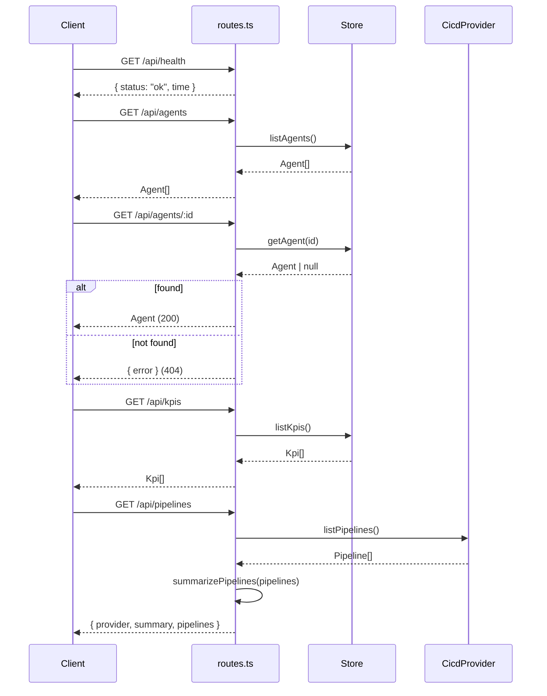

**File:** `server/src/routes.ts`

Registers all REST routes on the Express application. Handlers are
intentionally thin — each reads from an injected dependency and returns JSON.
Business logic lives in the store and CI/CD provider, not here.

## `registerRoutes`

```ts
export function registerRoutes(app: Express, deps: AppDeps): void
```

**Parameters:**

| Param | Type | Purpose |
|-------|------|---------|
| `app` | `Express` | The Express application to register routes on |
| `deps` | `AppDeps` | Injected `{ store, cicd }` dependencies |

**Returns:** `void` — mutates `app` by adding route handlers.

**Side effects:** Adds `GET` handlers to the Express app.

## Endpoints

### `GET /api/health`

```ts
app.get('/api/health', (_req, res) => {
  res.json({ status: 'ok', time: new Date().toISOString() })
})
```

Liveness probe. Returns immediately with no dependency calls.

**Response:**
```json
{ "status": "ok", "time": "2026-05-22T10:00:00.000Z" }
```

### `GET /api/agents`

```ts
app.get('/api/agents', async (_req, res) => {
  res.json(await deps.store.listAgents())
})
```

Returns the full agent catalogue as a JSON array. From the Postgres store,
results are ordered by `runs_per_week DESC`.

**Response:** `Agent[]`

### `GET /api/agents/:id`

```ts
app.get('/api/agents/:id', async (req, res) => {
  const agent = await deps.store.getAgent(req.params.id)
  if (!agent) {
    res.status(404).json({ error: 'Agent not found' })
    return
  }
  res.json(agent)
})
```

Returns a single agent by `id`. The `return` after sending the 404 is required
to prevent Express from attempting to send a second response after `res.json(agent)`.

**Response (found):** `Agent`

**Response (not found):**
```json
{ "error": "Agent not found" }
```
HTTP 404.

### `GET /api/kpis`

```ts
app.get('/api/kpis', async (_req, res) => {
  res.json(await deps.store.listKpis())
})
```

Returns the KPI list as a JSON array. From Postgres, ordered by `sort_order ASC`.

**Response:** `Kpi[]`

### `GET /api/pipelines`

```ts
app.get('/api/pipelines', async (_req, res) => {
  const pipelines = await deps.cicd.listPipelines()
  res.json({
    provider: deps.cicd.name,
    summary: summarizePipelines(pipelines),
    pipelines,
  })
})
```

Fetches pipelines from the CI/CD provider, computes a summary, and returns all
three together.

**Response:**
```json
{
  "provider": "mock",
  "summary": {
    "total": 8, "passing": 4, "failing": 2, "running": 2, "passRate": 67
  },
  "pipelines": [ /* Pipeline[] */ ]
}
```

`summarizePipelines` is imported from `integrations/cicd.ts`. It is a pure
function — no I/O.

:::note
`/api/agents` and `/api/kpis` are implemented and tested but not yet consumed
by the frontend. The frontend still renders agents and KPIs from its local
seed data.
:::

## Request flow diagram



## Used by

`server/src/app.ts` — called inside `createApp`:

```ts
registerRoutes(app, deps)
```
