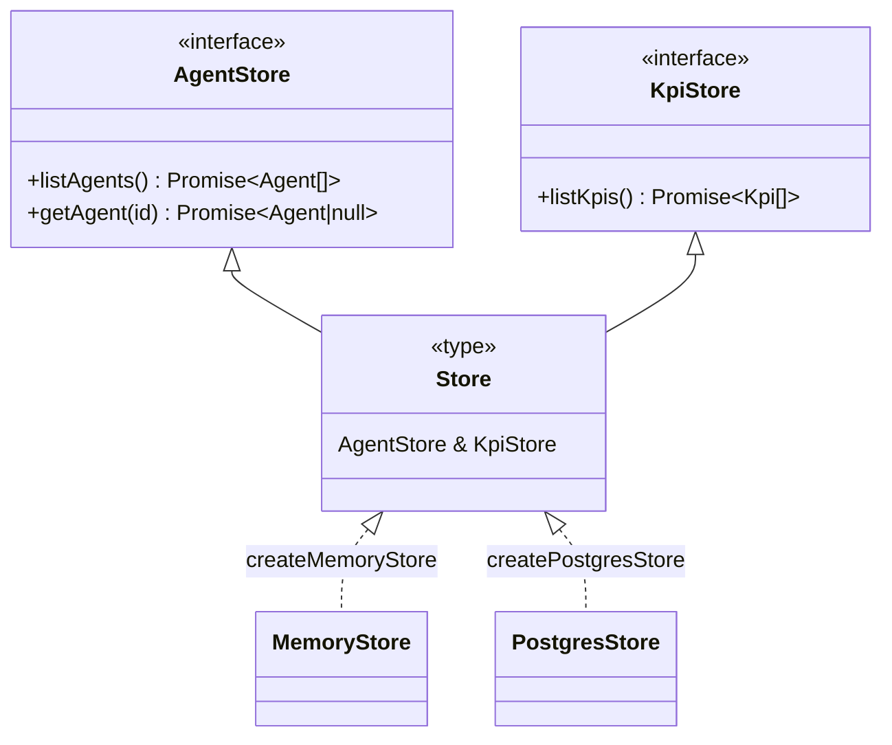

<!-- structure:8fbfdba6a34c -->

**File:** `server/src/store.ts` · **Lines:** 33

<!-- fill:file:summary -->
`store.ts` defines the data-access contract for the API: the `AgentStore` and `KpiStore` interfaces, their intersection `Store`, and `createMemoryStore`, an in-memory implementation. The interfaces work with the `Agent` and `Kpi` types from `domain.ts`, and the `Store` type is what `app.ts` injects via `AppDeps` and `routes.ts` reads through. `createMemoryStore` is used by the test suite (so `npm test` needs no database) and as a quick local fallback, while `postgresStore.ts` provides the production implementation of the same `Store` contract.
<!-- /fill:file:summary -->

## Imports

This file pulls in the following modules. Relative imports point to other documented files; external imports are libraries from `node_modules`.

| Module | Imports | Kind |
| --- | --- | --- |
| `./domain` | `Agent`, `Kpi` | type-only · internal |


## Symbols

This file exports 4 symbols. Every export is documented below, in declaration order.

| Name | Kind | Default |
| --- | --- | --- |
| createMemoryStore | function | no |
| AgentStore | interface | no |
| KpiStore | interface | no |
| Store | type | no |

## createMemoryStore

**Kind:** `function`

```ts
export function createMemoryStore(agents: Agent[], kpis: Kpi[]): Store { ... }
```

> In-memory store. Used by the test suite (so `npm test` needs no database)
> and as a fallback for quick local runs.

### Parameters

| Name | Type | Default | Required | Purpose |
| --- | --- | --- | --- | --- |
| agents | `Agent[]` | — | yes | The fixed agent catalogue the store serves; copied on read by `listAgents` and searched by id in `getAgent`. |
| kpis | `Kpi[]` | — | yes | The fixed KPI list the store serves; returned as a copy by `listKpis`. |

**Returns:** `Store`

<!-- fill:sym:createMemoryStore:return -->
Returns a `Store` object — an implementation of both `AgentStore` and `KpiStore` — backed by the supplied `agents` and `kpis` arrays held in a closure. It is always a valid object (never null); its individual methods return promises, and `getAgent` resolves to `null` only when no agent matches the requested id.
<!-- /fill:sym:createMemoryStore:return -->

### Line-by-line walkthrough

Each top-level statement of `createMemoryStore`, in execution order. The line numbers reference the source file as it appears today.

**Line 21 — `ReturnStatement`**

```ts
return {
    async listAgents() {
      return [...agents]
    },
    async getAgent(id: string) {
      return agents.find((a) => a.id === id) ?? null
    },
    async listKpis() {
      return [...kpis]
    },
  }
```

<!-- fill:sym:createMemoryStore:walk:0 -->
Returns an object literal implementing the `Store` contract over the closed-over `agents` and `kpis` arrays. `listAgents` returns a shallow copy `[...agents]` so callers can't mutate the backing array; `getAgent(id)` uses `Array.find` on `a.id === id` and coalesces a miss to `null` with `?? null` (matching the `Agent | null` signature); `listKpis` similarly returns a `[...kpis]` copy. All three are `async` so the in-memory store satisfies the same promise-returning interface as the Postgres store.
<!-- /fill:sym:createMemoryStore:walk:0 -->

### Examples

<!-- fill:sym:createMemoryStore:example -->
The test suite builds an app around an in-memory store seeded from `seed.ts`:

```ts
import { createMemoryStore } from '../store'
import { SEED_AGENTS, SEED_KPIS } from '../seed'

const store = createMemoryStore(SEED_AGENTS, SEED_KPIS)

await store.listAgents()            // => Agent[] (a copy of SEED_AGENTS)
await store.getAgent('pr-reviewer') // => the matching Agent
await store.getAgent('nope')        // => null
await store.listKpis()              // => Kpi[] (a copy of SEED_KPIS)
```
<!-- /fill:sym:createMemoryStore:example -->

### Used by

- `server/src/__tests__/api.test.ts`

## AgentStore

**Kind:** `interface`

```ts
export interface AgentStore { ... }
```

> Read access to the agent catalogue.

## KpiStore

**Kind:** `interface`

```ts
export interface KpiStore { ... }
```

> Read access to the KPI list.

## Store

**Kind:** `type`

```ts
export type Store = AgentStore & KpiStore
```

<!-- fill:sym:Store:summary -->
`Store` is the intersection type `AgentStore & KpiStore`, so any value typed as `Store` must provide all three read methods: `listAgents`, `getAgent`, and `listKpis`. It exists as the single data-access abstraction the rest of the app depends on, decoupling route handlers from any specific backend. Both `createMemoryStore` here and `createPostgresStore` in `postgresStore.ts` return a `Store`, and `app.ts` injects one through `AppDeps`.
<!-- /fill:sym:Store:summary -->

### Used by

- `server/src/app.ts`
- `server/src/postgresStore.ts`

## Diagrams

<!-- fill:file:diagrams -->

<!-- /fill:file:diagrams -->
