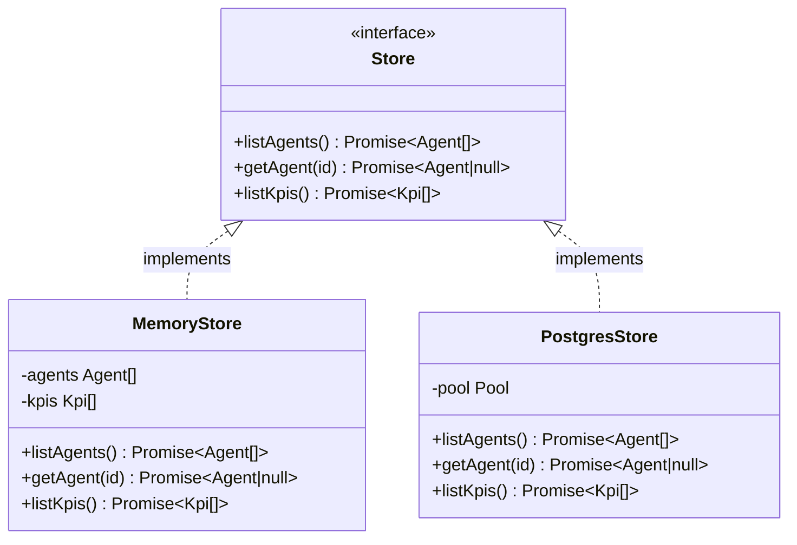

**File:** `server/src/store.ts`

Defines the `Store` abstraction for data access and provides the in-memory implementation used by tests. The interface is the key seam that enables dependency injection — the application depends on the interface, not on Postgres.

## Full source

```ts
import type { Agent, Kpi } from './domain'

export interface AgentStore {
  listAgents(): Promise<Agent[]>
  getAgent(id: string): Promise<Agent | null>
}

export interface KpiStore {
  listKpis(): Promise<Kpi[]>
}

export type Store = AgentStore & KpiStore

export function createMemoryStore(agents: Agent[], kpis: Kpi[]): Store {
  return {
    async listAgents() { return [...agents] },
    async getAgent(id: string) { return agents.find((a) => a.id === id) ?? null },
    async listKpis() { return [...kpis] },
  }
}
```

## `AgentStore` interface

```ts
export interface AgentStore {
  listAgents(): Promise<Agent[]>
  getAgent(id: string): Promise<Agent | null>
}
```

| Method | Signature | Returns |
|---|---|---|
| `listAgents` | `() => Promise<Agent[]>` | All agents. Order is implementation-defined (Postgres: `runs_per_week DESC`; memory: insertion order). |
| `getAgent` | `(id: string) => Promise<Agent \| null>` | The agent whose `id` equals the argument, or `null` if no match. Never `undefined`. |

Both methods are `async` (`Promise`-returning) even though the in-memory implementation has no I/O. This ensures the call sites in `routes.ts` are identical regardless of which implementation is injected — no `await` is conditional.

## `KpiStore` interface

```ts
export interface KpiStore {
  listKpis(): Promise<Kpi[]>
}
```

| Method | Signature | Returns |
|---|---|---|
| `listKpis` | `() => Promise<Kpi[]>` | All KPIs. Order is implementation-defined (Postgres: `sort_order ASC`; memory: insertion order). |

## `Store` type

```ts
export type Store = AgentStore & KpiStore
```

An intersection type — any `Store` must implement all three methods: `listAgents`, `getAgent`, and `listKpis`. The two sub-interfaces are always implemented together; there is no scenario where agents and KPIs come from different sources.

## `createMemoryStore`

```ts
export function createMemoryStore(agents: Agent[], kpis: Kpi[]): Store
```

**Parameters:**

| Parameter | Type | Purpose |
|---|---|---|
| `agents` | `Agent[]` | The agent array to serve. Typically `SEED_AGENTS` from `seed.ts`. |
| `kpis` | `Kpi[]` | The KPI array to serve. Typically `SEED_KPIS` from `seed.ts`. |

**Returns:** A fully functional `Store` backed by the provided arrays. Synchronous construction — no I/O.

**Side effects:** None at construction time. Each method call returns `Promise.resolve(...)` synchronously.

### `listAgents()`

```ts
async listAgents() { return [...agents] }
```

Returns a **shallow copy** of the backing array using the spread operator. Callers receive a new array object, so mutations to the returned array (such as `pop()` or `push()`) do not affect the store's backing data. Individual `Agent` objects are not deep-cloned — mutating a field of a returned agent would mutate the in-memory store's data, but no current code path does this.

### `getAgent(id)`

```ts
async getAgent(id: string) { return agents.find((a) => a.id === id) ?? null }
```

Uses `Array.prototype.find` to locate the first agent whose `id` matches. Returns `null` (not `undefined`) on a miss, matching the `AgentStore` interface's `Promise<Agent | null>` return type. The `?? null` converts the `undefined` that `find` returns on no match.

### `listKpis()`

```ts
async listKpis() { return [...kpis] }
```

Returns a shallow copy of the KPI backing array, for the same reason as `listAgents`.

## Store implementation comparison



| Aspect | `MemoryStore` | `PostgresStore` |
|---|---|---|
| Data source | In-memory arrays | PostgreSQL tables |
| Used in | Tests | Production |
| Ordering | Insertion order | `runs_per_week DESC` / `sort_order ASC` |
| I/O on each call | None | SQL query |
| Construction | Synchronous | Synchronous (pool is lazy) |
| Null on miss | `agents.find(...) ?? null` | `rows[0] ?? null` after query |

## Used by

- **`server/src/app.ts`** — receives `Store` as part of `AppDeps`.
- **`server/src/routes.ts`** — calls `store.listAgents()`, `store.getAgent(id)`, `store.listKpis()`.
- **`server/src/__tests__/api.test.ts`**:
  ```ts
  const app = createApp({
    store: createMemoryStore(SEED_AGENTS, SEED_KPIS),
    cicd: createMockCicdProvider(),
  })
  ```
