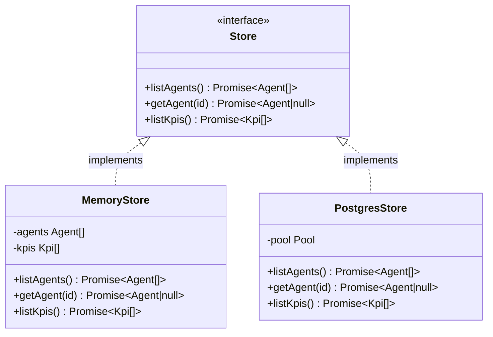

Data access in the Snabbit backend is abstracted behind a `Store` interface with two concrete implementations. This page compares the two and explains when each is used.

## The `Store` interface

The interface is defined in `server/src/store.ts` and consists of three async methods:

```ts
type Store = AgentStore & KpiStore

interface AgentStore {
  listAgents(): Promise<Agent[]>
  getAgent(id: string): Promise<Agent | null>
}

interface KpiStore {
  listKpis(): Promise<Kpi[]>
}
```

All methods return `Promise` so that call sites in `routes.ts` are identical regardless of which implementation is active. The in-memory store resolves synchronously; the Postgres store issues actual SQL queries.

## Implementation overview



## When each is used

| Context | Implementation | Created by |
|---|---|---|
| Unit tests (`api.test.ts`) | `MemoryStore` | `createMemoryStore(SEED_AGENTS, SEED_KPIS)` |
| Production server (`index.ts`) | `PostgresStore` | `createPostgresStore(pool)` |

The choice is made at the `createApp` call site — `app.ts` and `routes.ts` have no import of either implementation.

## In-memory store (`createMemoryStore`)

**File:** `server/src/store.ts`

```ts
export function createMemoryStore(agents: Agent[], kpis: Kpi[]): Store {
  return {
    async listAgents() { return [...agents] },
    async getAgent(id: string) { return agents.find((a) => a.id === id) ?? null },
    async listKpis() { return [...kpis] },
  }
}
```

Key characteristics:

- **No I/O** — all methods resolve immediately without network or disk access.
- **Shallow copies** — `listAgents` and `listKpis` return `[...array]` so callers cannot accidentally mutate the backing store.
- **Null on miss** — `getAgent` returns `null` (not `undefined`) to match the Postgres implementation's contract.
- **Order** — agents and KPIs are returned in the order they appear in the input arrays. In tests, this is `SEED_AGENTS` and `SEED_KPIS` order.
- **Isolation** — because `createApp` creates a new app instance per test, each test gets a fresh `createMemoryStore` call with its own backing arrays.

**Typical usage in tests:**

```ts
import { createMemoryStore } from '../store'
import { SEED_AGENTS, SEED_KPIS } from '../seed'
import { createMockCicdProvider } from '../integrations/cicd'
import { createApp } from '../app'

const app = createApp({
  store: createMemoryStore(SEED_AGENTS, SEED_KPIS),
  cicd: createMockCicdProvider(),
})
```

## Postgres store (`createPostgresStore`)

**File:** `server/src/postgresStore.ts`

```ts
export function createPostgresStore(pool: Pool): Store
```

Key characteristics:

- **SQL queries** — each method issues a parameterized query via the `pg` pool.
- **Ordered results** — `listAgents` orders by `runs_per_week DESC`; `listKpis` orders by `sort_order ASC`.
- **SQL-injection safe** — `getAgent` uses `$1` placeholder syntax, never string interpolation.
- **Row mapping** — `rowToAgent` and `rowToKpi` convert `snake_case` column names to camelCase domain types.
- **JSONB parsing** — `pg` automatically deserializes `trend JSONB` into a JavaScript `number[]`.

| Method | SQL |
|---|---|
| `listAgents()` | `SELECT * FROM agents ORDER BY runs_per_week DESC` |
| `getAgent(id)` | `SELECT * FROM agents WHERE id = $1` |
| `listKpis()` | `SELECT * FROM kpis ORDER BY sort_order ASC` |

**Typical usage in production:**

```ts
import { Pool } from 'pg'
import { config } from './config'
import { createPostgresStore } from './postgresStore'

const pool = new Pool({ connectionString: config.databaseUrl })
const store = createPostgresStore(pool)
```

## Comparison table

| Aspect | MemoryStore | PostgresStore |
|---|---|---|
| I/O per call | None | One SQL query |
| Setup required | None | Running Postgres + seeded tables |
| Result ordering | Input array order | SQL `ORDER BY` |
| Mutation safety | Shallow copy on return | New array from `rows.map()` |
| Null on miss | `find(...) ?? null` | `rows[0] as AgentRow \| undefined` → null |
| Type casting | N/A (already typed) | `as AgentCategory`, `as AgentStatus` |

For full implementation details, see:
- [store.ts — Store interfaces](/backend/store/)
- [postgresStore.ts — PostgreSQL store](/backend/postgresstore/)
