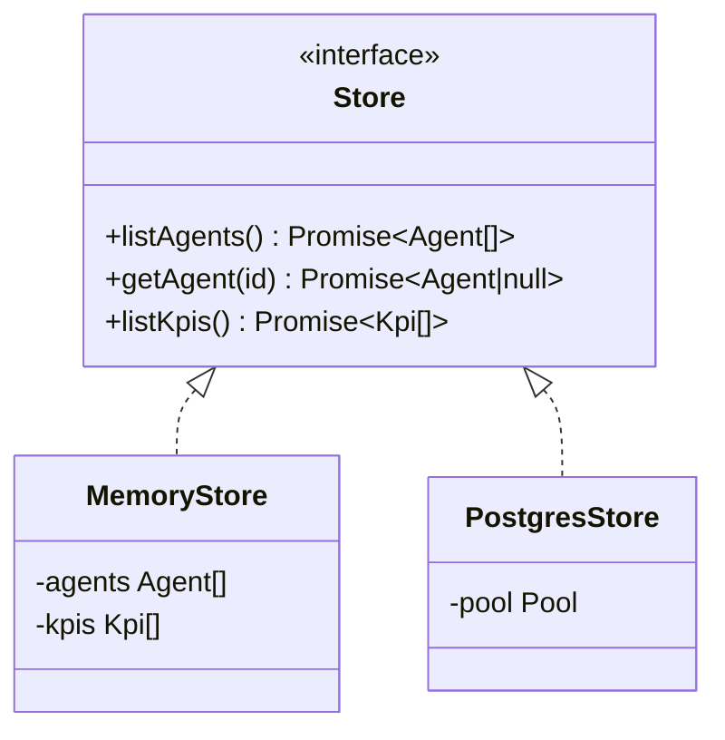

Data access is abstracted behind a `Store` interface with two implementations.
See [store.ts](/sdlc-sample-worflow/backend/store/) and
[postgresStore.ts](/sdlc-sample-worflow/backend/postgresstore/) for full details.

## The Store interface

```ts
interface AgentStore {
  listAgents(): Promise<Agent[]>
  getAgent(id: string): Promise<Agent | null>
}

interface KpiStore {
  listKpis(): Promise<Kpi[]>
}

type Store = AgentStore & KpiStore
```

All methods return `Promise` so the in-memory and Postgres implementations
share identical call sites.



## In-memory store

`createMemoryStore(agents, kpis)` — used in tests. Returns shallow copies from
arrays. `getAgent` returns `null` on miss.

```ts
// Used by tests:
createApp({
  store: createMemoryStore(SEED_AGENTS, SEED_KPIS),
  cicd: createMockCicdProvider(),
})
```

## Postgres store

`createPostgresStore(pool)` — used by the running server. Issues parameterized
SQL queries. Maps `snake_case` rows to camelCase domain types.

```ts
listAgents()  → SELECT * FROM agents ORDER BY runs_per_week DESC
getAgent(id)  → SELECT * FROM agents WHERE id = $1
listKpis()    → SELECT * FROM kpis ORDER BY sort_order ASC
```

## Schema

```sql
CREATE TABLE IF NOT EXISTS agents (
  id TEXT PRIMARY KEY, name TEXT NOT NULL, category TEXT NOT NULL,
  description TEXT NOT NULL, status TEXT NOT NULL,
  runs_per_week INTEGER NOT NULL, success_rate INTEGER NOT NULL,
  avg_duration TEXT NOT NULL, last_run TEXT NOT NULL,
  last_run_minutes INTEGER NOT NULL, popular BOOLEAN NOT NULL
);

CREATE TABLE IF NOT EXISTS kpis (
  id TEXT PRIMARY KEY, sort_order INTEGER NOT NULL,
  label TEXT NOT NULL, value TEXT NOT NULL, delta TEXT NOT NULL,
  positive BOOLEAN NOT NULL, hint TEXT NOT NULL, trend JSONB NOT NULL
);
```

## Setup script

`npm run db:setup` (from `server/`) creates the tables and upserts all seed
data. Safe to re-run — uses `INSERT … ON CONFLICT (id) DO UPDATE`.

See [db/setup.ts](/sdlc-sample-worflow/backend/db/setup/) for the full walkthrough.
