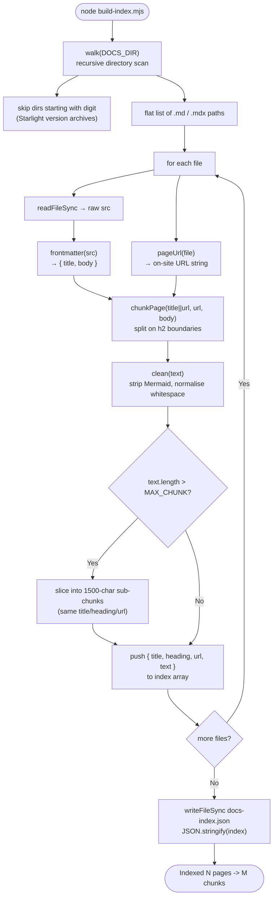

**File:** `chat-worker/build-index.mjs`

A Node.js ESM script that reads every Markdown and MDX page in the docs site,
splits each page into heading-level chunks, cleans the text for keyword
indexing, and writes a flat JSON array to `chat-worker/docs-index.json`. This
file is committed alongside the Worker source and bundled into the deployed
Cloudflare Worker by Wrangler so the chatbot has an offline search index at
request time.

## Running the script

```bash
cd chat-worker
node build-index.mjs   # direct invocation
# — or —
npm run index          # via the npm script alias
```

On success the script prints a summary line and exits:

```
Indexed 47 pages -> 183 chunks -> /home/runner/work/.../chat-worker/docs-index.json
```

:::tip
Run this script **before every deployment** whenever the documentation content
has changed. The index is bundled at deploy time; the Worker cannot pick up new
content without a rebuild and redeploy.
:::

Typical workflow:

```bash
node build-index.mjs
npm run deploy
```

## Imports

```js
import { readdirSync, readFileSync, writeFileSync, statSync } from 'node:fs';
import { join, relative, sep } from 'node:path';
import { fileURLToPath } from 'node:url';
```

The script uses only Node.js built-in modules — no external dependencies are
required beyond Node.js itself (v18+ recommended for native ESM support).

## Constants

### `here`

```js
const here = fileURLToPath(new URL('.', import.meta.url));
```

The directory containing the script file itself, resolved to an absolute path.
`import.meta.url` is the `file://` URL of `build-index.mjs`; `new URL('.')`
strips the filename to get the directory; `fileURLToPath` converts the URL to
an OS path string. All other paths are derived from `here` so the script works
correctly regardless of the working directory from which it is invoked.

### `DOCS_DIR`

```js
const DOCS_DIR = join(here, '..', 'docs-site', 'src', 'content', 'docs');
```

Absolute path to the Starlight content directory. This is where all Markdown
and MDX source files live. The `..` navigates from `chat-worker/` up one level
to the repository root, then descends into the docs site.

:::caution
If the docs site is moved or renamed, update `DOCS_DIR` to match. The script
will throw an `ENOENT` error at the `walk()` call if the path does not exist.
:::

### `OUT`

```js
const OUT = join(here, 'docs-index.json');
```

Output path for the generated JSON index — `chat-worker/docs-index.json`.
Wrangler bundles all files in the `chat-worker/` directory into the Worker, so
placing the index here makes it available to `src/index.js` as a static import:

```js
import INDEX from '../docs-index.json';
```

### `SITE_BASE`

```js
const SITE_BASE = '/sdlc-sample-worflow';
```

The base path configured in `docs-site/astro.config.mjs` (the `base` option).
`pageUrl()` prepends this value to every generated URL so that source links in
chatbot answers (`sources[].url`) resolve correctly on the deployed site.

:::danger
`SITE_BASE` must be kept in sync with the `base` option in `astro.config.mjs`.
A mismatch means every source link the chatbot returns will be a 404.
:::

### `MAX_CHUNK`

```js
const MAX_CHUNK = 1500;
```

Maximum number of characters per index chunk. Heading sections longer than
1 500 characters are split into consecutive chunks that all share the same
`title`, `heading`, and `url`. This prevents any single chunk from consuming
too much of the model's context window.

Six chunks at `MAX_CHUNK` characters each add at most ~9 000 characters of
grounding context to each request — well within the Claude Haiku context limit.

## Functions

### `walk(dir)`

```js
function walk(dir) {
  const out = [];
  for (const name of readdirSync(dir)) {
    const p = join(dir, name);
    if (statSync(p).isDirectory()) {
      if (/^\d/.test(name)) continue; // skip numbered version archives
      out.push(...walk(p));
    } else if (/\.mdx?$/.test(name)) {
      out.push(p);
    }
  }
  return out;
}
```

**Parameters**

| Name | Type | Description |
|------|------|-------------|
| `dir` | `string` | Absolute path to the directory to scan. |

**Returns:** A flat `string[]` of absolute paths to every `.md` and `.mdx` file
found recursively under `dir`.

**Algorithm**

For each entry in `dir`:

- If the entry is a directory:
  - Skip it if its name starts with a digit (`/^\d/`). Starlight's versioning
    plugin creates frozen archives like `2.0/`, `3.0/` under the content
    directory. These contain older copies of the docs and should not be indexed
    — the chatbot should only answer from the current (latest) documentation.
  - Otherwise recurse into the directory.
- If the entry is a file matching `/\.mdx?$/`, add its absolute path to the
  output array.
- Other files (images, JSON files, etc.) are silently ignored.

The function is synchronous (`readdirSync`, `statSync`) because it runs at
build time, not in the Cloudflare Worker.

### `pageUrl(file)`

```js
function pageUrl(file) {
  let rel = relative(DOCS_DIR, file).split(sep).join('/').replace(/\.mdx?$/, '');
  if (rel === 'index' || rel.endsWith('/index')) rel = rel.replace(/\/?index$/, '');
  return (SITE_BASE + '/' + rel + '/').replace(/\/{2,}/g, '/');
}
```

**Parameters**

| Name | Type | Description |
|------|------|-------------|
| `file` | `string` | Absolute path to a Markdown/MDX file returned by `walk()`. |

**Returns:** The canonical on-site URL for the page, with a trailing slash and
`SITE_BASE` prepended.

**Steps**

1. `relative(DOCS_DIR, file)` — compute the path relative to `DOCS_DIR`.
2. `.split(sep).join('/')` — normalise Windows backslash separators to forward
   slashes.
3. `.replace(/\.mdx?$/, '')` — strip the file extension.
4. Collapse `index` segments:
   - `index` (root index) → `''` (becomes `SITE_BASE + '/' + '' + '/'`)
   - `some/path/index` → `some/path`
5. Concatenate `SITE_BASE + '/' + rel + '/'` and replace any double slashes
   with a single slash via `.replace(/\/{2,}/g, '/')`.

**URL examples**

| File path (relative to DOCS_DIR) | Generated URL |
|----------------------------------|---------------|
| `index.md` | `/sdlc-sample-worflow/` |
| `getting-started.md` | `/sdlc-sample-worflow/getting-started/` |
| `frontend/components/agentcard.md` | `/sdlc-sample-worflow/frontend/components/agentcard/` |
| `chat-worker/index.md` | `/sdlc-sample-worflow/chat-worker/` |
| `chat-worker/worker.md` | `/sdlc-sample-worflow/chat-worker/worker/` |

### `frontmatter(src)`

```js
function frontmatter(src) {
  const m = src.match(/^---\r?\n([\s\S]*?)\r?\n---\r?\n?/);
  if (!m) return { title: null, body: src };
  const tm = m[1].match(/^title:\s*(.+)$/m);
  const title = tm ? tm[1].trim().replace(/^['"]|['"]$/g, '') : null;
  return { title, body: src.slice(m[0].length) };
}
```

**Parameters**

| Name | Type | Description |
|------|------|-------------|
| `src` | `string` | Raw file content read with `readFileSync`. |

**Returns:** `{ title: string | null, body: string }`

- `title` — the value of the `title:` YAML key, stripped of leading/trailing
  single or double quotes. `null` if no frontmatter block or no `title` key.
- `body` — the file content after the closing `---` delimiter (or the full
  `src` if no frontmatter was found).

**Regex breakdown**

`/^---\r?\n([\s\S]*?)\r?\n---\r?\n?/`

| Part | Meaning |
|------|---------|
| `^---` | Opening delimiter at start of string |
| `\r?\n` | CRLF or LF line ending after `---` |
| `([\s\S]*?)` | Non-greedy capture of the frontmatter body (group 1) |
| `\r?\n---` | Closing delimiter on its own line |
| `\r?\n?` | Optional trailing newline after the closing `---` |

`/^title:\s*(.+)$/m`

| Part | Meaning |
|------|---------|
| `^title:` | `title:` key at start of a line (`m` flag makes `^` match line start) |
| `\s*` | Optional spaces between `:` and the value |
| `(.+)` | Capture group: the title value (may contain spaces) |
| `$` | End of the line |

**Edge cases**

| Situation | Result |
|-----------|--------|
| No `---` delimiters at all | `{ title: null, body: src }` — whole file is treated as body |
| Frontmatter present, no `title:` key | `{ title: null, body: <post-frontmatter> }` |
| `title` value wrapped in quotes, e.g. `title: "My Page"` | Quotes stripped by `.replace(/^['"]|['"]$/g, '')` |

When `title` is `null`, the caller (`main loop`) substitutes the page URL as
the chunk title so that every chunk always has a non-empty `title` field.

### `clean(text)`

```js
function clean(text) {
  return text
    .replace(/```mermaid[\s\S]*?```/g, ' ')
    .replace(/\r/g, '')
    .replace(/[ \t]+/g, ' ')
    .replace(/\n{3,}/g, '\n\n')
    .trim();
}
```

**Parameters**

| Name | Type | Description |
|------|------|-------------|
| `text` | `string` | Raw Markdown body text for a chunk section. |

**Returns:** Cleaned text suitable for keyword indexing and inclusion in a
model prompt.

**Transformations applied in order**

| Step | Regex | Replacement | Reason |
|------|-------|-------------|--------|
| Strip Mermaid blocks | `` /```mermaid[\s\S]*?```/g `` | `' '` (single space) | Mermaid syntax (`flowchart TD`, `sequenceDiagram`, node labels) is noise for keyword search and the model. Replaced with a space rather than empty string to prevent adjacent words from merging. |
| Normalise line endings | `/\r/g` | `''` | Removes Windows carriage-return characters so subsequent `\n`-based operations work uniformly. |
| Collapse inline whitespace | `/[ \t]+/g` | `' '` | Collapses runs of spaces and tabs to a single space. |
| Collapse blank lines | `/\n{3,}/g` | `'\n\n'` | Three or more consecutive newlines become two, reducing vertical whitespace without losing paragraph structure. |
| Trim | — | — | Removes leading/trailing whitespace from the entire chunk. |

### `chunkPage(title, url, body)`

```js
function chunkPage(title, url, body) {
  const chunks = [];
  for (const part of body.split(/\n(?=## )/)) {
    const hm = part.match(/^##\s+(.+)/);
    const heading = hm ? hm[1].trim() : title;
    const nl = part.indexOf('\n');
    let text = clean(hm ? (nl === -1 ? '' : part.slice(nl + 1)) : part);
    if (!text) continue;
    while (text.length > MAX_CHUNK) {
      chunks.push({ title, heading, url, text: text.slice(0, MAX_CHUNK) });
      text = text.slice(MAX_CHUNK);
    }
    chunks.push({ title, heading, url, text });
  }
  return chunks;
}
```

**Parameters**

| Name | Type | Description |
|------|------|-------------|
| `title` | `string` | Page title from frontmatter, or the page URL as fallback. |
| `url` | `string` | On-site URL with trailing slash, from `pageUrl()`. |
| `body` | `string` | Page body with frontmatter already stripped (from `frontmatter()`). |

**Returns:** `Array<{ title: string, heading: string, url: string, text: string }>`

**Splitting strategy**

```js
body.split(/\n(?=## )/)
```

The body is split on newlines immediately followed by `##` (h2 headings). The
lookahead `(?=## )` means the `##` itself is kept at the start of each `part`,
so heading text can be extracted from each part. This divides the page into one
part per h2 section, plus a leading part for any content before the first h2.

Only `##` (h2) headings are used as split points. `###` (h3) and deeper headings
remain inside the same chunk as their parent h2 section.

**Heading extraction**

```js
const hm = part.match(/^##\s+(.+)/);
const heading = hm ? hm[1].trim() : title;
```

If the part begins with `##`, the heading text is extracted. If not (the
intro section before the first `##`), the page title is used as the heading.

**Body text extraction**

```js
const nl = part.indexOf('\n');
let text = clean(hm ? (nl === -1 ? '' : part.slice(nl + 1)) : part);
```

- If the part has a `##` heading line, `text` is everything after the first
  newline (the heading line itself is not included in the chunk text — it is
  already captured in `heading`).
- If the part has no heading (intro), the entire `part` is used as text.
- `clean()` is applied before the length check.
- If `clean()` returns an empty string, the part is skipped (`if (!text) continue`).

**Large-section splitting**

```js
while (text.length > MAX_CHUNK) {
  chunks.push({ title, heading, url, text: text.slice(0, MAX_CHUNK) });
  text = text.slice(MAX_CHUNK);
}
chunks.push({ title, heading, url, text });
```

If the cleaned text of a section exceeds `MAX_CHUNK` (1 500) characters, it is
split into as many 1 500-character slices as needed. All sub-chunks for the same
section share the same `title`, `heading`, and `url`. The split is by character
position — it does not attempt to split on word or sentence boundaries.

## Index entry shape

Each element of `docs-index.json` (and therefore each element of the `INDEX`
array imported by the Worker) has the following shape:

```ts
{
  title:   string,  // page title from frontmatter, or URL if no title
  heading: string,  // h2 section heading, or page title for intro section
  url:     string,  // on-site URL with SITE_BASE prefix and trailing slash
  text:    string,  // cleaned section text, at most MAX_CHUNK characters
}
```

The `title` and `heading` fields together form the "title text" that the
Worker's `search()` function weights 4× higher than body text. Pages with
descriptive titles and section headings rank more strongly for questions that
match those names directly.

## Main loop

```js
const files = walk(DOCS_DIR);
const index = [];
for (const file of files) {
  const { title, body } = frontmatter(readFileSync(file, 'utf-8'));
  const url = pageUrl(file);
  index.push(...chunkPage(title || url, url, body));
}

writeFileSync(OUT, JSON.stringify(index));
console.log(`Indexed ${files.length} pages -> ${index.length} chunks -> ${OUT}`);
```

The main execution:

1. Calls `walk(DOCS_DIR)` to obtain the full list of Markdown files.
2. For each file:
   a. Reads the file content synchronously.
   b. Calls `frontmatter()` to extract the title and strip the frontmatter block.
   c. Calls `pageUrl()` to compute the on-site URL.
   d. Calls `chunkPage()` with `title || url` as the fallback title — if a page
      has no `title` frontmatter key, its URL is used as the display title in
      the chatbot's source list.
   e. Spreads the returned chunk array into the global `index` array.
3. Serialises the complete `index` array to JSON with `writeFileSync`.
4. Logs the counts to stdout.

The output is a single JSON array with no pretty-printing (compact format), to
minimise the Worker bundle size.

## Full processing pipeline



## See also

- [Chat worker overview](/sdlc-sample-worflow/chat-worker/) — architecture, deployment workflow, configuration table
- [Worker — src/index.js](/sdlc-sample-worflow/chat-worker/worker/) — how `docs-index.json` is consumed at request time
