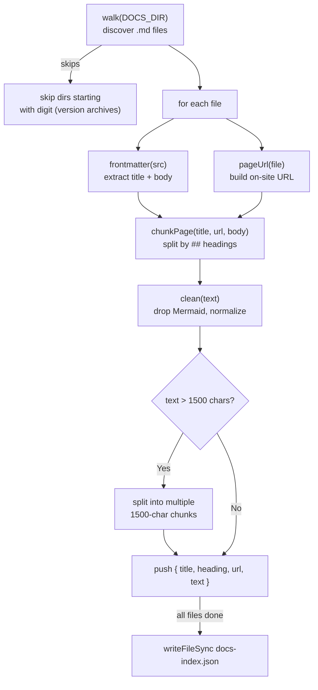

**File:** `chat-worker/build-index.mjs`

A Node.js script that reads every Markdown page in the docs site, splits each
into heading-level chunks, and writes `docs-index.json` — the search index the
chat Worker bundles and uses to answer questions.

## Running it

```bash
cd chat-worker
node build-index.mjs   # or: npm run index
```

On completion it prints:

```
Indexed 47 pages -> 183 chunks -> /path/to/chat-worker/docs-index.json
```

Run this script whenever the documentation changes, then redeploy the Worker
so the new index is bundled:

```bash
node build-index.mjs
npm run deploy
```

## Constants

```js
const DOCS_DIR = join(here, '..', 'docs-site', 'src', 'content', 'docs');
const OUT      = join(here, 'docs-index.json');
const SITE_BASE = '/sdlc-sample-worflow';
const MAX_CHUNK = 1500;
```

| Constant | Purpose |
|----------|---------|
| `DOCS_DIR` | Absolute path to the Markdown source directory. Computed relative to the script's own location via `import.meta.url`. |
| `OUT` | Output path for the JSON index. Written to the same `chat-worker/` directory, where Wrangler bundles it into the Worker. |
| `SITE_BASE` | The `base` path configured in `docs-site/astro.config.mjs`. Used to prefix all on-site URLs so source links in chatbot answers are correct. Must be kept in sync with the Astro config. |
| `MAX_CHUNK` | Maximum characters per index chunk. If a heading section's text exceeds this, it is split into multiple consecutive chunks. |

## `walk(dir)`

```js
function walk(dir) {
  const out = [];
  for (const name of readdirSync(dir)) {
    const p = join(dir, name);
    if (statSync(p).isDirectory()) {
      if (/^\d/.test(name)) continue;   // skip numbered version archives
      out.push(...walk(p));
    } else if (/\.mdx?$/.test(name)) {
      out.push(p);
    }
  }
  return out;
}
```

**Parameters:** `dir` — absolute path to a directory.

**Returns:** A flat array of absolute paths to every `.md` and `.mdx` file
found recursively under `dir`.

**Version archive exclusion:** Directories whose names start with a digit (e.g.
`2.0/`) are skipped. These are frozen version archives managed automatically by
the `starlight-versions` plugin. Only the current (latest) docs are indexed.

**File filter:** The regex `/\.mdx?$/` matches both `.md` and `.mdx` files.

## `pageUrl(file)`

```js
function pageUrl(file) {
  let rel = relative(DOCS_DIR, file).split(sep).join('/').replace(/\.mdx?$/, '');
  if (rel === 'index' || rel.endsWith('/index')) rel = rel.replace(/\/?index$/, '');
  return (SITE_BASE + '/' + rel + '/').replace(/\/{2,}/g, '/');
}
```

**Parameters:** `file` — absolute path to a Markdown file.

**Returns:** The on-site URL for that page, with a trailing slash.

**Steps:**

1. Compute the path relative to `DOCS_DIR`, normalize path separators to `/`,
   and strip the `.md`/`.mdx` extension.
2. Collapse `index` segments: `some/path/index` → `some/path/`, and
   `index` → `/`.
3. Prepend `SITE_BASE` and ensure no double slashes.

**Examples:**

| File path (relative to DOCS_DIR) | URL |
|-----------------------------------|-----|
| `index.md` | `/sdlc-sample-worflow/` |
| `getting-started.md` | `/sdlc-sample-worflow/getting-started/` |
| `frontend/components/agentcard.md` | `/sdlc-sample-worflow/frontend/components/agentcard/` |

## `frontmatter(src)`

```js
function frontmatter(src) {
  const m = src.match(/^---\r?\n([\s\S]*?)\r?\n---\r?\n?/);
  if (!m) return { title: null, body: src };
  const tm = m[1].match(/^title:\s*(.+)$/m);
  const title = tm ? tm[1].trim().replace(/^['"]|['"]$/g, '') : null;
  return { title, body: src.slice(m[0].length) };
}
```

**Parameters:** `src` — raw Markdown file content as a string.

**Returns:** `{ title: string | null, body: string }` where `title` is the
value of the `title:` frontmatter key (stripped of wrapping quotes), and `body`
is the file content with the frontmatter block removed.

**Regex breakdown:**

- `/^---\r?\n([\s\S]*?)\r?\n---\r?\n?/` — matches the entire frontmatter block
  including the delimiters. The `\r?\n` handles both LF and CRLF line endings.
  The `[\s\S]*?` is a non-greedy match of the frontmatter body.
- `/^title:\s*(.+)$/m` — extracts the value of the `title:` key. The `m` flag
  makes `^` / `$` match line boundaries.

If no frontmatter is present (no `---` delimiters), `title` is `null` and the
entire `src` is returned as `body`.

If a frontmatter block is found but has no `title` key, `title` is also `null`.
In that case the page's URL is used as the chunk title in the index.

## `clean(text)`

```js
function clean(text) {
  return text
    .replace(/```mermaid[\s\S]*?```/g, ' ')   // drop Mermaid diagram source
    .replace(/\r/g, '')                         // normalize line endings
    .replace(/[ \t]+/g, ' ')                   // collapse whitespace
    .replace(/\n{3,}/g, '\n\n')                // collapse blank lines
    .trim();
}
```

**Parameters:** `text` — a chunk's raw Markdown body.

**Returns:** Cleaned text suitable for keyword indexing.

**Why strip Mermaid?** Mermaid diagram source (```mermaid ... ```) contains
keywords like `flowchart`, `sequenceDiagram`, node labels, and edge text. This
content is noise for a chatbot — the diagram's meaning is conveyed by the
surrounding prose, not the raw syntax. Stripping it prevents the index from
matching questions about completely unrelated topics that happen to share a
diagram keyword.

The replacement is a single space (not empty string) to avoid adjacent words
merging: `fooLR` instead of `foo` + `LR`.

## `chunkPage(title, url, body)`

```js
function chunkPage(title, url, body) {
  const chunks = [];
  for (const part of body.split(/\n(?=## )/)) {
    const hm = part.match(/^##\s+(.+)/);
    const heading = hm ? hm[1].trim() : title;
    const nl = part.indexOf('\n');
    let text = clean(hm ? (nl === -1 ? '' : part.slice(nl + 1)) : part);
    if (!text) continue;
    while (text.length > MAX_CHUNK) {
      chunks.push({ title, heading, url, text: text.slice(0, MAX_CHUNK) });
      text = text.slice(MAX_CHUNK);
    }
    chunks.push({ title, heading, url, text });
  }
  return chunks;
}
```

**Parameters:**

| Param | Type | Purpose |
|-------|------|---------|
| `title` | `string` | Page title (from frontmatter, or URL as fallback) |
| `url` | `string` | On-site URL for source linking |
| `body` | `string` | Page body (frontmatter already stripped) |

**Returns:** An array of chunk objects `{ title, heading, url, text }`.

**Splitting strategy:**

```js
body.split(/\n(?=## )/)
```

Splits the page at every `##` (h2) heading. `\n(?=## )` uses a lookahead so
the `##` itself is kept at the start of each part. This means each chunk covers
one heading section from the page.

The first part (before any `##`) gets the page title as its `heading`.

**Heading extraction:**

```js
const hm = part.match(/^##\s+(.+)/);
const heading = hm ? hm[1].trim() : title;
```

Extracts the heading text from the `##` line. If the part has no heading (the
intro section), the page title is used.

**Body extraction:**

```js
const nl = part.indexOf('\n');
let text = clean(hm ? (nl === -1 ? '' : part.slice(nl + 1)) : part);
```

If the part has a `##` heading, the text is everything after the first newline
(i.e., the heading line is excluded from the chunk text). If not, the entire
part is used.

`clean()` is applied before length-checking.

**Large-section splitting:**

```js
while (text.length > MAX_CHUNK) {
  chunks.push({ title, heading, url, text: text.slice(0, MAX_CHUNK) });
  text = text.slice(MAX_CHUNK);
}
chunks.push({ title, heading, url, text });
```

If a section exceeds `MAX_CHUNK` (1500 characters), it is split into consecutive
chunks of up to 1500 characters each. All sub-chunks share the same `title`,
`heading`, and `url`.

## Chunk object shape

```ts
{
  title: string,    // page title (frontmatter or URL)
  heading: string,  // h2 section heading (or page title for intro)
  url: string,      // on-site URL with trailing slash
  text: string,     // cleaned, max 1500 chars per chunk
}
```

This is also the shape stored in `docs-index.json` and read by the Worker.

## Main loop

```js
const files = walk(DOCS_DIR);
const index = [];
for (const file of files) {
  const { title, body } = frontmatter(readFileSync(file, 'utf-8'));
  const url = pageUrl(file);
  index.push(...chunkPage(title || url, url, body));
}

writeFileSync(OUT, JSON.stringify(index));
console.log(`Indexed ${files.length} pages -> ${index.length} chunks -> ${OUT}`);
```

Processes all discovered Markdown files in `DOCS_DIR` (including subdirectories)
and writes the flat chunk array as JSON.

`title || url` falls back to the URL when a page has no `title` frontmatter
field (e.g. the index page if its frontmatter only has `description:`).

## Full processing pipeline


